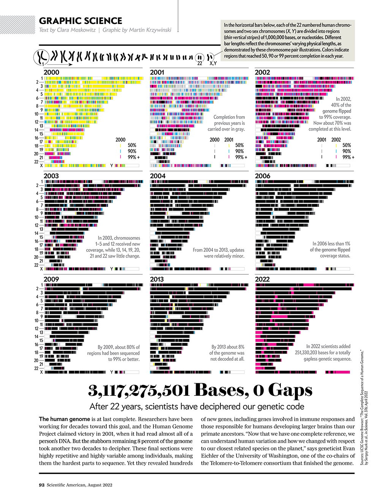

<head>

```{=html}
<script src="https://kit.fontawesome.com/ece750edd7.js" crossorigin="anonymous"></script>
```

</head>

```{r global_options, include=FALSE}
knitr::opts_chunk$set(warning=FALSE, message=FALSE)
```

::: objectives
<h2><i class="far fa-check-square"></i> Learning Objectives</h2>

-   Learn about the Bioconductor project
-   Understand common genomics file formats
-   Understand the difference between genome assemblies
:::
<br>
In this course, we will shift our focus to working with genomic data in R using libraries from the Bioconductor project. Before we begin, you should familiarise yourself with the Bioconductor and the different types of genomic data that we will be working with.

## Bioconductor

<br>

{width=100%}

<br>

[Bioconductor](https://www.bioconductor.org/) is an open-source project that provides tools for the analysis and interpretation of biological data. It is built on top of the R programming language and offers a large collection of packages for a wide range of genomic analyses, including gene expression analysis, variant calling, and functional annotation.

It also provides access to numerous genomic datasets that can be analysed directly in R, along with tools for querying external databases such as [Ensembl](https://www.ensembl.org/index.html) and [UCSC](https://genome.ucsc.edu/).

In addition, Bioconductor defines dedicated data structures for storing and manipulating genomic data, such as the GRanges class for representing genomic intervals and the SummarizedExperiment class for handling experimental data (e.g. gene expression matrices).

Bioconductor is a community-driven project, with contributions from researchers around the world. It is maintained by a team of volunteers supported by the Bioconductor core team. A key feature of Bioconductor is its emphasis on reproducibility and transparency in research. Packages are required to follow strict guidelines for documentation, testing, and version control, helping to ensure that analyses can be reliably reproduced and shared.

Extensive documentation is available on the Bioconductor website and can also be accessed within R using the `help()` function. Most packages include a **vignette**, which provides a detailed tutorial on how to use the package and its functions.

Bioconductor libraries are installed via the `BiocManager` package, rather than the standard `install.packages()` function used for CRAN packages. To install Bioconductor packages, you first need to install the `BiocManager` package from CRAN and then use the `BiocManager::install()` function to install the desired Bioconductor packages.

```{r, eval = FALSE}

## EXAMPLE. NO NEED TO RUN THIS IF ALREADY INSTALLED

# Install BiocManager from the default CRAN repository if it is not already installed
if (!requireNamespace("BiocManager", quietly = TRUE)){
    install.packages("BiocManager")
}

# Install Bioconductor packages with BiocManager
BiocManager::install("GenomicRanges")
```

## Genomics data formats

In this course, we will work with several different genomic datasets including genome sequences, gene models, ChIP-seq peak co-ordinates and aligned sequencing reads. Most of these datasets exist in databases outside of R in standardised text formats. 

Standardised file formats have specific conventions for how data is organised and represented, providing consistency and interoperability across different tools and platforms.

It will be useful to familiarise yourself with these formats and the type of data stored within each. You don't need to memorise the details of each format, but you should understand the general purpose of each file type.

In this course we will use Fasta, Bed, wiggle and GFF files. A brief summary of file formats is provided below as well as in this
[presentation](https://docs.google.com/presentation/d/1WjaovDGr6YF0oHU1b1tJwBBvaqAdxBahOWk72LUrmjc/edit?usp=sharing)

#### [Fasta](https://en.wikipedia.org/wiki/FASTA_format)
Standard format for sequence data (DNA/RNA or protein). Can store multiple sequences separated by unique headers.

#### [Fastq](https://en.wikipedia.org/wiki/FASTQ_format)
Fastq is similar to Fasta but is used to store sequencing reads and includes extra lines to encode sequencing quality scores.

#### [BED](https://genome.ucsc.edu/FAQ/FAQformat.html#format1)
Bed (browser extensible data) files store genomic co-ordinates to represent positions of features such as genes, ChIP-seq peaks or regulatory features (e.g. CpG islands). Bed files have at least 3 columns (chromosome, start, end) to encode regions of the genome.

- Bed6 is a strict version of the bed format where each region must have a score, strand and name (chromosome, start, end, name, score, strand).
- Bed12 has extra columns to represent exons in gene models.
- There is a binary version of bed called **bigBed**, used to store and visualise large datasets.

#### [GFF/GTF](https://en.wikipedia.org/wiki/General_feature_format)
The GFF (general feature format) is used to store rich information on genomic annotations. GTF (gene transfer format) is a derivative of GFF which stores gene transcript models, with detailed information on genetic features such as start codons, alternative transcripts, exons and CDS.

#### [Wiggle](https://genome.ucsc.edu/goldenPath/help/wiggle.html)
The wiggle or .wig format is used to represent signals or scores across the genome (e.g. sequencing read depth, GC% etc.). It has four columns (chromosome, start, end, score). There is a binary version called bigWig used to store and visualise large datasets.

#### [SAM](https://samtools.github.io/hts-specs/SAMv1.pdf)
The SAM (sequence alignment/map) format stores sequencing reads and quality scores as well as detailed information following alignment to a genome/transcriptome. There is a binary version called BAM used to store and visualise large datasets. 

#### [VCF](https://genome.ucsc.edu/goldenPath/help/vcf.html)
The VCF (variant calling format) is used to store positions of SNPs, INDELs and other genomic variations following variant calling analysis

## Genome assemblies

A genome assembly is a reference sequence of a particular species, which serves as a template for mapping and analysing genomic data. Different assemblies may exist for the same species, representing different versions of the reference genome. 

When a reference genome sequence is published it is given a name or ID. Reference sequences are continually being improved by re-sequencing and new versions are given a new name. These unique names are often referred to as the genome **assembly** or genome **build**.



For example, the human genome has several assemblies including hg19 (also known as GRCh37) and hg38 (also known as GRCh38). These assemblies differ in terms of the reference sequence, the annotation of genes and other genomic features, and the coordinates used to represent genomic locations.

Human genome assemblies:

  - NCBI34 / hg16: July 2003
  - NCBI35 / hg17: May 2004
  - NCBI36 / hg18: March 2006
  - GRCh37 / hg19: Feb 2009
  - GRCh38 / hg38: Dec 2013
  - CHM13 : Mar 2021 (Gapless Telomere-to-telomere assembly)

The reference sequence changes with each release of a genome build

  - Chromosome lengths can change
  - Each genome build has a specific co-ordinate system
    - Chr1 position 1000000 is T in hg19 and G in hg38!

It is **extremely important** to know which build your data is mapped to.

::: key-points
<h2><i class="fas fa-thumbtack"></i> Key points</h2>

-   Bioconductor is a repository of open source R packages for bioinformatics 
-   Bioconductor packages are installed with the `BiocManager` package
-   Genomic data is stored in standardised file formats
-   Different genome assemblies exist for the same species and have different reference sequences and co-ordinates

:::
