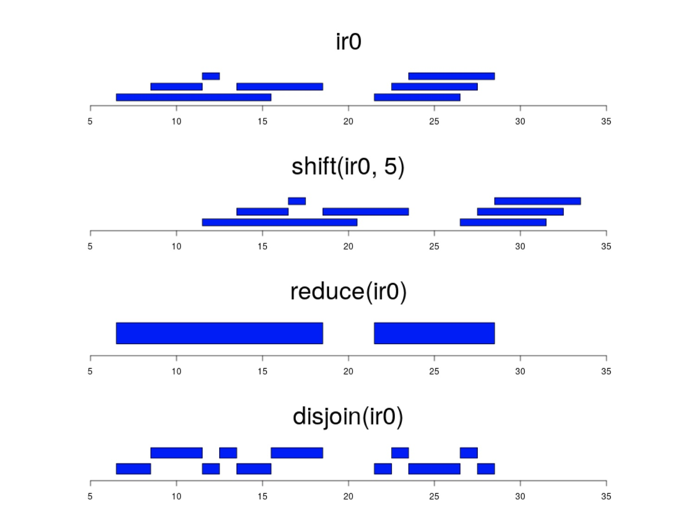

<head>

```{=html}
<script src="https://kit.fontawesome.com/ece750edd7.js" crossorigin="anonymous"></script>
```

</head>

```{r global_options, include=FALSE}
knitr::opts_chunk$set(warning=FALSE, message=FALSE)
```

::: objectives
<h2><i class="far fa-check-square"></i> Learning Objectives</h2>

-   Learn to use the GenomicRanges package in R
-   Import genomic data as GRanges objects
-   Perform operations on GRanges objects
:::

<br>

The **GenomicRanges** package defines general purpose containers, known as **GRanges** objects, for storing and manipulating genomic data. GRanges objects store genomic co-ordinates and associated metadata. They are used in many Bioconductor packages to analyse genomic data.

The types of data that can be stored in a GRanges object include:

-   Genomic intervals (e.g. gene models, ChIP-seq peaks, regulatory features)
-   Genomic signals (e.g. sequencing read depth, GC content)
-   Genomic variations (e.g. SNPs, INDELs)

GRanges are built on the **IRanges** function which is a general purpose object in R for representing numeric intervals.

Load the GenomicRanges library and take a look at the documentation for the `IRanges()` and `GRanges()` functions.

```{r message=FALSE, warning=FALSE}
library(GenomicRanges)
```

```{r message=FALSE, warning=FALSE, eval=FALSE}
?IRanges
?GRanges
```

::: discussion
<h2><i class="fas fa-comments"></i> Discussion:</h2>

1.  What are the minimal required inputs for `IRanges()`?
2.  What are the minimal required inputs for `GRanges()`?
3.  What other columns can be included in a GRanges object?
:::

<br>

We can use the `GRanges()` function to generate a sample of genomic intervals. The `IRanges()` function creates numeric intervals which are passed to `GRanges()` and understood as genomic co-ordinates.

```{r message=FALSE, warning=FALSE}

## Create a genomicRanges object from scratch
gr <- GRanges(seqnames = c("chr2", "chr2", "chr6", "chr6", "chr10"),
              ranges = IRanges(start = c(100, 150, 300, 350, 500),
                               end = c(200, 300, 400, 500, 600)),
              names=c(1, 2, 3, 4, 5))

gr
```
Our GRanges object contains 5 genomic intervals on 3 different chromosomes. We have included a column called **names** to store the name of each interval but we could have included any other metadata columns as well.

We can use the `sample()`, `rep()` and `seq()` functions in base R to generate sample co-ordinates. Try playing around with these functions.

```{r message=FALSE, warning=FALSE}

## Create a second GRanges object with different co-ordinates
gr2 <- GRanges(seqnames = paste0("chr", seq(2, 10, 2)),
               ranges = IRanges(start = sample(1000000, 5) ,
                                width = rep(500, 5)),
               strand = c(rep("+", 3), rep("-", 2)), 
               names=seq(1, 5)
               )

gr2
```

We can store multiple GRanges objects in a **GRangeslist**.

For instance, say we had two sets of candidate genes from two different, but related experiments. We can place these together in a list and apply the same operations on both sets at the same time.

```{r}
## Create a GRanges list
gl <- GRangesList("Experiment_1" = gr, "Experiment_2" = gr2)

gl
```

## Accessor functions for GRanges objects

The GRanges object has several **accessor** functions to quickly extract information about the data:

The `length()` function gives the number of genomic intervals in the GRanges object.

```{r message=FALSE, warning=FALSE}
length(gr)
```
We can access the individual components of the GRanges object with the following functions:

```{r message=FALSE, warning=FALSE}
## Get the names of sequences (e.g. chromosomes) represented in the GRanges object
seqnames(gr)
```
The output data type is **factor-Rle**. Rle stands for run-length encoding and is a way to store repeated values more efficiently. In this case, the chromosome names are repeated across multiple intervals so they are stored as a factor with the number of repeats. If we wanted to convert this to a vector we can use the `as.factor()` function.

```{r message=FALSE, warning=FALSE}
## Get the names of sequences (e.g. chromosomes) as a factor vector
seqnames(gr) |> as.factor()
```

```{r message=FALSE, warning=FALSE}
## Get the start positions
start(gr2)
## Get the end positions
end(gr2)
## Get the strand information
strand(gr2)
```

```{r message=FALSE, warning=FALSE}
## Get the size of each genomic interval
width(gr)
```

The GRanges object also contains metadata columns with additional information about each genomic interval. We can assign and retrieve metadata with the `$` operator.

```{r message=FALSE, warning=FALSE}
## Create a new column to represent GC content (A fraction between 1 and 0)
gr$GC <- seq(1, 0, length = length(gr))
gr
```

We can access the metadata columns as a dataframe with the `mcols()` function.

```{r message=FALSE, warning=FALSE}
## Fetch the metadata columns as a DataFrame
mcols(gr)
```

## Vector operations on GRanges objects

GRanges objects work like a lot of other vector objects in R. This means you can use many of the base R functions to subset, combine, sort and compare GRanges.


```{r}
## Select specific intervals with square bracket notation
gr3 <- gr[c(5, 4, 3)]
gr3
```

```{r}
## Sort a Granges object by seqname and range
sort(gr3)
```

```{r}
## Concatenate two GRanges into one object
c(gr, gr2)
```

```{r}
## Subset a GRanges object to get minus strand intervals only
subset(gr2, strand(gr2) == "-")
```

```{r}
## Split GRanges into a GRangesList by chromosome
split(gr, seqnames(gr))
```
<br>

::: resources
<h2><i class="fas fa-book"></i> Further Learning</h2>

You may be wondering why we have gone back to using a lot of **base R** functions when the Tidyverse style of coding is much more intuitive and easier to read. The GenomicRanges package was developed before the Tidyverse and uses base R functions at its core. 

The **TidyOmics** project has started to develop packages to manipulate genomic data in a tidyverse style.

One of these packages is **plyranges**, a tidyverse style interface to GRanges objects. It has many of the same functions as GenomicRanges but uses Tidyverse style verbs instead of base R functions. 

- [https://github.com/tidyomics](https://github.com/tidyomics)
- [https://tidyomics.github.io/plyranges/articles/an-introduction.html](https://tidyomics.github.io/plyranges/articles/an-introduction.html)

The TidyOmics packages are still developing and not yet widely used but they are worth keeping an eye on as they will make working with genomic data much easier in the future.
:::

<br>

:::: challenge
<h2><i class="fas fa-pencil-alt"></i> Challenge:</h2>

1. Extract the GRanges in gr with \>=0.5 GC content and split them into a list for each chromosome.

2. Concatenate the GRanges in gr and gr2 and extract the intervals on chr2.

<details>

<summary>

</summary>

::: solution
<h2><i class="far fa-eye"></i> Solution:</h2>

1. Extract the GRanges in gr with \>=0.5 GC content and split them into a list for each chromosome.

```{r}
gr_subset = subset(gr, GC>=0.5)
split(gr_subset, seqnames(gr_subset))
```

2. Concatenate the GRanges in gr and gr2 and extract the intervals on chr2.

```{r}
grc <- c(gr, gr2)
subset(grc, seqnames(grc) == "chr2")
```

:::

</details>
::::

<br>

::: resources
<h2><i class="fas fa-book"></i> Further Learning</h2>

The **GenomicRanges** package has many more functions to manipulate and compare GRanges objects. Take a look at the [documentation](https://bioconductor.org/packages/release/bioc/vignettes/GenomicRanges/inst/doc/GenomicRangesIntroduction.html) for the package to learn more about these functions and how to use them.
:::

## A convenient plotting function to visualise GRanges objects

Before we move on to performing operations on GRanges objects, it is useful to have a way to visualise the data. We are going to create two functions using **ggplot2** to plot genomic intervals in a GRanges object.

The first function, `pg()`, plots up to 5 ranges in a GRanges object. The second function, `pg2()`, plots two GRanges objects side by side for comparison.

Don't worry about the code, just know that you can use these functions to visualise your GRanges objects as we go through the operations in the next section.

```{r message=FALSE, warning=FALSE}
library(ggplot2)
library(patchwork)

strand_cols <- c("+" = "#457B9D", "-" = "#E63946", "*" = "grey")

## Plots up to 5 ranges in a GRanges object
pg <- function(gr, n = 5, name = "names") {
  
  title = paste("Genomic Ranges",deparse(substitute(gr)))
  
  if(!name %in% names(mcols(gr))){
    mcols(gr)[name] <- seq(1,length(gr))
  }
  
  df <- as.data.frame(gr[1:min(n,length(gr))])
  
  ggplot(df, aes(xmin = start, xmax = end, y = as.character(!!sym(name)) , colour = strand)) +
    geom_segment(aes(x = start, xend = end, y = as.character(!!sym(name)), yend = as.character(!!sym(name))), size = 5) +
    labs(title = title, x = "Genomic Position", y = "Name") +
    theme_minimal() +
    scale_colour_manual(values = strand_cols) +
    theme(panel.grid.major.y = element_blank()) +
    facet_wrap(~seqnames, scales = "free", ncol = 1)
}

## plots the first range of 2 GRanges objects side by side for comparison
pg2 <- function(gr, gr2, n = 1, strand = "both", name = "names"){
  
  if(!name %in% names(mcols(gr))){
    mcols(gr)[name] <- seq(1,length(gr))
  }
  if(!name %in% names(mcols(gr2))){
    mcols(gr2)[name] <- seq(1,length(gr2))
  }
  
  if(!"-" %in% factor(strand(gr))){
    strand = "+"
  }
  
  if(strand == "+"){
    gr_plus <- subset(gr, factor(strand(gr)) %in% c("+","*"))[1:min(n,length(gr))]
    gr <- gr_plus
  } else if (strand == "-"){
    gr_minus <- subset(gr, factor(strand(gr)) == "-")[1:min(n,length(gr))]
    gr <- gr_minus
  } else {
    gr_plus <- subset(gr, factor(strand(gr)) %in% c("+","*"))[1:min(n,length(gr))]
    gr_minus <- subset(gr, factor(strand(gr)) == "-")[1:min(n,length(gr))]
    gr <- c(gr_plus, gr_minus)
  }
  
  if(!"-" %in% factor(strand(gr2))){
    strand = "+"
  }
  
  if(strand == "+"){
    gr2_plus <- subset(gr2, factor(strand(gr2)) %in% c("+","*"))[1:min(n,length(gr2))]
    gr2 <- gr2_plus
  } else if (strand == "-"){
    gr2_minus <- subset(gr2, factor(strand(gr2)) == "-")[1:min(n,length(gr2))]
    gr2 <- gr2_minus
  } else {
    gr2_plus <- subset(gr2, factor(strand(gr2)) %in% c("+","*"))[1:min(n,length(gr2))]
    gr2_minus <- subset(gr2, factor(strand(gr2)) == "-")[1:min(n,length(gr2))]
    gr2 <- c(gr2_plus, gr2_minus)
  }
  
  gr <- as.data.frame(gr) |> dplyr::select(seqnames,start,end,strand,all_of(name)) |> dplyr::mutate(gr="before")
  gr2 <- as.data.frame(gr2) |> dplyr::select(seqnames,start,end,strand,all_of(name)) |> dplyr::mutate(gr="after")
  df <- rbind(gr,gr2) |> dplyr::mutate(gr=factor(gr,levels=c("before","after")))
  
  
  
  ggplot(df, aes(xmin = start, xmax = end, y = !!sym(name), colour = strand)) +
    geom_segment(aes(x = start, xend = end, y = as.character(!!sym(name)), yend = as.character(!!sym(name))), size = 5) +
    labs(title = "Genomic Ranges Compare", x = "Genomic Position", y = "Name") +
    scale_colour_manual(values = strand_cols) +
    theme_bw() +
    theme(panel.grid.major.y = element_blank()) +
    facet_grid(gr~seqnames, scales = "free")
}
```

Let's try out `pg()` on our objects `gr` and `gr2`.

```{r message=FALSE, warning=FALSE}
gr
pg(gr)
```

```{r message=FALSE, warning=FALSE}
gr2
pg(gr2)
```


## Range based operations on GRanges objects

{width="50%"}

The GenomicRanges package has several functions to perform operations on GRanges objects based on their genomic intervals.

The `shift()` function shifts all the coordinates along the genome.

```{r}
## Shift all the co-ordinates 100b to the right
gr.shift <- shift(gr, 100)
gr.shift
```

```{r}
## Use negative numbers to shift to the left
shift(gr, -10)
```

It can be quite tricky to keep track of the changes to the coordinates when performing operations on GRanges objects. The `pg2()` function can be used to visualise the changes to the coordinates after performing an operation.

```{r}
pg2(gr, gr.shift, n=2)
```

This shows us the first two intervals in `gr` and `gr.shift` side by side. We can see that the coordinates have been shifted to the right by 100bp.

The `resize()` function resizes the intervals to a specified width from the start coordinate.

```{r}
## Resize all the intervals to 100bp
resize(gr, width = 100)
pg2(gr, resize(gr, width = 100), n = 2)

```

We can use the **fix** argument to specify which coordinate to use as the anchor point for resizing. By default, the start coordinate is used but we can change this to the end or the center of the interval.

```{r}
## Anchor the centre of the end of the interval
resize(gr, width = 100, fix="end")

pg2(gr, resize(gr, width = 100, fix = "end"), n = 2)

```

```{r}
## Anchor the centre of the interval
resize(gr, width = 100, fix="center")

pg2(gr, resize(gr, width = 100, fix = "center"), n = 2)

```

Our object `gr` does not have any strand information. The strand is denoted as `*` which means everything is treated as a forward strand interval.

Object `gr2` does have strand information. Some, but not all, of the functions in GenomicRanges take strand into account when performing operations. You need to be careful and check the documentation for each function to see if strand is used in the calculations.

Try the following functions and see how the output changes when you use `gr2` with strand information instead of `gr`.

```{r}
## shift 
shift(gr2, 100)

## For stranded GRanges, pg2 will show 1 range from each strand
pg2(gr2, shift(gr2, 100))

```

The `shift()` function does not take strand into account it just moves the coordinates along the genome.

```{r}
resize(gr2, width = 100)

## plot the changes
pg2(gr2, resize(gr2, width = 100))
```

The `resize()` function does take strand into account and will resize the intervals in the opposite direction if they are on the minus strand.

Many of the functions in GenomicRanges have an **ignore.strand** argument. This is normally set to FALSE by default but you can change this to TRUE if you want to ignore strand information.

The `flank()` function can be used to get the flanking regions around the start or end of the intervals.

```{r}
## Get the flanking region around the start of the feature
flank(gr2, 1000)
pg2(gr2, flank(gr2, 1000))
```

```{r}
## Get the flanking region around the end of the feature
flank(gr2, 1000, start = F)
pg2(gr2, flank(gr2, 1000, start = F))
```

```{r}
## Get the flanking regions either side of the start coordinate
flank(gr2, 1000, both = T)
pg2(gr2, flank(gr2, 1000, both = T))
```

```{r}
## Get the flanking regions either side of the end coordinate
flank(gr2, 1000, both = T, start = F)
pg2(gr2, flank(gr2, 1000, both = T, start = F))
```

```{r}
## Get the flanking regions either side of the end coordinate, ignoring strand
flank(gr2, 1000, both = T, start = F, ignore.strand = T)
pg2(gr2, flank(gr2, 1000, both = T, start = F, ignore.strand = T))
```

The `promoters()` and `terminators()` functions are wrappers for the `flank()` function to simplify getting regions around the start or ends of intervals. By default, `promoters()` gets the 2000bp upstream and 200bp downstream of the start coordinate but you can change this with the **upstream** and **downstream** arguments.

```{r}
## Get the promoter region around the start of the feature
promoters(gr2)
pg2(gr2, promoters(gr2))

```

```{r}
## Get the promoter region around the start of the feature
promoters(gr2, upstream = 100, downstream=100)
pg2(gr2, promoters(gr2, upstream = 100, downstream=100))
```

```{r}
## Get the terminator region around the end of the feature
terminators(gr2, upstream = 10, downstream=100)
pg2(gr2, terminators(gr2, upstream = 10, downstream=100))
```

## Finding overlaps between GRanges

It is often interesting to find the overlaps between genomic intervals.

Firstly, we may have overlapping intervals within a single GRanges object. We can use the `reduce()` function to merge these into single intervals. This is often a required step for downstream analysis where you want to avoid counting the same region multiple times. For instance, you may have overlapping ChIP-seq peaks that you want to merge together before counting the number of reads in each peak.


```{r}
## Reduce overlapping ranges into single ranges
reduce(gr)
pg2(gr, reduce(gr), n=5)

```

```{r}
## Create a new GRanges object with overlapping intervals on different strands
gr4 <- gr
strand(gr4) <- c("+", "-", "+", "-", "+")
gr4
```

```{r}
reduce(gr4)
pg2(gr4, reduce(gr4), n=2)
```

Overlaps on opposite strands are not merged by default but we can change this with the **ignore.strand** argument.

```{r}
reduce(gr4, ignore.strand=T)
pg2(gr4, reduce(gr4, ignore.strand=T), n=2)
```

Because we used `ignore.strand=T`, the intervals on opposite strands are now merged together and our reduced ranges are now **unstranded**. This is something to be careful about when using the **ignore.strand** argument in any of the functions in GenomicRanges.

GenomicRanges also has several functions to find the overlaps between two different sets of genomic intervals. For instance, we might want to know which ChIP-seq peaks overlap with gene promoters or which SNPs overlap with exons.

Let's create some new intervals of genes and peaks to visualise the overlaps between them.

```{r}
## Create a new GRanges object with different co-ordinates
genes <- GRanges(seqnames ="chr1",
                 ranges = IRanges(start = c(100,300,400) ,
                                  end = c(200,350,480)),
                 strand = c("+", "-", "+"),
                 names= c("geneA","geneB","geneC")
)

peaks <- GRanges(seqnames ="chr1",
                 ranges = IRanges(start = c(80,150,280,500) ,
                                  end = c(120,170,320,520)),
                 names= c("peak1","peak2","peak3","peak4")
)

## Plot the genes and peaks to visualise the overlaps
p_genes <- pg(genes) + xlim(0,520)
p_peaks <- pg(peaks) + xlim(0,520)
p_genes/p_peaks + plot_layout(guides = "collect")
```

The `findOverlaps()` function gives the indices of the overlapping intervals between two GRanges objects.

```{r}
## Find the overlaps between 2 sets of GRanges
fo <- findOverlaps(query = genes, subject = peaks)
fo
```

The **query** is the GRanges object supplied as the first argument (genes) and the **subject** is the GRanges object supplied as the second argument (peaks). 

We can see that genes[1] overlaps with peaks[1] and peaks[2], and genes[2] overlaps with peaks[3]. The output is a **Hits object** which contains the indices of the overlapping intervals in the query and subject GRanges objects.

```{r}
## Use the subjectHits or queryHits functions to extract columns from the output
subjectHits(fo)
queryHits(fo)
```
We can use these to extract the overlapping intervals from the original GRanges objects.

```{r}
## Extract the genes that overlap with peaks
## We use unique() so intervals are not repeated
genes_with_peaks <- genes[queryHits(fo) |> unique()]
genes_with_peaks

## Plot the genese with peaks
p_genes_peaks <- pg(genes_with_peaks) + xlim(0,520)
p_genes / p_peaks / p_genes_peaks + plot_layout(guides = "collect")
```

```{r}
## Extract the peaks that overlap with genes
## We use unique() so intervals are not repeated
peaks[subjectHits(fo) |> unique()]
```
## Set functions on GRanges

GenomicRanges can perform set functions on the intervals in two GRanges objects. For instance, we can get the intersecting regions between two sets of genomic intervals with the `intersect()` function.

```{r}
## Get the overlapping regions between peaks and genes
gr_intersect <- GenomicRanges::intersect(genes,peaks)
gr_intersect
```

Strange. Our intersect is empty. This is because the `intersect()` function takes strand into account by default and our peaks are unstranded. We can change this with the **ignore.strand** argument. Notice how unstranded features behave differently in different functions. This is a big **gotcha** when using GenomicRanges. Always check the documentation and your results!

```{r}
## Get the overlapping regions between peaks and genes
gr_intersect <- GenomicRanges::intersect(genes,peaks,ignore.strand=T)
gr_intersect

p_intersect <- pg(gr_intersect) + xlim(0,520)
p_genes / p_peaks / p_intersect + plot_layout(guides = "collect")
```

What happens if we set all the peaks to be on the minus strand?

```{r}
strand(peaks) = "-"
GenomicRanges::intersect(peaks, genes)
```
Now we only get a single intersecting region.

::: resources
<h2><i class="fas fa-book"></i> Further Learning</h2>

There are many other functions to perform set operations and overlaps on GRanges objects such as 

  - `union()` : Get the union of two sets of genomic intervals
  - `setdiff()` : Get the regions in one set of genomic intervals that do not overlap with the other set
  - `disjoin()` : Get the non-overlapping regions from a single set of genomic intervals
  - `setequal()` : Check if two sets of genomic intervals are the same
  - `subsetByOverlaps()` : Subset a GRanges object by overlaps with another GRanges object

If you need to perform a specific operation on genomic intervals there is probably an existing function or combination of functions. Check the documentation or search the web.
:::

## Operations on GRangesList objects

When we have multiple GRanges in a GRangesList, we can perform operations on all of them at once.

```{r}
## We can perform operations on all items in the list with a single command
shift(gl, 100)
```

:::: challenge
<h2><i class="fas fa-pencil-alt"></i> Challenge:</h2>

Create new GRanges objects called **genes** and **peaks**. 

```{r}
genes <- GRanges(seqnames = c("chr2", "chr5", "chr6", "chr8","chr10"),
                 ranges = IRanges(start = c(250000,3260,670000,36100,129865), width=3000),
                 strand= c("+","+","-","-","+"),
                 name=c("geneA","geneB","geneC","geneD","geneE"))

peaks <- GRanges(seqnames = c("chr2","chr4","chr6","chr8","chr10"),
                 ranges = IRanges(start = c(250124,102687,670888,39129,605438) ,
                                  end = c(250623,103186,671387,39628,605937)),
                 strand = c("+", "+", "+", "-", "-"),
                 name= c("peak1","peak2","peak3","peak4","peak5"))

```

The features in **peaks** are binding sites of our protein of interest. Which of the **genes** are bound by this protein at the promoter region?

<details>

<summary>

</summary>

::: solution
<h2><i class="far fa-eye"></i> Solution:</h2>

```{r}
## Get the gene promoters
promoters <- promoters(genes)

## Overlap promoters and peaks
overlaps <- findOverlaps(query = promoters, subject = peaks)

## Get the unique query hits
qh <- queryHits(overlaps) |> unique()

## Subset genes by the query hits
genes[qh]
```

Note that it is also possible to string together GRanges operations with R **pipes** e.g.

```{r}
qh <- findOverlaps(query = promoters(genes), subject = peaks) |>
  queryHits() |> 
  unique()

genes[qh]
```

:::

</details>
::::

## Importing files as Genomic Ranges

The **genomation** package has several useful functions to import annotation and sequencing files into R as GRanges objects.

We are going to work with annotation files from the Human hg19 reference genome. The file contains gene annotations downloaded from the Ensembl database in **bed** format.

Load the **genomation** library and use the `readBed()` function to read in the file. 

```{r}
library(genomation)

## Read in a bed file from your data folder
hg19.genes <- readBed("data/Ensembl.GRCh37.74.edited.genes.strict.bed")

## Read in a bed file from the web
#hg19.genes <- readBed("http://bifx-core.bio.ed.ac.uk/genomes/human/hg19/annotation/Ensembl.GRCh37.74.edited.genes.strict.bed")

## Inspect the object
hg19.genes
```

This is a much bigger GRanges object with 57773 intervals representing gene annotations.

Note that the GRanges object has a slot for **seqinfo** which can store the lengths of each chromosome and the genome they are derived from. 

Some functions make use of seqinfo. For instance, when calculating the gaps in coverage of a GRanges object we need to know where the end of each chromosome is. This information is currently empty but we will see how to update it later.

```{r}
seqinfo(hg19.genes)
```

We can also use genomation to read in files that are not in a standard format using the `readGeneric()` function. Let's update our hg19.genes object by reading a file with more information (metadata) about each gene.

This file contains the same gene annotations along with additional columns of information. The file is not in the strict **bed** format so we need to use the `readGeneric()` function.

The **meta.cols** argument allows us to specify the column numbers to be read as metadata and how to name these. It takes a list of column numbers and the names we want to give them.


```{r}

## This file contains the same gene annotations but has some extra columns in the table which we can also import.

hg19.genes <- readGeneric("data/Ensembl.GRCh37.74.edited.genes.bed", 
                          chr = 1, 
                          start = 2, 
                          end = 3, 
                          strand = 6, 
                          meta.cols = list(name = 4,
                                           symbol = 5,
                                           biotype = 7))

hg19.genes
```

We can use the metadata to filter our GRanges object using the `subset()` function. Let's get all of the protein coding genes.

```{r}
##Get all protein coding genes
hg19.pc.genes <- subset(hg19.genes, biotype == "protein_coding")
hg19.pc.genes
```

There are just over 20000 annotated protein coding genes in the human genome, so this seems about right.

::: resources
<h2><i class="fas fa-book"></i> Further Learning</h2>

The **genomation** package has several other import functions for different types of genomic data:

-   `readBam()` : Import sequencing alignments.
-   `readNarrowPeak()` and `readBroadPeak()` : Import ChIP-seq peak regions from commonly used peak caller tools.
-   `gffToGRanges()` : Import GFF annotation files.
-   `readTranscriptFeatures()` : Import a bed file and split it into promoter, exon and intron regions.

Take a look at the **genomation** [manual](https://www.bioconductor.org/packages/release/bioc/vignettes/genomation/inst/doc/GenomationManual.html) and [documentation](https://www.bioconductor.org/packages/release/bioc/manuals/genomation/man/genomation.pdf) to learn more.
:::

<br>

::: key-points
<h2><i class="fas fa-thumbtack"></i> Key points</h2>

-   Store genomic co-ordinates and metadata in **GRanges** objects
-   Access information and perform operations on **GRanges** with functions from the **GenomicRanges** library.
-   The **genomation** library has functions to easily load many types of genomics datasets.
-   All of the **Bioconductor** packages have very good documentation!
:::
