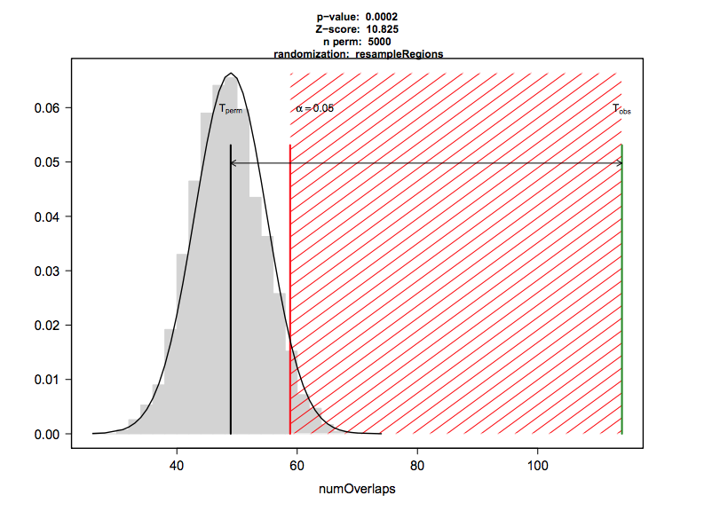

<head>

```{=html}
<script src="https://kit.fontawesome.com/ece750edd7.js" crossorigin="anonymous"></script>
```

</head>

```{r global_options, include=FALSE}
knitr::opts_chunk$set(warning=FALSE, message=FALSE)
```

::: objectives
<h2><i class="far fa-check-square"></i> Learning Objectives</h2>

  - Annotate GRanges objects with gene features
  - Compare and plot annotations of ChIP-seq peaks 
  - Run functional enrichment analyses on sets of genes
  - Combine genome annotations in *GRanges* objects with genomic data in bigWig files
  - Plot and visualise sequencing reads around genomic annotations
:::
<br>
Bioconductor has many packages for annotating, analysing and visualising genomic data. In this section we will introduce some of these packages to give you a taste of the types of analysis you can perform. Here, we focus on ChIP-seq data but these methods can be applied to many types of genomic data.

## Annotating GenomicRanges

Once you have imported data as a *GRanges* object, you will often want to annotate these with overlapping genes or other genomic features. For instance, if you have a set of ChIP-seq peaks, you may want to know how many of these peaks overlap with gene promoters, exons or intergenic regions.

There are several options for annotating GRanges objects with sets of features. *Genomation* and *ChIPpeakAnno* for instance all provide methods to do this. There are also packages like *Homer* and *DeepTools* available outside of R. Here we are going to use **ChIPseeker** to annotate sets of ChIP-seq peaks relative to gene annotations.

#### ChIP-seq data

We are going to use data from the ChIPSeeker tutorial which includes ChIP-seq peaks for CBX6 and CBX7 in human fibroblasts, 2 components of the polycomb repressive complex ([GEO GSE40740](https://www.ncbi.nlm.nih.gov/geo/query/acc.cgi?acc=GSE40740)). 

In addition, there are also ChIP-seq peaks for human andronegen receptor (AR) in cells at 3 different concentrations of andronegen ARmo_0M, ARmo_1nM, ARmo_100nM ([GEO GSE48308](https://www.ncbi.nlm.nih.gov/geo/query/acc.cgi?acc=GSE48308)).

These datasets are all aligned to the human hg19 assembly. Let's make sure you have the hg19 annotation and gene models loaded in the previous lesson:

```{r message=FALSE, warning=FALSE}
library(tidyverse)
library(GenomicRanges)

## NO NEED TO RUN THIS AGAIN IF ALREADY LOADED
library(org.Hs.eg.db)

options(timeout=600) ## This will increase the time for downloading large files

library(txdbmaker)
txdb.gff <- makeTxDbFromGFF(file = "data/Homo_sapiens.GRCh37.74.edited.gtf",format = "gtf", organism = "Homo sapiens")
```

#### Annotate peaks

Load the `ChIPseeker` library and the CBX6 peaks as a GRanges object. The `readPeakFile()` function is provided by ChIPseeker but you could also use `readBed()` from the genomation package. 

```{r}
library(ChIPseeker)

## Get the example file locations
peakFiles <- getSampleFiles()
```

Inspect all of the sample files

```{r,eval=F}
peakFiles
```

Select files for further analysis

```{r}
## Select CBX6 for further analysis
CBX6 <- readPeakFile(peakFiles[[4]])

## Inspect the GRanges object
CBX6
```

This is a GRanges object with ChIP-seq peaks. Each peak has a name and a score stored in the GRanges metadata columns. Let's visualise the distribution of CBX6 peaks along the genome.

```{r,fig.height=10}

## Plot distribution of peaks and peak heights on Chromosomes
covplot(CBX6, weightCol="V5")
```

We will now use the `txdb` object we created earlier to annotate our peaks with gene features. The promoter regions are given as +/- 3Kb around the TSS of each gene.

```{r}
## Annotate the peak regions with gene features. We can also set the level to "transcript"
peakAnno <- annotatePeak(CBX6, 
                         tssRegion = c(-3000, 3000),
                         TxDb= txdb.gff,
                         annoDb = "org.Hs.eg.db",
                         level = "gene")

peakAnno
```

This output shows us the distribution of peaks with respect to gene features. The `peakAnno` object also contains a GRanges object where our peaks are annotated with overlapping features in the metadata. 

```{r}
## Let's look at our annotated GRanges object
as.GRanges(peakAnno)
```
We now have additional columns with annotations for each peak.

#### Visualise annotations

We can visualise the distribution of peaks relative to gene features by plotting the `peakAnno` object.

```{r}
## Bar plot of peak distribution across gene features
plotAnnoBar(peakAnno)
```

Here we can see that ~60% of our peaks can be found in or around promoter regions.

We can also annotate and plot multiple peaks at once. Let's use all of the sample datasets within ChIPSeeker. To do this, we use the `map()` function from the tidyverse **purrr** package to loop through our peak files and run the `annotatePeak()` function. We will learn more about the `map()` function later. 

```{r,message=F,warning=F}
## map all of the files to the annotatePeak function to create a list of annotated peaks
library(purrr)
peakAnnoList <- map(peakFiles, ~annotatePeak(.x,
                                             TxDb=txdb.gff,
                                             tssRegion=c(-3000,3000),
                                             annoDb="org.Hs.eg.db",
                                             level="gene")
)
```

We can plot the full list with one command.

```{r}
## Plot all the sets of peaks together
plotAnnoBar(peakAnnoList)
```

We can clearly see different distributions of peaks in relation to genomic features for the AR and CBX proteins.

#### Plot peak distributions around TSS

Let's plot the positions of peaks for all samples relative to the TSS regions in our gene model. We first need to create a matrix of peaks around the TSS regions. This can take some time so we will use a pre-computed dataset.

```{r}
## Set the promoter regions
promoter <- getPromoters(TxDb = txdb.gff, upstream = 3000, downstream = 3000)

## !!! The step below takes around 10 mins to complete, in order to speed up the tutorial the data is supplied below!!!##

## Create a matrix of peak positions for each of the samples. Be patient, this will take around 10 mins to run.
#tagMatrixList <- map(peakFiles, ~getTagMatrix(.x, windows = promoter))

## Load the pre-computed tagMatrixList
data("tagMatrixList")

```

We can now plot out the matrix to see the average profile of peaks around promoter regions.

```{r}
## Plot average profiles of peak distribution across promoter regions
plotAvgProf(tagMatrixList, xlim = c(-3000, 3000), facet="row",)
```

It is possible to add errors to these plots by adding **conf** and **resample** arguments. This will add confidence intervals to the plot by re-sampling the data and calculating confidence intervals from the re-sampled data. This can take a while to run so we have not included this in the tutorial but you can try it out if you have time. 

```{r}
## Plot average profiles including confidence intervals
#plotAvgProf(tagMatrixList, xlim = c(-3000, 3000), facet = "row", conf = 0.95, resample = 1000)
```

We can also plot this as a heatmap.

```{r}
## Plot heatmaps of peak distribution across promoter regions
tagHeatmap(tagMatrixList)
```

With both plots we can see a definite enrichment of ChIP-seq peaks around the TSS in both CBX6 and CBX7.

::: resources
<h2><i class="fas fa-book"></i> Further Learning</h2>

If you are working with ChIP-seq data then it is worth going through the [ChIP-seeker tutorial](https://bioconductor.org/packages/release/bioc/vignettes/ChIPseeker/inst/doc/ChIPseeker.html) as there are many other useful functions:

  - Plotting average peak profile across gene bodies and other features
  - Functional enrichment analysis
  - Venn diagrams of peak set overlaps

:::

## Overlapping features

**Genomation** and **ChIPseeker** both have useful functions for looking at overlaps between GRanges objects.

Genomation can annotate one GRanges objet with another. For instance, we can annotate our CBX6 peaks with the promoter regions we defined earlier.

```{r}
library(genomation)
par(mfrow=c(1,1)) ## reset plotting format as ChIPseeker may have altered this

CBX6.promoters <- annotateWithFeature(CBX6, promoter, feature.name ="Promoters")
CBX6.promoters
```

```{r}
## Plot the annotation overlap as a pie chart
plotTargetAnnotation(CBX6.promoters, col=c("#0B7189", "#8FD694"), main = "CBX6")
```

Let's look at some different ChIP-seq peaks and see how they overlap with each other. We can use the `annotateWithFeatures()` function to annotate one set of peaks with multiple sets of features at once.

```{r}
## Read in CBX7 and AR1 files as GRanges
CBX7 <- readPeakFile(peakFiles[[5]])
AR1 <- readPeakFile(peakFiles[[1]])

## Annotate with multiple features
CBX.overlap <- annotateWithFeatures(CBX6, GRangesList(CBX7 = CBX7, AR1 = AR1))
CBX.overlap
```

#### Statistical testing of overlaps

It is useful to know to what extent peaks from different samples overlap and whether this overlap is statistically significant, as it may imply co-operative binding. **ChIPseeker** has a function `enrichPeakOverlap()` to calculate and test overlaps between peak sets.

The function generates a null distribution by randomly shuffling the positions of the query peaks throughout the genome and testing for overlaps with the other peaks, then repeating this many times. You should set the **nShuffle** argument to >=1000 for robust results.

```{r enrich}
epo <- enrichPeakOverlap(queryPeak = CBX6,
                  targetPeak    = unlist(peakFiles[c(1:3,5)]),
                  TxDb          = txdb.gff,
                  pAdjustMethod = "BH",
                  nShuffle      = 1000,
                  verbose       = FALSE,
                  chainFile     = NULL)
epo
```

Unfortunately, there seems to be a bug in some versions of ChIPseeker where it will return all p-values as 1. 

An alternative package, **regioneR** has a comprehensive set of functions for overlap analysis.

The regioneR package performs association analysis of overlapping features based on permutation tests. The permutation test first calculates the number of overlaps between a genomic feature and a set of given regions. To test if this number is expected by chance it also calculates a distribution of feature overlaps from numerous sets of randomised regions.

{ width=50% }

The regioneR `permTest()` function takes a while to run, so we have supplied the code below as an example but will not run this in the workshop. We can use regioneR to test the significance of overlaps between CBX6 peaks and promoter regions:

```{r regioner, eval=F}
#library(regioneR)

## Test the significance of overlaps between CBX6 and gene promoter regions.

#pt <- permTest(A = CBX6,
#               B = promoter,
#               randomize.function = randomizeRegions,
#               evaluate.function = numOverlaps,
#               count.once = T,
#               genome = "BSgenome.Hsapiens.UCSC.hg19.masked",
#               ntimes=1000)

# pt
# plot(pt)
```

When using regioneR you need to select **evaluation** and **randomisation** functions. 

Here we have evaluated the number of overlaps between regions (`numOverlaps()`). You can also evaluate the distance between regions or the mean score if your GRanges are weighted (e.g. methylation scores). 

For randomisation, we have used the `randomizeRegions()` function which selects random regions from the genome with the same length distribution as our CBX6 peaks to approximate the null distribution. We supply a repeat masked `BSgenome` so only mappable regions of the genome are selected. 

The alternative is to use `resampleRegions()`. This assumes that your regions are part of a larger set e.g. differential binding sites. You can then approximate the null distribution by randomly sampling the same number from the full set of binding sites.


::: resources
<h2><i class="fas fa-book"></i> Further Learning</h2>

All of this is described in depth in the [*regioneR* documentation](https://bioconductor.org/packages/release/bioc/vignettes/regioneR/inst/doc/regioneR.html).
:::

<br>

::: discussion
<h2><i class="far fa-bell"></i> Discussion</h2>

Can you think of other situations where we might want to look at overlaps of genomic regions?

  - Overlap of ChIP-seq peaks of replicates to test reproducibility
  - Overlap of ChIP-seq peaks from different proteins to test for co-localisation
  - Overlap of differentially expressed genes with specific genomic features
    - Chromatin marks, classes of repeats, CpG islands etc.
:::

## Functional gene enrichment

Because we have annotated CBX6 peaks with ChIPseeker we can ask if these genes are enriched for particular functional terms. We can use the **clusterProfiler** package to perform Gene Ontology (GO) enrichment analysis.

The GO database is a hierarchical structured database of gene functions. It has three main categories: Biological Process, Molecular Function and Cellular Component. Each category contains terms which are associated with sets of genes. For instance, the term "DNA binding" in the Molecular Function category is associated with a set of genes that have been experimentally shown to bind DNA.

```{r}
library(clusterProfiler)

## Get the Entrez Gene IDs for genes with a CBX6 binding site. 
## na.omit will remove all of the NA entries
CBX6.gene <- na.omit(peakAnno@anno$ENTREZID)
head(CBX6.gene)

##Run the GO enrichment analysis
ego <- enrichGO(gene          = CBX6.gene,
                OrgDb         = org.Hs.eg.db,
                ont           = "ALL", ## We could select all or just one of the categories (BP, MF or CC)
                pAdjustMethod = "BH", ## This is the statistical method used to adjust p-values for multiple testing. BH is the Benjamini-Hochberg method which controls the false discovery rate. We will look at this in the statistics course
                qvalueCutoff  = 0.05,
                readable      = TRUE)
```

Let's take a look at the top enriched terms. The "p.adjust" column gives the adjusted p-value for each term, the "geneID" column gives the genes associated with each term and the "Count" column gives the number of genes associated with each term.

```{r,fig.height=8}

## Inspect the top 20 enriched terms
head(ego)

## Plot the top 20 enriched terms
barplot(ego, showCategory=20, colorBy = "p.adjust")
```

We can also plot a network of the top enriched terms and their associated genes. We will just choose the top 5.

```{r,fig.height=10}
## Plot a network of the top 8 enriched terms and their associated genes
cnetplot(ego, showCategory = 5)
```


::: resources
<h2><i class="fas fa-book"></i> Further Learning</h2>

**clusterProfiler** also provides methods to query pathway databases such as KEGG. You can find out more in the [documentation](https://bioconductor.org/packages/release/bioc/vignettes/clusterProfiler/inst/doc/clusterProfiler.html).

:::

<br>

The **gprofiler2** package is a wrapper for the online tool [g:Profiler](https://biit.cs.ut.ee/gprofiler/gost) which looks at many different databases at once including GO, KEGG and transcription factor motifs. g:Profiler performs functional enrichment analysis of gene lists and will understand and convert Ensembl identifiers directly.

```{r}
library(gprofiler2)

## Get a table of enriched terms with the gost function
gp <- gost(query = peakAnno@anno$geneId,
           organism = "hsapiens", 
           ordered_query = FALSE, 
           multi_query = FALSE,
           significant = TRUE,
           exclude_iea = TRUE,
           user_threshold = 0.05,
           correction_method = "g_SCS", 
           domain_scope = "annotated",
           custom_bg = NULL)
```

Inspect the output. The "term_name" column is the enriched term and the "source" tells us which database it belongs to. 

```{r}
## Inspect the output
gp$result
```

There is an interactive plot function built into **gprofiler2** to visualise enriched terms.

```{r}
## Plot gprofiler output
gostplot(gp, capped = TRUE, interactive = TRUE)
```

## Plot sequencing read profiles across genomic regions with soGGi

A common task in sequencing analysis is to plot profiles of particular signals across regions of interest. For instance ChIP-seq reads across the TSS regions of genes. You've probably guessed by now but there are many different ways to do this in R! Here we will introduce **soGGi** which is one of the more intuitive packages. 

#### Data

First, make sure you have hg19 gene data imported from a BED file in the previous lesson.

```{r}
hg19.genes <- readGeneric("data/Ensembl.GRCh37.74.edited.genes.bed",
                          chr = 1,
                          start = 2,
                          end = 3,
                          strand = 6,
                          meta.cols = list(name = 4,
                                           symbol = 5,
                                           biotype = 7))

hg19.pc.genes <- subset(hg19.genes, hg19.genes$biotype == "protein_coding")
```

Next, we need to select the data to plot, these are our tracks. We are going to plot ChIP-seq read profiles for two histone modifications, H3K4me3 and H3K27me3. H3K4me3 is a mark of active promoters and H3K27me3 is a mark of repressed chromatin.

These data are stored in **bigWig** files and represent coverage profiles of aligned reads across a genome. They have four columns:

  - Chromosome
  - Start_position
  - End_position
  - Score
  
In this case, the score represents sequencing read coverage at each position. Enriched read coverage across a region of interest (e.g. TSS) indicates the presence of a particular chromatin mark.

```{r}
## This is the data we intend to plot. We can supply the file paths of bigWig files directly to soGGi without importing the data to R.

## H3K4me3 ChIP-seq read profiles
H3K4me3.chip <- "data/H3K4me3.bw"

## H3K27me3 ChIP-seq read profiles
H3K27me3.chip <- "data/H3K27me3.bw"

```  


#### Average profile plots

Load the *soGGi* library and run the `regionPlot()` function for each track.

The `regionPlot()` function creates a matrix of binned scores across genomic regions. The default is to bin each region into 100 bins and calculate the average coverage per base. This gives us a matrix where rows are regions and columns are bins. The function will stranded features by reversing bins for features on the negative strand.

The `regionPlot()` function works with BAM files and bigwig files. Here, we supply a bigWig file and our hg19 protein coding genes.

```{r}
library(soGGi)

rp <- regionPlot(bamFile = H3K4me3.chip,
                 testRanges = hg19.pc.genes,
                 format = "bigwig",
                 style = "percentOfRegion")

rp2 <- regionPlot(bamFile = H3K27me3.chip,
                  testRanges = hg19.pc.genes,
                  format = "bigwig",
                  style = "percentOfRegion")
```

Take a look at the `rp` object. This is a special class of object called `ChIPprofile` which contains the GRanges, scores and metadata.

```{r}
## R object with multiple 'slots'
rp

## GRanges object of regions stored here
rp@rowRanges

## Matrix of scores across regions stored here
rp@assays@data
```

By calculating the average score across all regions for each bin, we can plot an average profile plot.

```{r}
## Concatenate the chipProfile objects into a single object
rpc <- c(rp, rp2)

## Plot the chipProfiles
plotRegion(rpc, colourBy = "Sample")
```

The output is a ggplot object. This means we can customise the output further with ggplot functions. For instance we can change the theme, labels and colours.

```{r}
## Plot average profiles
plotRegion(rpc,colourBy = "Sample") +
  theme_bw() +
  labs(x = "Position relative to Gene", y = "Average coverage") +
  scale_colour_manual(values = c("#3D405B", "#E07A5F"))
```


::: resources
<h2><i class="fas fa-book"></i> Further Learning</h2>

The [**soGGi**](https://www.bioconductor.org/packages/release/bioc/vignettes/soGGi/inst/doc/soggi.pdf) package has many more customisation options for plotting average profiles. Take a look through the tutorial to see how you can adjust the regions to plot, the flank sizes, number of windows and smoothing options.

:::

## Heatmaps with profileplyr

The **profileplyr** package has many functions for importing, manipulating and visualising score matrices like the ones we created in soGGi. We can convert our `ChIPprofile` object to a `profileplyr` object and then use the `generateEnrichedHeatmap()` function to plot heatmaps of our ChIP-seq read profiles across the TSS regions of genes.

```{r}

library(profileplyr)

## convert chipProfile object to profileplyr object
pp <- as_profileplyr(rpc)

## pipe profileplyr object to enrichedHeatmap
pp |> generateEnrichedHeatmap()
```
  
::: resources
<h2><i class="fas fa-book"></i> Further Learning</h2>

The [*profileplyr*](https://www.bioconductor.org/packages/release/bioc/vignettes/profileplyr/inst/doc/profileplyr.html) package leverages many Bioconductor packages to make it easy to manipulate and visualise profile data. It also works with packages outside of R like *deepTools*.

:::

#### Grouping genes in heatmaps

We can put genes into different groups to plot them separately. 

Let's plot our histone modification data based on high and low expression of genes from RNA-seq data.

```{r}
## Read in gene expression values calculated from RNA-seq data

exp <- read.table("http://bifx-core3.bio.ed.ac.uk/Shaun/Shaun/training/ROI_workshop/data/rna-seq_expression.tab",header=T,sep="\t")

exp
```
This table contains gene IDs and their expression values in TPM (transcripts per million). We will use the expression values to group genes into high and low expression groups and then plot the ChIP-seq read profiles for these groups separately.

```{r}

## Remove genes with no expression: != means not equal to in R.
exp <- exp |> filter(!Expression.tpm == 0)

## Order by expression and take the top 2000 gene IDs
high <- exp |> arrange(desc(Expression.tpm)) |> slice(1:2000) |> pull(geneID)
low <- exp |> arrange(Expression.tpm) |> slice(1:2000) |> pull(geneID)

## Create a list of high and low expressed gene names
exp_list = list(high = high, low = low)
```

We can now use the **groupBy** function in profileplyr to group these genes together in plots. Grouping can be performed with gene IDs, as we have done here, but also by overlapping ranges or clustering. See the profileplyr manual for more examples.

```{r}
## By default, profileplyr expects our ranges to have a column called SYMBOL. This doesn't exist in our data so we are going to copy from the gene names column. This is the quickest way to do this in this tutorial

pp@rowRanges$SYMBOL = pp@rowRanges$names

## group by the genes in out expression list
pp |> groupBy(group = exp_list) |> generateEnrichedHeatmap()
```

We can see that the H3K4me3 mark is enriched around the TSS of highly expressed genes and depleted around lowly expressed genes, which is what we would expect. The opposite is true for H3K27me3 which is a mark of repressed chromatin.

We can also use profileplyr functions to create average profile plots similar to the ones created with soGGi.

```{r}
pp |> groupBy(group = exp_list) |> generateProfilePlot() +
  labs(x = "Position relative to Gene", y = "Average coverage", colour = "Expression level") +
  scale_colour_manual(values = c(high = "#E63946",low = "#1D3557"))
```

## Other Bioconductor packages

In the remaining time, have a look at some of the other Bioconductor packages available and see if you can follow their tutorials. Here are a few ideas:

  - Genome browser plotting and visualisation
    - [Karyoploter](http://bioconductor.org/packages/release/bioc/html/karyoploteR.html)
    - [ggbio](https://bioconductor.org/packages/release/bioc/html/ggbio.html)
    - [trackViewer](https://bioconductor.org/packages/release/bioc/html/trackViewer.html)
    - [GViz](https://bioconductor.org/packages/release/bioc/html/Gviz.html)
  - Average profile and heatmap plots
    - [EnrichedHeatmap](https://bioconductor.org/packages/release/bioc/html/EnrichedHeatmap.html)
    - [soGGi](https://bioconductor.org/packages/release/bioc/html/soGGi.html)
    - [profileplyr](https://www.bioconductor.org/packages/release/bioc/html/profileplyr.html)
  - Sequence alignment logos
    - [seqlogo](https://bioconductor.org/packages/release/bioc/vignettes/seqLogo/inst/doc/seqLogo.html)
  - HiC data analysis
    - [HiCbricks](https://www.bioconductor.org/packages/release/bioc/html/HiCBricks.html)
    - [HiCcompare](https://bioconductor.org/packages/release/bioc/html/HiCcompare.html)
  - RNA-seq differential expression 
    - [DESeq2](https://bioconductor.org/packages/release/bioc/html/DESeq2.html)
  - Methylation analysis
    - [methylKit](https://www.bioconductor.org/packages/release/bioc/vignettes/methylKit/inst/doc/methylKit.html)

<br>

::: keypoints
<h2><i class="fas fa-thumbtack"></i> Key points</h2>

**Bioconductor** has a large library of packages for analysing and visualising genomic datasets.

:::


