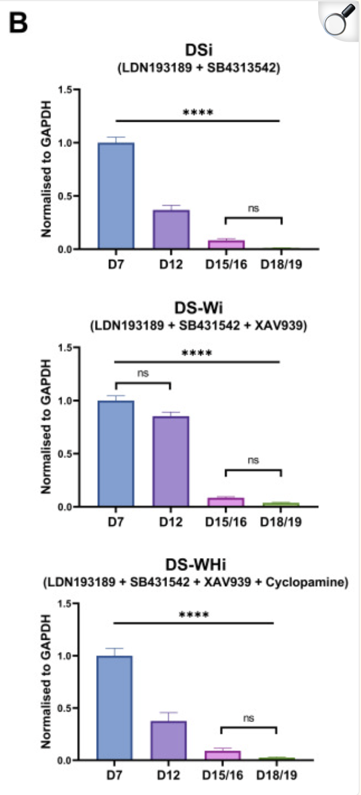

<head>

```{=html}
<script src="https://kit.fontawesome.com/ece750edd7.js" crossorigin="anonymous"></script>
```

</head>

```{r global_options, include=FALSE}
knitr::opts_chunk$set(warning=FALSE, message=FALSE)
```

::: objectives
<h2><i class="far fa-check-square"></i> Learning Objectives</h2>
  - Download and tidy a qPCR dataset
  - Plot the data with ggplot2
  - Perform statistical analysis
  - Compare results with the original paper
:::

## Task

In this exercise, you will be working with a qPCR dataset from a publication by Lee et al. (2020) investigating the role of APOE in human neural stem cell maintenance. You will download the dataset, tidy it, perform statistical analysis, and plot the results. Finally, you will compare your results with those reported in the original paper.

## Paper summary

[Lee et al. (2020)](https://pmc.ncbi.nlm.nih.gov/articles/PMC7355222/) investigated the role of APOE in human neural stem cell maintenance.

Apolipoprotein E (APOE) is a multifunctional protein that plays significant roles in important cellular mechanisms in peripheral tissues and is also expressed in the central nervous system, notably by adult neural stem cells (NSCs) in the hippocampus. 

Evidence from animal studies suggest that APOE is critical for adult NSC maintenance. However, whether APOE has the potential to play a similar role in human NSCs has not been directly investigated. To address this question, we conducted a focused study characterising APOE gene and protein expression in an in vitro model of neural differentiation utilising human induced pluripotent stem cells. 

They found that APOE gene expression dramatically decreased as the cells became more differentiated, indicating that APOE expression levels reflect the degree of cellular differentiation during neural induction.

Figure 2B from the paper shows the qPCR results for APOE expression across different days of differentiation for three different differentiation lineages (DSi, DS-Wi, DS-WHi). 

The data is presented as fold change normalised to GAPDH and relative to the day 7 samples.

The statistical analysis was performed using ANOVA with Bonferroni correction for multiple comparison.

{fig-align="center" width="30%"}

## Data

Start with this dataset, which contains the raw C(t) values for APOE and GAPDH across different days of differentiation for three different differentiation lineages (DSi, DS-Wi, DS-WHi).

[Lee et al. (2020) qPCR dataset](https://bifx-core3.bio.ed.ac.uk/training/DSB/data/APOE_qpcr.csv)

The [published dataset](https://figshare.com/articles/dataset/raw_data_for_qPCR/12136944?file=22319013) is available via Figshare. It contains the intermediate calculations used to group replicates, normalise and calculate delat C(t) and fold change. You might want to use this to check your intermediate results as you work through the exercise.

## Analysis steps

1. Load and explore the data
2. Tidy the data
3. Calculate delta C(t) and fold change
4. Run ANOVA analysis for statistical testing
5. Normalise fold change for plotting
6. Calculate means for plotting
7. Plot the data
8. Add the statistical results to the plot

::: resources
<h2><i class="far fa-bell"></i> Resources</h2>

### What is ANOVA? 

We did not cover ANOVA in the lessons. ANOVA, or analysis of variance, is a statistical test used to compare the means of three or more groups. In this case, we want to compare the delta C(t) values across different days of differentiation for each differentiation lineage.

ANOVA is a parametric test with the following assumptions:

- The data is normally distributed within each group
- The variance of the data is similar across groups

There are two steps to performing ANOVA analysis: 

  - First, run the ANOVA test to determine if there are any significant differences between the groups. 
  - If the ANOVA test is significant, you then run post-hoc tests to identify which groups are significantly different from each other. 
  
The most common post-hoc test for ANOVA is the Tukey HSD test, which compares all pairs of groups and adjusts for multiple comparisons.

[Datanovia](https://www.datanovia.com/en/lessons/anova-in-r/) has a great tutorial on how to perform ANOVA analysis in R using the `rstatix` package. 

:::


## Load and explore the data

```{r}
## Load libraries
library(tidyverse)
library(rstatix)
library(ggpubr)
```

Now load the data and explore it.

::: hints
<h2><i class="fas fa-magnifying-glass"></i> Solution</h2>

<details>
<summary>
</summary>
::: solution

```{r}
qpcr <- read_csv("https://bifx-core3.bio.ed.ac.uk/training/DSB/data/APOE_qpcr.csv")
summary(qpcr)
```

:::
</details>
:::

## Tidy the data

The data is not in a tidy format as the sample name contains information about the differentiation lineage, day of differentiation, biological replicate and technical replicate. We need to tidy the data by separating the sample name into these different variables and setting categorical variables as factors.

::: hints
<h2><i class="fas fa-magnifying-glass"></i> Solution</h2>

<details>
<summary>
</summary>
::: solution

```{r}
## Separate sample column and set categorical variables as factors
qpcr_tidy <- qpcr |>
  separate(Sample, into = c("Diff", "Day", "Biological_rep","Technical_rep"), sep = "_") |>
  mutate(Biological_rep = Biological_rep |> str_remove("Biological Replicate "),
         Technical_rep = Technical_rep |> str_remove("Technical Replicate "),
         Diff = factor(Diff, levels = c("DSi", "DS-Wi", "DS-WHi")),
         Day = factor(Day, levels = c("D7", "D12", "D15/16", "D18/19"), ordered = T)
         )

qpcr_tidy
summary(qpcr_tidy)
```

:::
</details>
:::

## Calculate delta C(t) and fold change

Calculate the mean C(t) for APOE and GAPDH for each sample, then calculate the delta C(t) for each sample. The mean for APOE and GAPDH should be calculated across **technical replicates** for each biological replicate. The delta C(t) should be calculated for each biological replicate separately.

The fold change should be calculated using the formula: 

$$
Fold~Change = 2^{-ΔΔCt}
$$

Where ΔΔCt is the difference between the delta C(t) for APOE and the controls (GAPDH).

This will give you the fold change for each biological replicate for each differentiation lineage and day.

You can refer to the case study in lesson 1 for more information on qPCR analysis.

::: hints
<h2><i class="fas fa-magnifying-glass"></i> Solution</h2>

<details>
<summary>
</summary>
::: solution

```{r}
qpcr_mean <- qpcr_tidy |>
  group_by(Diff, Day, Biological_rep) |>
  summarise(mean_APOE_Ct = mean(`APOE_C(t)`),
            mean_GAPDH_Ct = mean(`GAPDH_C(t)`)) |>
  ungroup() |>
  mutate(delta_Ct = mean_APOE_Ct - mean_GAPDH_Ct,
         fold_change = 2^(-delta_Ct))

qpcr_mean
```

:::
</details>
:::

## Check if the data is normally distributed

The authors use ANOVA, which is a parametric test that assumes the data is normally distributed. We should check if our delta C(t) values are normally distributed before running the ANOVA. We want to check per group so will need to group by Diff and Day.

```{r}
qpcr_mean |> 
  group_by(Diff,Day) |> 
  shapiro_test(delta_Ct)
```

The data is normally distributed in each group as the p-value is greater than 0.05.

Parametric tests also assume homogeneity of variance, which means that the variance of the data should be similar across groups. We should also check this assumption before running the ANOVA. The delta C(t) values should be similar across groups. We can check this using the `levene_test()` function.

```{r}
qpcr_mean |> 
  group_by(Diff) |> 
  levene_test(delta_Ct ~ Day)
```

The data has homogeneity of variance within each differentiation as the p-value is greater than 0.05.

Both assumptions for ANOVA are met, so the authors were correct to select ANOVA for this analysis.

## Run ANOVA analysis for statistical testing

ANOVA is a statistical test used to compare the means of three or more groups. In this case, we want to compare the delta C(t) values across different days of differentiation for each differentiation lineage.

For each differentiation lineage, run a one-way ANOVA to test for differences in delta_CT across days. 

Use bonferroni correction to adjust the p-values for multiple comparisons.

**HINT** you can use the `anova_test()` function from the `rstatix` package to run the ANOVA and the `adjust_pvalue()` function to adjust the p-values for multiple comparisons.

::: hints
<h2><i class="fas fa-magnifying-glass"></i> Solution</h2>

<details>
<summary>
</summary>
::: solution


```{r}
anova_results <- qpcr_mean |>
  group_by(Diff) |>
  anova_test(delta_Ct ~ Day) |>
  adjust_pvalue(method = "bonferroni") |>
  add_significance()
```

:::
</details>
:::

If the ANOVA is significant, we then want to run *post-hoc* tests to identify which days are significantly different from each other.

The most common post-hoc test for ANOVA is the Tukey HSD test, which compares all pairs of groups and adjusts for multiple comparisons. There is an rstatix function that can be used to run the Tukey HSD test.

::: hints
<h2><i class="fas fa-magnifying-glass"></i> Solution</h2>

<details>
<summary>
</summary>
::: solution

```{r}
posthoc_results <- qpcr_mean |>
  group_by(Diff) |>
  tukey_hsd(delta_Ct ~ Day) |>
  add_significance()
```

:::
</details>
:::

## Relative fold change for plotting

In the paper, they plotted the fold change values relative to the mean of the D7 samples for each differentiation lineage.

Calculate the fold change values relative to the mean of the D7 samples for each differentiation lineage. The mean of D7 samples should be calculated across biological replicates for each differentiation lineage.

**HINT** You can add a new column to your dataframe that contains the mean fold change for D7 samples for each differentiation lineage e.g.

`mutate(mean_D7_fc = mean(fold_change[Day == "D7"]))`

::: hints
<h2><i class="fas fa-magnifying-glass"></i> Solution</h2>

<details>
<summary>
</summary>
::: solution

```{r}
qpcr_relative <- qpcr_mean %>%
  group_by(Diff) %>%
  mutate(
    mean_D7_fc = mean(fold_change[Day == "D7"]),
    relative_fc = fold_change / mean_D7_fc
  ) |>
  ungroup()

qpcr_relative
```

:::
</details>
:::

## Calculate means for plotting

Finally, they calculated the mean fold change values for each differentiation lineage and day to plot the data. They also calculated the standard error of the mean (SEM) for each differentiation lineage and day to add error bars to the plot.

Calculate the mean and SEM (standard error of the mean) for relative fold change for each differentiation lineage and day. The mean should be calculated across biological replicates for each differentiation lineage and day. SEM can be calculated using the formula:

$$
SEM = \frac{SD}{\sqrt{n}}
$$
Where SD is the standard deviation of the relative fold change values for each differentiation lineage and day, and n is the number of biological replicates for each differentiation lineage and day. 

**HINT** you can use `sd()` to calculate the standard deviation and `n()` to calculate the number of biological replicates for each differentiation lineage and day.

::: hints
<h2><i class="fas fa-magnifying-glass"></i> Solution</h2>

<details>
<summary>
</summary>
::: solution

```{r}
qpcr_rel_means <- qpcr_relative |>
  group_by(Diff, Day) |>
  summarise(mean_relative_fc = mean(relative_fc),
            sd_relative_fc = sd(relative_fc),
            n = n(),
            se_relative_fc = sd_relative_fc / sqrt(n)) |>
  ungroup()

qpcr_rel_means
```

:::
</details>
:::


## Plot the data

Make a bar plot of mean fold change per differentiation lineage and day. Split the plot by differentiation lineage. Colour the bars by day.

**HINT** look at `geom_col()` and `geom_errorbar()` for plotting the data.

::: hints
<h2><i class="fas fa-magnifying-glass"></i> Solution</h2>

<details>
<summary>
</summary>
::: solution

```{r}

day_cols <- c("D7" = "#7DA0D4", "D12" = "#A48AD3", "D15/16" = "#E996EF", "D18/19" = "#83B355")

qpcr_plot <- ggplot(qpcr_rel_means, aes(x = Day, y = mean_relative_fc,
                         fill = Day, colour = Day)) +
  geom_col() +
  geom_errorbar(aes(ymin = mean_relative_fc - se_relative_fc, 
                    ymax = mean_relative_fc + se_relative_fc),
                width = 0.2) +
  scale_fill_manual(values = day_cols) +
  scale_colour_manual(values = day_cols) +
  labs(x = "", y = "Normalised to GAPDH") +
  guides(fill = "none", colour = "none") +
  theme_minimal() +
  coord_cartesian(ylim = c(0, 2)) +
  facet_wrap(~ Diff, nrow = 1)

qpcr_plot
```

:::
</details>
:::

## Add the statistical results to the plot

Use the results from the post-hoc tests to add significance bars to the plot. You can use the `stat_pvalue_manual()` function from the `ggpubr` package to add the significance bars.

This will be a bit tricky as we have faceting in our plot, so we need to manually set the y-positions for our brackets.

::: hints
<h2><i class="fas fa-magnifying-glass"></i> Solution</h2>

<details>
<summary>
</summary>
::: solution

```{r}
# We want to manually set the bracket positions to handle the faceting in our plot

ph_res <- posthoc_results |> 
  group_by(Diff) |>
  mutate(y.position = case_when(
    Diff == "DSi" ~ c(1.2, 1.3, 1.4, 1.5, 1.6, 1.7),
    Diff == "DS-Wi" ~ c(1.2, 1.3, 1.4, 1.5, 1.6, 1.7),
    Diff == "DS-WHi" ~ c(1.2, 1.3, 1.4, 1.5, 1.6, 1.7)
  )) |>
  ungroup()

## Add stat_pvalue_manual to the plot
qpcr_plot + stat_pvalue_manual(ph_res, label = "p.adj.signif", tip.length = 0.01)
```

:::
</details>
:::

## Compare results with the original paper

  - Are the relative fold-changes the same?
  - Are the SEM error bars the same?
  - Are the significant differences between days the same?
  
There isn't a lot of information in the paper about how they performed the statistical analysis, where do you think the differences in results might be coming from?

This is why it is important to publish the code used to perform the analysis alongside the paper, so that others can reproduce the results and understand how the analysis was performed.


