<head>

```{=html}
<script src="https://kit.fontawesome.com/ece750edd7.js" crossorigin="anonymous"></script>
```

</head>

```{r global_options, include=FALSE}
knitr::opts_chunk$set(warning=FALSE, message=FALSE)
```

::: {.box .objectives}
<h3><i class="far fa-check-square"></i> Learning Objectives</h3>

-   Understand population sampling
-   Learn to perform hypothesis tests
-   Learn to interpret test statistics and p-values
:::

Inferential statistics allow us to make predictions. We can use data from a sample to make inferences about the population from which the sample was drawn. This is important as it is often impossible to measure an entire population due to factors such as large numbers, cost, ethics, and other practicalities.

We can express predictions about a population in degrees of confidence (confidence intervals) or in terms of significance (p-values) and use inferences to look for differences between sample groups.

## Sampling and the Central Limit Theorem

When we measure or collect a sample from a population, we are trying to estimate a population parameter (e.g. mean, variance). However, any summary statistic we calculate from our sample (e.g. mean weight of a mice, lengths of a petal or expression of a gene) is likely to be different to that of the population due to sampling error.

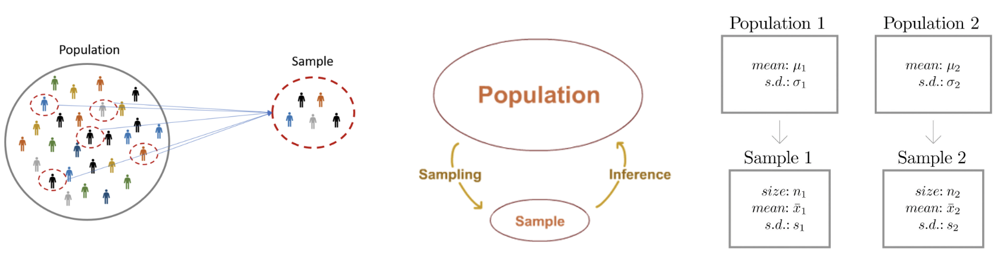

#### Population

All objects of interest. Too big or too difficult to measure. We do not know the statistic we are interested in (e.g. mean) or its distribution.

#### Sample

We know the sample size, mean, spread, distribution etc. This gives us a best guess of the population statistic if properly selected. A sample that is large and randomly selected should be a good representation of the entire population.

#### Sampling error

No sample is a perfect representation of the population. The sample mean is unlikely to be the population mean. If we sample multiple times, individual samples are likely to have different means. The sampling error is the difference between the sample statistic and the true population parameter. The sampling error can be reduced by increasing the sample size, but it can never be completely eliminated.

### Central Limit Theorem (CLT)

The **central limit theorem** states that if you take enough samples from any population, the means of those samples will follow a normal distribution.

By repeatedly sampling a from a population we can build a distribution of sample means (or other statistics). This is called the **sampling distribution**. The sampling distribution of the mean will be approximately normal if the sample size is large enough.

This is a powerful result because it allows us to make inferences about the population mean using the sample mean and standard error, even if the population distribution is not normal.

We can see this in practice by simulating sampling from a population distribution and plotting the sampling distribution of the mean.

```{r}
library(tidyverse)
library(patchwork)
library(rstatix)
library(ggpubr)

set.seed(123)

# Population of 10000 values with a Poisson distribution
population <- rpois(10000, lambda = 5)
hist(population)

# Take a random sample of 30 values from this distribution 1000 times and calculate the mean of each sample to build the sampling distribution of the mean
sample_means <- replicate(1000, mean(sample(population, size = 30, replace = TRUE)))

## Plot the sampling distribution of the mean
hist(sample_means, breaks = 30, main = "Sampling Distribution of the Mean", xlab = "Sample Mean")

```

### Standard error (SE)

The **standard error** (SE) is the standard deviation of the sampling distribution and represents the dispersion of sample means around the population mean. It is a measure of how accurately a sample can estimate the population.

The SE can be estimated from a single sample using its standard deviation (SD) and sample size (n).

It is common to mistake standard error (SE) and standard deviation (SD). The standard deviation is a measure of variability in the data, while the standard error is a measure of how much the sample mean is expected to vary from the true population mean.

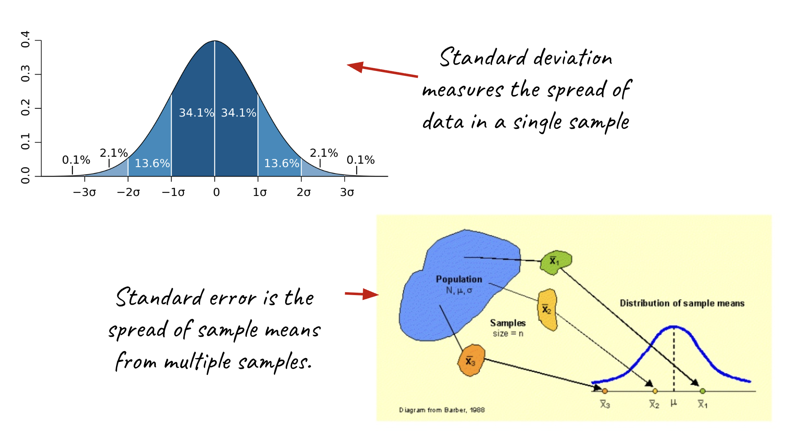

To calculate the standard error of the mean, we can use the formula:

$$\text{SE} = \frac{\text{SD}}{\sqrt{n}}$$

Where SD is the standard deviation of the sample and n is the sample size. As the sample size increases, the standard error decreases, indicating that our estimate of the population mean becomes more precise.

```{r}
# Example of calculating standard error

# Sample of 100 values from a normal distribution
sample_data <- rnorm(100, mean = 5, sd = 2) 

sample_mean <- mean(sample_data)
sample_sd <- sd(sample_data)
sample_size <- length(sample_data)

standard_error <- sample_sd / sqrt(sample_size)

standard_error
```

A standard error of \~0.2 indicates that the sample mean is expected to vary by about 0.2 from the true population mean. The standard error quantifies the uncertainty associated with our sample statistic and is crucial for constructing confidence intervals and conducting hypothesis tests.

## Hypothesis testing

We can test a hypothesis about a parameter in a population (e.g. the mean) using data collected from a sample. Hypothesis tests provide our predictions with degrees of confidence and statistical significance.

### Hypothesis testing in 6 steps:

1.  Specify a null hypothesis H0
2.  Specify the alternative hypothesis H1
3.  Set the significance level 𝝰 (often 0.05)
4.  Calculate the test statistic using an appropriate test
5.  Compare the test statistic to the null distribution to acquire a p-value
6.  Draw a conclusion: Accept or reject H0

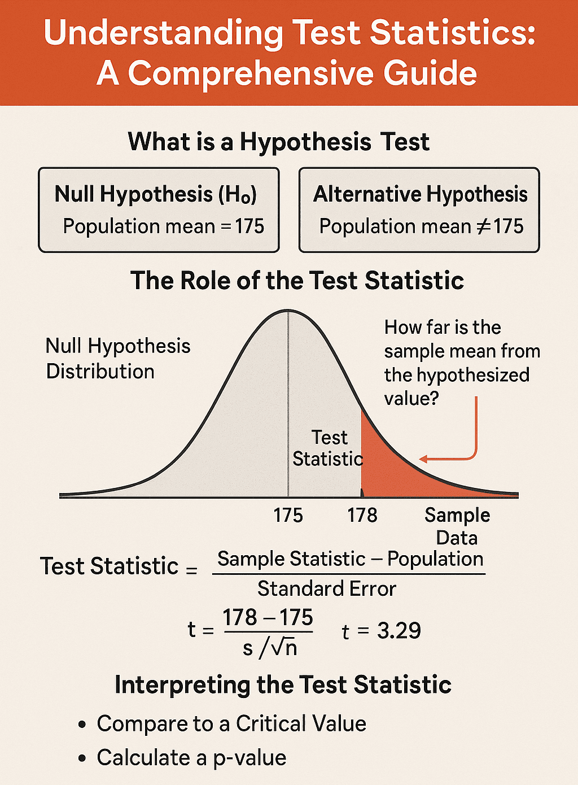{fig-align="center" width="50%"}

## Define a hypothesis

We are testing a hypothesis, not the data, so it is important to define this correctly. Hypotheses should be formulated from biological concepts rather than cherry picking data that looks different (p-hacking).

Hypothesis testing tells us if our results are surprising and how likely they are to be the product of chance. We need to define a **null hypothesis** and an **alternative hypothesis** to test our data against.

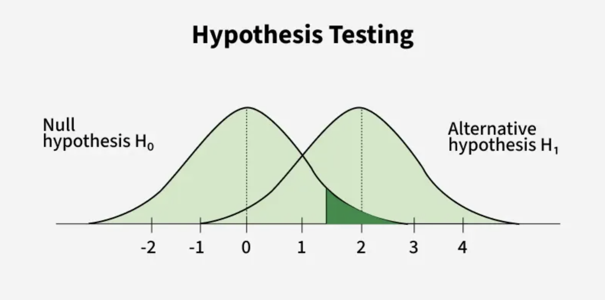{fig-align="center" width="50%"}

#### Null Hypothesis H0

The null hypothesis corresponds to the absence of an effect. We start our hypothesis test by defining the null hypothesis and assuming that it is true. For example, there is no difference between the expression level of geneA in WT and KO cells.

#### Alternative Hypothesis H1

The alternative hypothesis encompasses all of the possible outcomes that aren’t included in the null hypothesis. We cannot prove the alternative hypothesis. We can only choose to reject the null hypothesis based on the data we have! For example, there is a difference in the expression level of geneA between WT and KO cells.

## Set a significance level

The significance level (𝝰) is the threshold for rejecting the null hypothesis. It is often set at 0.05, which means that we are willing to accept a 5% chance of rejecting the null hypothesis when it is actually true (false positive).

You can make the significance level more or less stringent depending on the risks associated with false positives in your experiment. For instance, in a clinical trial for a new drug, you might want to set a more stringent significance level (e.g. 0.01) to reduce the risk of false positives, while in an exploratory study, you might be more lenient (e.g. 0.1) to allow for more discoveries.

## Statistical tests

There are many different types of statistical tests available, and the choice of test depends on your data and the question you are trying to answer.

-   **Type of data**
    -   Continuous
    -   Discrete
    -   Binary
    -   Categorical
-   **Data structure**
    -   Comparing 1 sample group to a hypothetical value
    -   Comparing 2 sample groups (e.g. WT and mutant)
    -   Comparing 3 or more sample groups
-   **Variables**
    -   One variable (e.g. gene expression)
    -   Two variables (e.g. gene expression and treatment)
-   **Distribution of your the data**
    -   Parametric or non-parametric

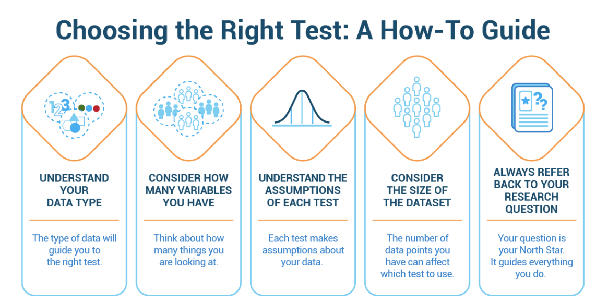{fig-align="center" width="75%"}

To make inferences or predictions from sampled data we first need to understand how the data in our samples are distributed. If the data fits a known probability distribution (parametric) then we can use those parameters in our statistical analysis.

### Parametric or non-parametric?

Parametric data fits a known distribution and has specific properties. Specific tests are available only if the data is parametric and fits certain assumptions. A trap researchers often fall into is to use a parametric test without checking if the data meets the assumptions of that test. This can lead to incorrect conclusions.

Parametric tests usually require your data to be normally distributed! You can check for normality by plotting or using a **Shapiro Wilk test**.

A Shapiro Wilk test tests the null hypothesis that the data is normally distributed. If the p-value is less than your significance level (e.g. 0.05), you can reject the null hypothesis and conclude that the data is not normally distributed.

You can use the base R function `shapiro.test()` or the `shapiro_test()` function from the rstatix to perform a Shapiro Wilk test.

:::: {.box .challenge}
<h3><i class="fas fa-pencil-alt"></i> Challenge:</h3>

The data frame below contains the observed times taken for mice to complete a maze. The mice are divided into two sample groups (dietA and dietB). Check if the data is normally distributed in each group and decide if you can use a parametric test to compare times between the two groups of samples.

You can use visualisation and/or a `shapiro_test()` to check for normality.

Does transforming the data to make it more normal?

```{r}
set.seed(123)

# Simulated data for two groups of mice
dietA <- rnorm(30, mean = 5, sd = 1)
dietB <- rexp(30, rate = 0.5)
maze_data <- tibble(
  time = c(dietA, dietB),
  diet = factor(rep(c("dietA", "dietB"), each = 30))
)

```

<details>

<summary>

</summary>

::: {.box .solution}
<h2><i class="far fa-eye"></i> Solution:</h2>

Visualise and test for normality.

```{r}
# Example of shapiro wilk test for normality
set.seed(123)

# Draw histograms
maze_data |>
  ggplot(aes(x = time)) +
  geom_histogram(bins = 30, fill = "grey80",colour="black") +
  theme_bw() +
  facet_wrap(~ diet)

# Compare both groups with a boxplot
maze_data |>
  ggplot(aes(x = diet,y = time, fill = diet)) +
  geom_boxplot() +
  theme_bw()

## Test normality with a shapiro test using rstatix package
maze_data |>
  group_by(diet) |>
  shapiro_test(time)

```

The data for dietA is normally distributed (p-value \> 0.05) but the data for dietB is not normally distributed (p-value \< 0.05). Therefore, we cannot use a parametric test to compare the two groups of samples.

If we log transform the data, we can check if it becomes more normal.

```{r}
# Log transform the data
maze_data <- maze_data |>
  mutate(log_time = log(time))

# Visualise the log transformed data
maze_data |>
  ggplot(aes(x = log_time)) +
  geom_histogram(bins = 15, fill = "steelblue", colour="grey80") +
  theme_bw() +
  facet_wrap(~ diet)

# Test for normality again
maze_data |>
  group_by(diet) |>
  shapiro_test(log_time)
```

The log transformation has made the data for dietB more normal (p-value \> 0.05), so we can now use a parametric test to compare the log(means) between the two groups.
:::

</details>
::::

#### Non-parametric tests

**Non-parametric tests** are distribution free tests. They often work on the ranks of ordered data rather than the values themselves. A non-parametric test will give you less statistical power so it is always better to use a parametric test if your data meets the assumptions. For each parametric test, there is usually a non-parametric equivalent.

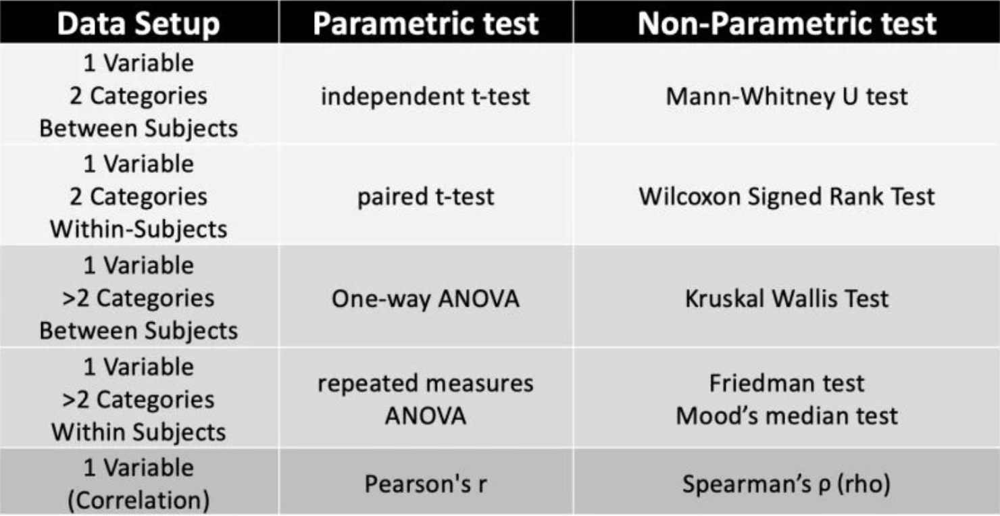{fig-align="center" width="70%"}

### Choosing a statistical test

Your choice of statistical test will depend on the data you have and the question you are trying to answer. 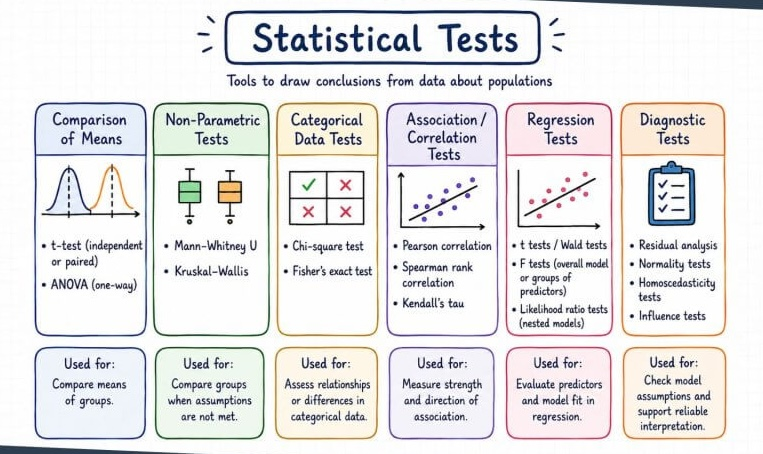{fig-align="center" width="75%"}

There are many online resources to choose the correct test for your data, or you can consult with a statistician or AI (with a clear description of your data and question) to help you choose the right test.

::: {.box .resources}
<h3><i class="fas fa-book"></i> Resources</h3>

The resources below are a good starting point for learning about different types of statistical tests and when to use them.

-   [Statistics in research](https://irrespub.com/statistical-tests-in-biomedical-research/)
-   [Selecting a statistical test](https://www.graphpad.com/support/faqid/1790/)
-   [Comparing means in R](http://www.sthda.com/english/wiki/comparing-means-in-r)
-   [Choosing a statistical test](https://www.biostathandbook.com/testchoice.html)
:::

## Comparing the means of two groups

A common question in biology is whether there is a difference in the mean of a variable between two groups (e.g. WT vs KO cells, before/after treatment).

**Example: Weights of plants**

The `PlantGrowth` dataset contains the weight of plants in three different groups (control, treatment 1 and treatment 2). The treatments are different types of fertilizer. We want to know if there is a difference in the mean weight of plants between the control and treatment groups.

```{r}
data("PlantGrowth")
summary(PlantGrowth)

# View the first few rows
head(PlantGrowth)

## Visualise the data between the 3 groups
PlantGrowth|>
  ggplot(aes(x = group, y = weight, fill = group)) +
  geom_boxplot() +
  theme_bw()

## Check for normality of each group
PlantGrowth |>
  group_by(group) |>
  shapiro_test(weight)

```

The data for all groups is normally distributed (p-value \> 0.05) so we can use parametric tests to compare the groups.

### T-test

Let's test for a difference between the control and treatment 1. The appropriate test to compare the means of two independent groups is the **t-test**:

-   Parametric test
-   Assumes data is normally distributed
-   Compares the means and calculates a T-statistic
-   A large T-statistic means a large difference between groups
-   Under the null hypothesis, the T-statistic is expected to fall into a range of values distributed around zero.

The T-statistic is calculated as the difference in means between the two groups divided by the standard error of the difference, or in other words, the signal (difference in means) divided by the noise (standard error).

$$t = \frac{\text{Signal}}{\text{Noise}} = \frac{\bar{x}_1 - \bar{x}_2}{SE}$$

We can use the `t_test()` function from the rstatix package to perform this test.

-   Null hypothesis: There is no difference in mean weight between the control and treatment 1 groups.
-   Alternative hypothesis: There is a difference in mean weight between the control and treatment 1
-   Significance level: 0.05

```{r}
# Compare the mean weights between control and treatment
t_test_ctrl_trt1 <- PlantGrowth |>
  filter(group %in% c("trt1", "ctrl")) |>
  mutate(group = factor(group, levels = c("trt1", "ctrl"))) |> # This removes the unused factor levels from the group variable, and sets the order of the groups. We typically want to put our control group last so that the difference is calculated as treatment - control.
  t_test(weight ~ group) |>
  add_significance() ## This adds a column with significance levels based on the p-value (e.g. *** for p < 0.001, ** for p < 0.01, * for p < 0.05, ns for not significant)

# View the results
t_test_ctrl_trt1
```

To add the p-value to the plot, we can use the `stat_compare_means()` function from the **ggpubr** package. This function will perform the t-test and add the p-value to the plot. Or we can use the `stat_pvalue_manual()` function to add the p-value directly from the results of the t-test we have already run.

```{r}
# Visualise the results
p1 <- PlantGrowth |>
  filter(group %in% c("trt1", "ctrl")) |>
  mutate(group = factor(group, levels = c("trt1", "ctrl"))) |>
  ggplot(aes(x = group, y = weight, fill = group)) +
  geom_boxplot() +
  theme_bw() +
  stat_compare_means(method = "t.test", var.equal = TRUE, label.y = 7)

p2 <- PlantGrowth |>
  filter(group %in% c("trt1", "ctrl")) |>
  mutate(group = factor(group, levels = c("trt1", "ctrl"))) |>
  ggplot(aes(x = group, y = weight, fill = group)) +
  geom_boxplot() +
  theme_bw() +
  stat_pvalue_manual(t_test_ctrl_trt1, label = "p", y.position = 7)

p1 + p2

```

The p-value is 0.249. This means there is a 24.9% chance of observing a difference in mean weight between the control and treatment groups that is **as, or more, extreme** as the one observed in our sample, assuming that the null hypothesis is true (i.e. there is no difference in mean weight between the two groups).

Since this p-value is greater than our significance level of 0.05, we fail to reject the null hypothesis and conclude that there is no statistically significant difference in mean weight between the control and treatment 1 group.

Now, let's compare the control group to treatment 2. We will use the same null hypothesis, alternative hypothesis and significance level.

```{r}
# Compare the mean weights between control and treatment 2
t_test_ctrl_trt2 <- PlantGrowth |>
  filter(group %in% c("trt2", "ctrl")) |>
  mutate(group = factor(group, levels = c("trt2", "ctrl"))) |>
  t_test(weight ~ group) |>
  add_significance()

# View the results
t_test_ctrl_trt2
```

Let's visualise the results:

```{r}
# Visualise the results
PlantGrowth |>
  filter(group %in% c("trt2", "ctrl")) |>
  mutate(group = factor(group, levels = c("trt2", "ctrl"))) |>
  ggplot(aes(x = group, y = weight, fill = group)) +
  geom_boxplot() +
  theme_bw() +
  stat_pvalue_manual(t_test_ctrl_trt2, label = "p.signif", y.position = 7)
```

The p-value is 0.0479, which is less than our significance level of 0.05. Therefore, we reject the null hypothesis and conclude that there is a statistically significant difference in mean weight between the control and treatment 2 group.

### Multiple testing correction

But wait! There is a problem with this analysis. Whenever we perform multiple tests on the same data, we increase the chances of finding a false positive. It's a bit like buying two lottery tickets instead of one - you have a better chance of winning.

In the context of hypothesis testing, this means that if we perform multiple tests on the same data, we are more likely to find a significant result by chance alone. We need to adjust our p-values for multiple testing when we perform multiple tests on the same data.

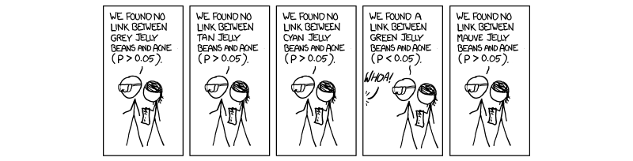{fig-align="center" width="90%"}

There are a few different methods to adjust for multiple testing:

#### Bonferroni

Simple but stringent method that divides the significance level by the number of tests performed to control for the family-wise error rate (FWER). Good for a small number of tests but can be too conservative when many tests are performed, leading to a high rate of false negatives.

#### Benjamini-Hochberg

Less conservative method that controls the false discovery rate (FDR). It ranks the p-values and compares each p-value to its rank divided by the total number of tests multiplied by the significance level. This method is more powerful than Bonferroni when many tests are performed (e.g. 22000 genes in RNA-seq experiments), but it allows for a higher rate of false positives.

Let's say we want to do pairwise comparisons between all three groups in our plant data:

-   Treatment 1 vs Control
-   Treatment 2 vs Control
-   Treatment 1 vs treatment 2

With rstatix, we can run all three t-tests at once. However, since we are performing multiple tests on the same data, we need to use adjusted p-values. Rstatix adds adjusted p-values to the result by default. We can also use the `adjust_pvalue()` function to specify the method we want to use.

```{r}
## Run all 3 t-tests and adjust for multiple testing
t_test_results <- PlantGrowth |>
  mutate(group = factor(group, levels = c("trt1", "trt2", "ctrl"))) |>
  t_test(weight ~ group, p.adjust.method = "bonferroni") |>
  add_significance()

t_test_results
```

Visualise the results:

```{r}
PlantGrowth |>
  mutate(group = factor(group, levels = c("trt1", "trt2", "ctrl"))) |>
  ggplot(aes(x = group, y = weight, fill = group)) +
  geom_boxplot() +
  theme_bw() +
  stat_pvalue_manual(t_test_results, label = "p.adj.signif", bracket.nudge.y =c(-0.5,0,0.5),y.position = 7)
```

As you can see, the only significant difference is between treatment 1 and treatment 2. The differences between treatment 1 and control and treatment 2 and control are not significant after adjusting for multiple testing. The more tests we perform, the more stringent our significance threshold becomes.

### ANOVA

With many groups, performing multiple pairwise comparisons can become unwieldy and the multiple error correction soon balloons out of control.

The correct way to analyse data with more than two groups is to use an ANOVA (analysis of variance) test, which tests for differences between the means of multiple groups at once. If the ANOVA test is significant, you can then perform post-hoc tests to determine which specific groups are different from each other.

This framework controls for multiple testing and is more powerful than performing multiple pairwise t-tests. ANOVA is not covered in this course but should be your go-to for multi-factorial statistical analysis. You can use the `anova_test()` function from rstatix to perform an ANOVA test.

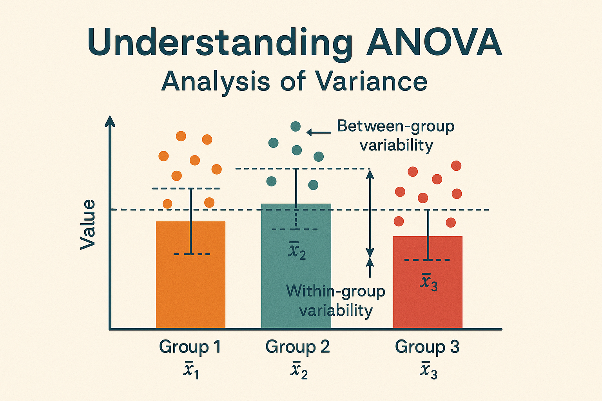{fig-align="center" width="70%"}

### Two-sided vs one-sided tests

When we perform a hypothesis test, we can specify whether we are testing for a difference in either direction (two-sided) or a difference in a specific direction (one-sided).

For example, we might want to test if the mean weight of plants in treatment 1 is different from the mean weight of plants in the control group, without specifying whether we expect treatment 1 to be heavier or lighter than the control group. This would be a two-sided test, and our alternative hypothesis would be that there is a difference in mean weight between the two groups.

Alternatively, we might have a specific hypothesis that treatment 1 will increase the mean weight of plants compared to the control group. In this case, we would perform a one-sided test, and our alternative hypothesis would be that the mean weight of plants in treatment 1 is **greater** than the mean weight of plants in the control group.

A one sided test has more statistical power to detect an effect in the specified direction as your significance threshold increases on one side of the distribution.

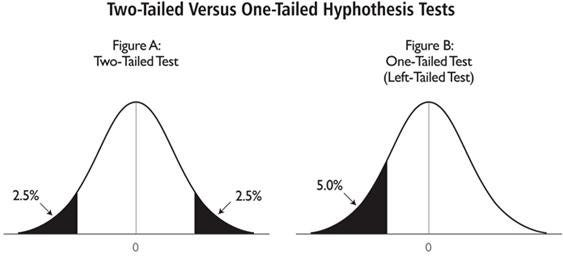{fig-align="center" width="70%"}

You should only use a one-sided test if you have a strong biological rationale for expecting an effect in a specific direction and are not interested in detecting an effect in the opposite direction.

It is NOT OKAY to run a two-sided test, see that the p-value is not significant, and then switch to a one-sided test to try to get a significant result. This is a form of p-hacking that can lead to false positives.

The `t_test()` function from rstatix allows you to specify the alternative hypothesis using the `alternative` argument. You can set it to "two.sided", "greater", or "less" depending on your hypothesis.

**Example: One-sided test**

The `chickwts` dataset contains the weights of chicks fed with different types of feed. We want to test if the mean weight of chicks fed with "casein" feed (high protein) is greater than the mean weight of chicks fed with regular "linseed" feed.

In this example, we only want to know if chicks gain more weight when fed with casein. If they gain less weight, then we are not interested in using casein as feed. Therefore, we will perform a one-sided t-test with the alternative hypothesis that the mean weight of chicks fed with casein feed is greater than the mean weight of chicks fed with linseed feed.

```{r}
chickwts |>
  filter(feed %in% c("casein", "linseed")) |>
  mutate(feed = droplevels(feed)) |>
  ggplot(aes(x = feed, y = weight, fill = feed)) +
  geom_boxplot() +
  theme_bw() +
  stat_compare_means(method = "t.test", method.args = list(alternative = "greater") ,label.y = 450)

```

### Paired vs independent tests

When comparing two groups, we need to consider whether the samples are independent or paired. Independent samples are those where the observations in one group are not related to the observations in the other group.

Paired samples are most often repeated measurements on the same subjects (e.g. before and after treatment) or matched samples (e.g. twins, siblings, or matched cases and controls).

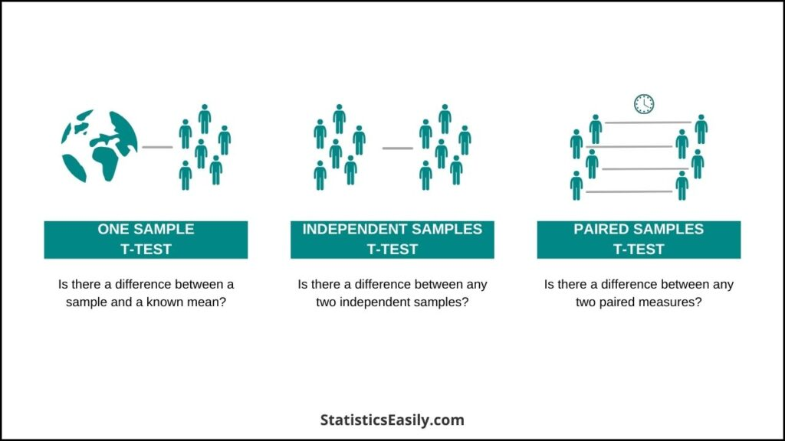{fig-align="center" width="70%"}

When the samples are paired, we need to use a paired test that takes into account the fact that the observations are related.

**Example: Paired test**

A researcher studying the effects of dopamine (DA) depletion on working memory in rhesus monkeys, tested working memory performance in 15 monkeys after administration of a saline (placebo) injection and again after injecting a dopamine-depleting agent.

Working memory performance was measured as the percentage of correct responses in a working memory task. The researcher wants to know if there is a significant difference in working memory performance following DA depletion.

```{r}
## Load the data
wm_data <- read_csv("https://bifx-core3.bio.ed.ac.uk/training/DSB/data/working.memory.csv")
wm_data |> summary()

## Convert our data to long format to make it easier to plot
wm_long_data <- wm_data |>
  pivot_longer(cols = c(DA.depletion,placebo), names_to = "condition", values_to = "performance") |>
  mutate(condition = factor(condition, levels = c("DA.depletion", "placebo")))

## The placebo and DA depleted conditions are paired measurements on the same monkeys. We can visualise the data with a paired plot.
wm_long_data |>
  ggplot(aes(x = condition, y = performance, group = Subject)) +
  geom_line() +
  geom_point() +
  theme_bw()

```

We can see that there is a lot of variability in the performance of the monkeys, but it looks like most monkeys perform worse after DA depletion compared to placebo. There is a large outlier, where one monkey performs much better after DA depletion compared to placebo. It's possible there was an error in the data collection for this monkey and it could be removed, but let's assume the result is real and include it in our analysis.

In a paired test, we are interested in the difference in performance between the two conditions for each monkey. We can calculate the difference in performance for each monkey and then test if the mean difference is significantly different from zero.

Because we are looking at the differences in performance for each monkey, we need to check if the differences are normally distributed.

```{r}
wm_data |>
  mutate(diff = DA.depletion - placebo) |>
  shapiro_test(diff)
```

The differences are not normally distributed (p-value \< 0.05), so we cannot use a parametric test to compare the two conditions.

The non-parametric equivalent of the paired t-test is the **Wilcoxon signed-rank test**. This test does not assume normality and is used to compare two related samples.

We can use the `wilcox_test()` function from the rstatix package. For a paired test, we need to specify the `paired = TRUE` argument. The `t_test()` function also has a `paired` argument that can be set to TRUE when performing a paired t-test.

Non parametric tests are less powerful than parametric tests, so we have a higher chance of failing to detect a true effect. However, they are more robust to violations of assumptions and can be used when the data is not normally distributed. They work by ranking the differences in performance for each monkey and then testing if the ranks of the differences are significantly different from zero.

Because we do not have prior hypothesis about the effect of DA depletion on working memory performance, we will perform a two-sided test with the alternative hypothesis that there is a difference in performance between the two conditions.

-   Null hypothesis: There is no difference in working memory performance between the placebo and DA depleted conditions.
-   Alternative hypothesis: There is a difference in working memory performance between the placebo and DA depleted
-   Significance level: 0.05

```{r}
wm_long_data |>
  wilcox_test(performance ~ condition, paired = TRUE) |>
  add_significance()
```

Visualise the results:

```{r}
wm_long_data |>
  ggplot(aes(x = condition, y = performance, fill = condition)) +
  geom_boxplot() +
  geom_point(aes(colour = condition), alpha=0.8) +
  geom_line(aes(group = Subject), colour = "grey80") +
  theme_bw() +
  stat_compare_means(method = "wilcox.test", paired = TRUE)
```

## Comparing categorical data

We can also use hypothesis testing to compare categorical data.

**Example: Genotype frequencies**

A researcher is studying a specific gene that determines whether a rare species of butterfly has Spotted or Plain wings. They want to see if the genotype ($AA$ vs $Aa$) is associated with the wing pattern. Because the species is rare, the researcher can only collect a small sample of butterflies (n = 20). The data is shown below:

| Genotype | Wing Pattern | Count |
|----------|--------------|-------|
| AA       | Spotted      | 8     |
| AA       | Plain        | 2     |
| Aa       | Spotted      | 1     |
| Aa       | Plain        | 9     |

To test if there is an association between genotype and wing pattern, we can use a **fisher's exact test**. This test compares the observed frequencies of each category to the expected frequencies under the null hypothesis of no association. The fisher's exact test is appropriate for small sample sizes and is a non-parametric test that does not assume any distribution for the data.

-   Null hypothesis: There is no association between genotype and wing pattern.
-   Alternative hypothesis: There is an association between genotype and wing pattern.
-   Significance level: 0.05

Under the null hypothesis, we would expect the frequencies of each category to be proportional to the overall frequencies of the genotypes and wing patterns in the sample.

| Genotype | Wing Pattern | Observed | Expected |
|----------|--------------|----------|----------|
| AA       | Spotted      | 8        | 4.5      |
| AA       | Plain        | 2        | 5.5      |
| Aa       | Spotted      | 1        | 4.5      |
| Aa       | Plain        | 9        | 5.5      |

The fisher's exact test calculates the probability of observing the data we have collected (or more extreme) under the null hypothesis and gives us a p-value to help us decide whether to reject or fail to reject the null hypothesis.

```{r}
# Create a contingency table
contingency_table <- matrix(c(8, 2, 1, 9), nrow = 2, byrow = TRUE)
rownames(contingency_table) <- c("AA", "Aa")
colnames(contingency_table) <- c("Spotted", "Plain")

contingency_table

# Perform the Fisher's exact test
fisher_test(contingency_table)
```

We can also use a **chi-squared test** to test for association between categorical variables. However, the chi-squared test is not appropriate for small sample sizes and can give inaccurate results when the expected frequencies in any cell of the contingency table are less than 5.

## Reporting statistical results

A significant p-value (e.g. p \< 0.05) means that we reject the null hypothesis and conclude that there is a statistically significant difference in our data. However, it does not tell us about the size of the effect or its biological relevance.

When reporting statistical results, it is important to include the test statistic, degrees of freedom, p-value, and confidence intervals for the effect size. This provides a more complete picture of the results and allows readers to assess the biological relevance of the findings.

**Degrees of freedom (df)** are a measure of the amount of information available to estimate the variability in the data. They are calculated based on the sample size and the number of parameters being estimated.

**EXAMPLE: Reporting t-test results**

Let's look at the results of the t-test comparing the control and treatment 2 groups in our plant data. This time we will use the `detailed = TRUE` argument in the `t_test()` function to get more information.

```{r}
t_test_full_result <- PlantGrowth |>
  filter(group %in% c("trt2", "ctrl")) |>
  mutate(group = factor(group, levels = c("trt2", "ctrl"))) |>
  t_test(weight ~ group, detailed = T) |>
  add_significance()

t_test_full_result
```

The t-test results include:

-   t-statistic (statistic)
-   degrees of freedom (df)
-   p-value (p)
-   confidence intervals (conf.low, conf.high)

The **t-statistic** is 2.13, which indicates that the difference in mean weight between the control and treatment 2 group is 2.13 standard errors away from zero.

The **degrees of freedom** are 16.8, which is based on the sample size of each group and the number of groups being compared.

The **p-value** is 0.0479, which is less than our significance level of 0.05, so we reject the null hypothesis and conclude that there is a statistically significant difference in mean weight between the control and treatment 2 group.

The **confidence interval** for the difference in means is (-0.983, -0.00513), which means that we are 95% confident that the true difference in mean weight between the two groups lies within this interval.

When reporting these results in a scientific paper, we would include all of this information to provide a complete picture of the statistical analysis and allow readers to assess the biological relevance of the findings.

We can print the results in a more readable format. The **glue** package is useful for this. It allows us to create a string with embedded R code that will be evaluated and included in the output.

```{r}
library(glue)

# Pre-calculate to keep the glue block clean
ctrl_mean <- mean(PlantGrowth$weight[PlantGrowth$group == "ctrl"])
trt2_mean <- mean(PlantGrowth$weight[PlantGrowth$group == "trt2"])

glue("The mean weight of plants in the control group is {round(ctrl_mean, 2)} \\
      and the mean weight of plants in treatment 2 group is {round(trt2_mean, 2)}. \\
      The t-test results show a significant difference (t = {round(t_test_full_result$statistic, 2)}, \\
      df = {round(t_test_full_result$df,2)}, p = {round(t_test_full_result$p, 4)}). \\
      The confidence interval is ({round(t_test_full_result$conf.low, 4)}, \\
      {round(t_test_full_result$conf.high, 4)}).")

```

## Interpreting statistical results

When interpreting statistical results, it is important to consider the biological relevance of the findings. A statistically significant result does not necessarily mean that the effect is biologically meaningful.

#### Is it large enough?

Statistical tests produce statistics which represent the size of the effect over the variability within samples. Check the effect size and confidence intervals to assess the magnitude and precision of the effect. When sample sizes are large, even small differences can be statistically significant, but they may not be biologically meaningful. Conversely, when sample sizes are small, large differences may not reach statistical significance, but they could still be biologically relevant.

#### Is it real?

We use p-values to make decisions, not to tell us if something is real or not. Using a threshold we can claim “statistical significance” and quantify the confidence we have in this difference. However, we can never be 100% sure that the difference we are seeing is real. We can only say that it is unlikely to have occurred by chance alone (e.g. p \< 0.05).

#### Is it meaningful?

We must assess if the difference is meaningful within the biological context of our experiment. A significant p-value does not necessarily mean that the effect is biologically relevant or that the size of the effect is large enough to be meaningful. Consider the context of the experiment and whether the findings are consistent with existing literature and biological knowledge.

## P-values

The p-value is the probability of finding a result, as or more extreme than our observed data, when we assume that the null hypothesis H0 is true.

-   p = 0 : Zero chance of getting these results under H0
-   p = 1 : 100% chance of getting these results under H0
-   p = 0.05 : 5% chance of getting this or a more extreme result under H0

Setting alpha = 0.05 is a commonly used threshold to reject the null hypothesis and accept the alternative hypothesis. If there is no effect, we would only see a result like this or more extreme 5% of the time.

P-values are commonly misconceived. The p-value is NOT:

-   The probability of the null hypothesis being true
-   The probability of the alternative hypothesis being true
-   The probability of observing our precise result under the null hypothesis

A non-significant p-value DOES NOT mean there is no difference observed between two groups.

A significant p-value DOES NOT represent a scientifically relevant result or the size of a detected effect.

::: {.box .resources}
<h3><i class="fas fa-book"></i> Resources</h3>

Here is some more reading on p-values and their misconceptions:

-   [P-values and when not to use them](https://towardsdatascience.com/p-values-and-when-not-to-use-them-92cab8a86304)
-   [P-values and misconceptions](https://sixsigmadsi.com/wp-content/uploads/2020/10/A-Dirty-Dozen-Twelve-P-Value-Misconceptions.pdf)
-   [What the p-value really tells us](https://www.ncbi.nlm.nih.gov/pmc/articles/PMC5665734)
:::

## Confidence intervals

P-values assign probabilities to our findings but tell us nothing about the size of the effect we are seeing. Confidence intervals can provide a more informative interpretation as they give a range of probable scores based on our model.

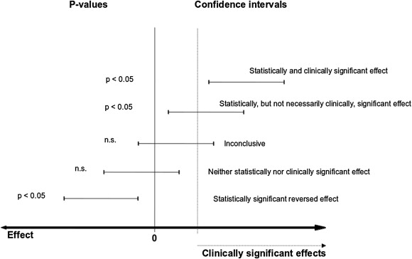{fig-align="center" width="80%"}

A 95% confidence interval is the range of values for which we are 95% certain contains the real statistic.

Example: Two surveys measuring self reported quality of life on a 0-10 scale: Study A: mean = 7 (95% CI 6,8) Study B: mean = 7 (95% CI 1,9)

Are they saying the same thing? What is the practical impact of a larger confidence interval?

If your null hypothesis represents no change between 2 groups and your 95% confidence interval does not include 0, this is the same as a statistically significant result with alpha = 0.05.

## Final challenge

:::: {.box .challenge}
<h3><i class="fas fa-pencil-alt"></i> Final Challenge:</h3>

In this challenge we are going to perform statistical analysis to see if the weights of 10 rabbits *increase* after a hypothetical experimental treatment. First prepare the data:

```{r}
# The data set 

# Weight of the rabbit before treatment 
before <-c(190.1, 190.9, 172.7, 213, 231.4,  
           196.9, 172.2, 285.5, 225.2, 113.7) 
  
# Weight of the rabbit after treatment 
after <-c(392.9, 313.2, 345.1, 393, 434,  
          227.9, 422, 383.9, 392.3, 135.6) 
  
# Create a data frame 
rabbits <- data.frame(  
  sample=c(1:10), ##Assign sampleIDs
  before=before,
  after=after
)
```

## Consider the following:

-   Plot the data first. What is the best way to visualise this?
-   Are the values independent or paired?
-   Should you use a parametric or non-parametric test?
-   Which test will you use?
-   What is the alternative hypothesis?
-   Are the groups significantly different?
-   What is the confidence interval?

<details>

<summary>

</summary>

::: {.box .solution}
<h3><i class="far fa-eye"></i> Solution:</h3>

Visualise:

```{r, answer=TRUE, eval=TRUE, purl=FALSE}
rabbits |>
  pivot_longer(cols = c(before, after), names_to = "condition", values_to = "weight") |>
  mutate(condition = factor(condition, levels = c("before", "after"))) |>
  ggplot(aes(x = condition, y = weight, fill = condition)) +
  geom_boxplot() +
  geom_point(aes(colour = condition), alpha=0.8) +
  geom_line(aes(group = sample), colour = "grey80") +
  theme_bw()
```

Test for normality:

```{r}
rabbits |>
  mutate(diff = after - before) |>
  shapiro_test(diff)
```

We fail to reject the Null hypothesis that the difference in weights is normally distributed. In this case, we can use a parametric t-test to compare the weights before and after treatment.

-   Null hypothesis: There is no increase in weight after treatment compared to before treatment.
-   Alternative hypothesis: There is an increase in weight after treatment compared to before treatment.
-   Significance level: 0.05

Because our alternative hypothesis is directional, we will use a one-sided test and use "greater" as our alternative hypothesis.

```{r}
## run a paired t-test with rstatix
rabbits |> 
  pivot_longer(cols = c(before, after), names_to = "condition", values_to = "weight") |>
  mutate(condition = factor(condition, levels = c("after", "before"))) |>
  t_test(weight ~ condition, paired = TRUE, alternative = "greater", detailed = TRUE) |>
  add_significance()
```

Because we are performing a one-sided test, we are only looking for an increase in weight after treatment. The p-value is 0.0002, which is less than our significance level of 0.05, so we reject the null hypothesis and conclude that there is a statistically significant increase in weight after treatment compared to before treatment. One-sided tests produce a single confidence interval that is either above or below zero, depending on the direction of the alternative hypothesis. In this case, the confidence interval is (101, Inf), which means that we are 95% confident that the true increase in weight after treatment compared to before treatment is greater than 101.
:::

</details>
::::

::: {.box .key-points}
<h3><i class="fas fa-thumbtack"></i> Key points</h3>

-   Inference is the process of drawing conclusions about a population based on a sample of data
-   Hypothesis tests are used to determine if observed differences are statistically significant
-   The choice of statistical test depends on the type of data, the structure of the data, the variables being compared, and the distribution of the data
-   P-values are commonly used to determine statistical significance, but they do not provide information about the size of the effect or its biological relevance
-   Confidence intervals can provide more information about the magnitude and biological relevance of the effect
-   Always include the full statistical results when reporting your findings, including the test statistic, degrees of freedom, p-value, and confidence intervals
:::
