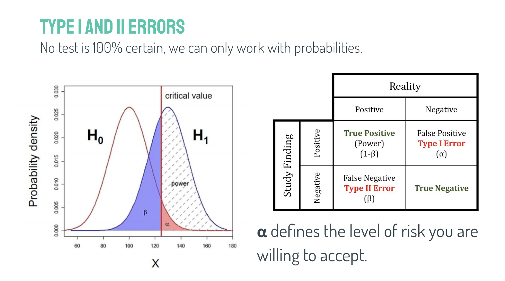
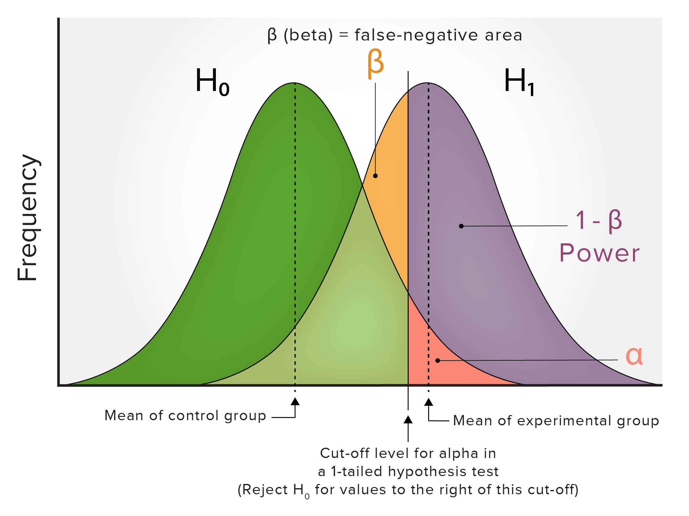
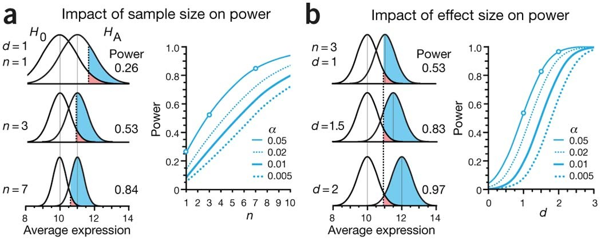
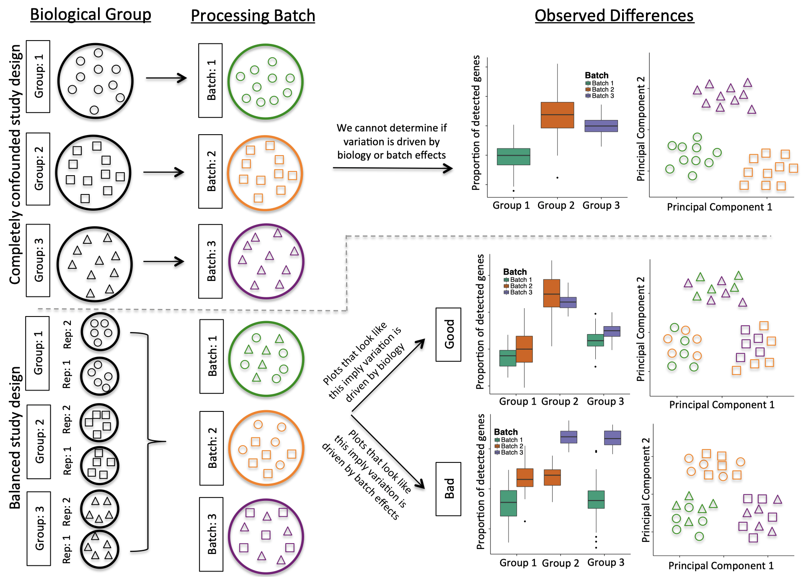

<head>

```{=html}
<script src="https://kit.fontawesome.com/ece750edd7.js" crossorigin="anonymous"></script>
```

</head>

```{r global_options, include=FALSE}
knitr::opts_chunk$set(warning=FALSE, message=FALSE)
```

::: {.box .objectives}
<h3><i class="far fa-check-square"></i> Learning Objectives</h3>

-   Understand the concepts of Type I and Type II errors
-   Understand statistical power and its importance in hypothesis testing
-   Learn to perform power analysis to determine sample size requirements
-   Understand the role of statistics in experimental design
-   Learn how to expand your statistical toolkit for more complex analyses
:::

In this lesson we will discuss the concept of statistical power and its importance in hypothesis testing. We will also learn how to perform power analysis to determine the sample size requirements for experiments.

## Type I and II errors

No statistical test is 100% certain. We can only reject or fail to reject the null hypothesis based on probability. This means that there is always a chance of making an error in our conclusions. There are two types of errors that can occur in hypothesis testing:

-   A **Type I error** occurs when we reject the null hypothesis when it is actually true (false positive).
-   A **Type II error** occurs when we fail to reject the null hypothesis when it is actually false (false negative).



The significance level (𝝰) controls the rate of Type I errors. By setting a significance level of 0.05, we are accepting a 5% chance of making a Type I error.

The power of a test (1 - β) controls the rate of Type II errors. A higher power means a lower chance of making a Type II error.

## Statistical power

Statistical power is the probability that a test will correctly reject a false null hypothesis. It is calculated as 1 minus the probability of a Type II error (β). A common threshold for acceptable power is 0.80, which means there is an 80% chance of correctly rejecting a false null hypothesis.

{fig-align="center" width="70%"}

### Power analysis

Power analysis is a technique used to determine the sample size required to achieve a desired level of power for a given effect size and significance level. It can also be used to determine the power of a test given a specific sample size.

To perform a power analysis, we need to specify three of the following parameters:

-   **Effect size**: The magnitude of the effect we are trying to detect (e.g., difference between groups).
-   **Significance** level (𝝰): The threshold for rejecting the null hypothesis (comm only set at 0.05).
-   **Power** (1 - β): The desired probability of correctly rejecting a false null hypothesis (commonly set at 0.80).
-   **Sample size**: The number of observations in the study.

If we know three of these parameters, we can calculate the fourth using power analysis.

{fig-align="center" width="70%"}

For example, if we want to determine the required sample size for a study with a specific effect size, significance level, and desired power, we can use power analysis to find the necessary sample size.

**EXAMPLE: Power analysis**

A researcher activates T cells with an antibody. The cells are then marked by a fluorescent antibody which recognises a T-cell receptor. They count the cells and categorise them as polarised or not polarised. They hypothesise that the polarisation varies between WT and KO cells. The scientist starts by running a pilot study.

| Genotype | Polarised | Not polarised |
|----------|-----------|---------------|
| WT       | 10        | 31            |
| KO       | 14        | 21            |

The proportion of polarised cells is higher in the KO samples. The researcher wants to know how many samples they need to detect this effect size with a significance level of 0.05 and a desired power of 0.80.

```{r}
library(tidyverse)
library(pwr)

## The effect size can be calculated using the proportions of polarised cells in each group. We can use the `ES.h` function from the `pwr` package to calculate the effect size for a two-proportion test (known as Cohen's h).
effect_size <- ES.h(p1 = 10/41, p2 = 14/35) 

power_2p <- pwr.2p.test(h = effect_size, sig.level = 0.05, power = 0.80, alternative = "two.sided")

power_2p
```

The power analysis indicates that we would need approximately 139 samples (n) per group to detect the observed effect size with a significance level of 0.05 and a desired power of 0.80.

The **pwr** package provides various functions for performing power analysis for different types of tests, including t-tests, ANOVA, chi-squared tests, and more. By using these functions, researchers can plan their studies effectively to ensure they have sufficient power to detect meaningful effects.

It also includes a plotting function to visualise the relationship between sample size, effect size, and power. For example, we can plot the power curve for our two-proportion test to see how power changes with different sample sizes.

```{r}
plot.power.htest(power_2p) +
  theme_bw()
```

::: {.box .discussion}
<h3><i class="fas fa-bell"></i> Discussion:</h3>

What statistical power do we have in the pilot study? Is it sufficient to detect the observed effect size?
:::

:::: {.box .challenge}
<h3><i class="fas fa-pencil-alt"></i> Challenge</h3>

A researcher wants to compare the weights of WT and KO mice. They do not have any data yet on the KO but they have values for the WT.

A difference of interest would be at least 10%. Given that you will be using a t-test, what sample size is needed to be able to spot a 10% difference with 80% power?

The effect size for a t-test, known as *Cohen's d*. It can be calculated using the means and standard deviations of the two groups. Since we only have data for the WT group, we will assume that the standard deviation is the same for both groups and use the mean of the WT group to calculate the effect size for a 10% difference.

$$\text{d} = \frac{\text{M1 - M2}}{\text{SD}}$$

-   M1 is the mean of the first group (WT)
-   M2 is the mean of the second group (KO)
-   SD is the standard deviation of the groups (assumed to be the same for both groups)

```{r}
WT <- c(27.2,25.5,26,29.1) # Sample weights for WT mice
```

<details>

<summary>

</summary>

::: {.box .solution}
<h3><i class="far fa-eye"></i> Solution:</h3>

```{r}
## Calculate Cohen's d for a 10% difference
effect_size <- (mean(WT) - (mean(WT) * 0.9)) / sd(WT)

alpha <- 0.05 # Significance level
power <- 0.80 # Desired power

# Calculate required sample size
pwr_t <- pwr.t.test(d = effect_size, sig.level = alpha, power = power, type = "two.sample")

pwr_t
```

The power analysis indicates that we would need approximately 7 samples per group to detect a 10% difference in weights between WT and KO mice with a significance level of 0.05 and a desired power of 0.80.

The sample size is relatively small for two reasons:

-   The effect size is quite large (a 10% difference in weights is substantial).
-   The variance in the WT group is relatively low, so a smaller sample size is required to detect that effect.
:::

</details>
::::

### Effect size estimation

If you don't know the effect size, you can perform a power analysis to determine the sample size needed to detect a range of effect sizes. This can help you plan your study and ensure that you have enough power to detect meaningful effects.

Cohen's d is a commonly used measure of effect size for t-tests. It represents the standardised difference between two means. A Cohen's d of 0.2 is considered a small effect, 0.5 is a medium effect, and 0.8 and above is a large effect.

If you don't have any data to estimate the effect size, you can use a range of plausible effect sizes based on previous literature, pilot studies or by using the Cohen's d values for small, medium, and large effects as a guide.

Understanding statistical power is crucial for designing experiments that can detect meaningful effects. By performing power analysis, researchers can ensure that their studies are adequately powered to avoid Type II errors and increase the likelihood of making valid conclusions.

## Experimental design

Experimental design is the process of planning and structuring an experiment to ensure that it can effectively test the research hypothesis. A well-designed experiment can help control for confounding variables, reduce bias, and increase the validity of the results.

If we wanted to compare the weights of WT and KO mice, we would need to consider several factors in our experimental design to ensure that we can draw valid conclusions from our data. If all of the WT mice were housed in one cage and all of the KO mice were housed in another cage, we would not be able to determine whether any differences in weight were due to the genotype or to other factors such as the environment or social interactions. This is an example of a confounding variable.

Other examples include:

-   Comparing two sample groups where one group is all male and the other is female
-   Comparing cell lines that have been cultured in different labs
-   Comparing sequencing data that was sequenced on different machines or at different times

To ensure that our experimental design is robust and appropriate for statistical analysis we need to consider the following principles:

#### Randomisation

Randomly assigning subjects to different groups to ensure that any differences between groups are due to the treatment and not other factors.

#### Blocking

Blocking is the method of grouping subjects based on certain characteristics (e.g., age, sex) to control for variability and increase the precision of the experiment. Once blocks are defined, subjects within each block are randomly assigned to treatment groups. This helps to ensure that any differences observed between treatment groups are more likely to be due to the treatment itself rather than other factors.

#### Biological replicates

Measuring the same mouse three times is not the same as measuring three different mice. Many statistical tests assume that observations are independent and include measurements of variance in their calculations. Biological replicates are required to properly model variation in the population.

#### Controls

Statistical tests rely on comparisons between groups or a known distribution to determine if there is a significant effect. Controls provide a baseline for comparison and help to ensure that any observed effects are truly due to the treatment or condition being tested.

#### Sampling

When designing an experiment, it is important to consider how samples will be collected and whether they are representative of the population being studied. Sampling methods can include random or stratified sampling.

#### Sample size

Determining the appropriate sample size is crucial for ensuring that the experiment has sufficient power to detect meaningful effects. Power analysis can be used to calculate the required sample size based on the expected effect size, significance level, and desired power. At least 3-5 biological replicates per group are generally recommended to model variation in the population, but the exact number varies depending on the specific experiment and expected effect size.

#### Batch effects

Batch effects are a common issue in experimental design, especially in high-throughput experiments. They can arise from differences in sample processing, equipment, or environmental conditions. To minimise batch effects, it is important to randomise samples across batches, use consistent protocols, and include appropriate controls. Sometimes, batch effects cannot be avoided. It is possible to account for batch effects in the statistical analysis using methods such as batch correction or including batch as a covariate in the model.

Batch effects can often be identified by visualising the data using techniques such as principal component analysis (PCA) or hierarchical clustering. If samples cluster by batch rather than by biological condition, this may indicate the presence of batch effects.

It is important to record all relevant metadata about the samples and experimental conditions to help identify and account for batch effects in the analysis!

{fig-align="center" width="85%"}

## Expanding your statistical toolkit

As you progress in your research, you may encounter more complex data and research questions that require advanced statistical methods. We will delve into some of these methods in our RNA-seq lesson, but here is a brief overview of some of the techniques you may want to explore:

-   **Multi-factorial analysis**
    -   Comparing more than two groups (e.g. ANOVA)
-   **Regression analysis**
    -   Modelling relationships between variables (e.g. linear regression, logistic regression)
-   **Bayesian statistics**
    -   Incorporating prior knowledge and updating beliefs based on data
-   **Mixed-effects models**
    -   Accounting for both fixed and random effects in the data
-   **Multivariate analysis**
    -   Analysing multiple dependent variables simultaneously
-   **Time series analysis**
    -   Analysing data collected over time to identify trends and patterns
-   **Dimensionality reduction**
    -   Reducing the number of variables in the data while retaining important information (e.g. PCA, UMAP)
-   **Clustering**
    -   Grouping similar observations together based on their characteristics (e.g. k-means, hierarchical clustering)
-   **Machine learning**
    -   Using algorithms to make predictions or identify patterns in data (e.g. random forests, support vector machines)

::: {.box .resources}
<h3><i class="fas fa-book"></i> Resources</h3>

Here are some resources to study more advanced statistical analyses:

-   [High dimensional stats in R](https://carpentries-incubator.github.io/high-dimensional-stats-r/)
-   [R for data science](https://r4ds.had.co.nz/)
-   [Tidymodels: Tidyverse libraries for modelling and machine learning](https://www.tidymodels.org/)
:::

::: {.box .key-points}
<h3><i class="fas fa-thumbtack"></i> Key points</h3>

-   It is important to ensure that your study has sufficient power to detect meaningful effects
-   Power analysis can be used to determine the sample size required for a study
-   A well-designed experiment is crucial for drawing valid conclusions from your data.
:::
