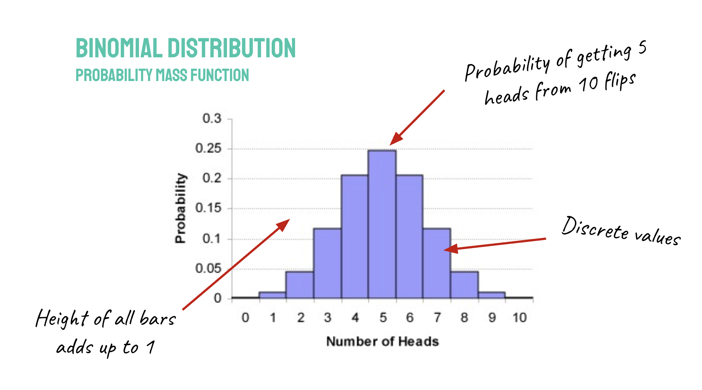
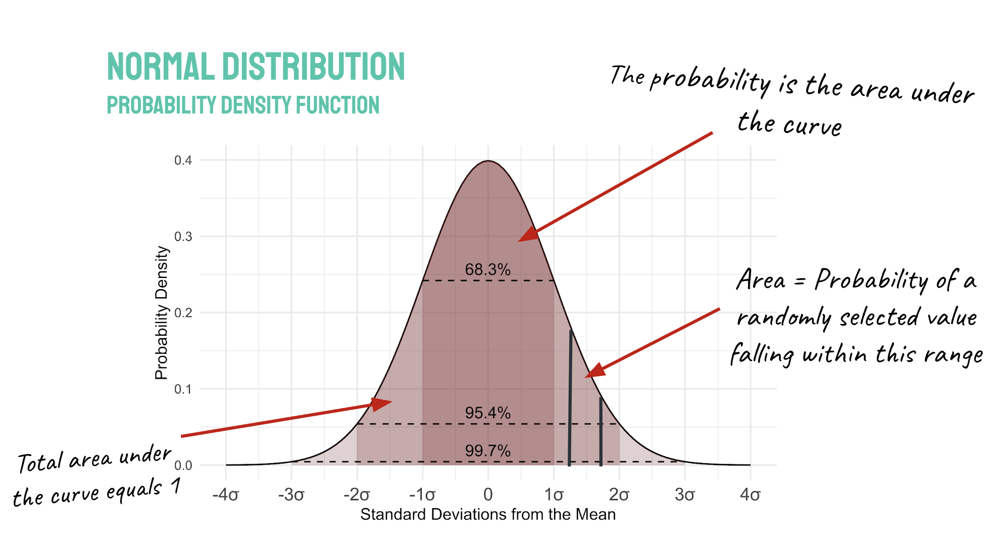
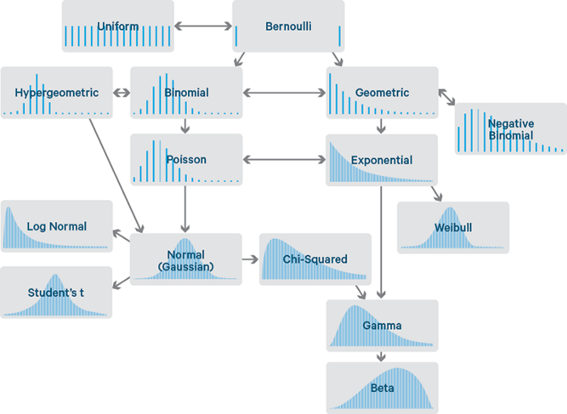
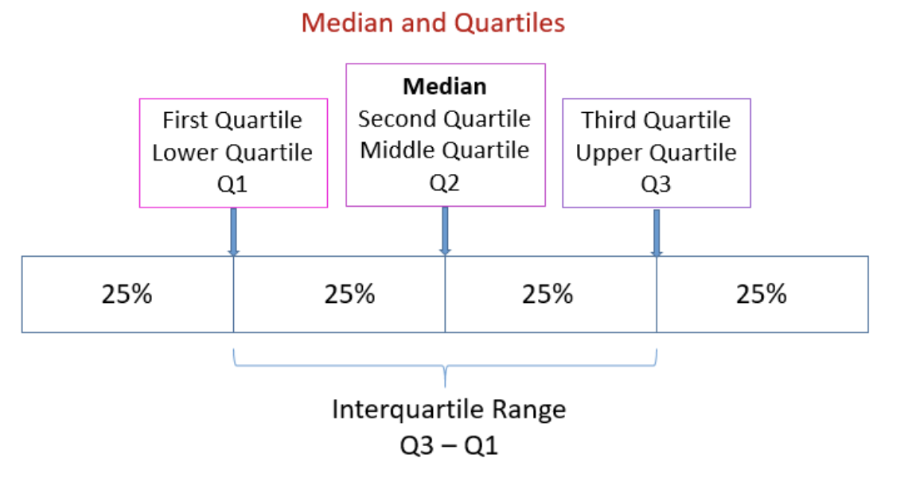
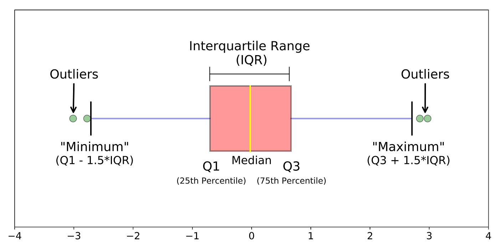
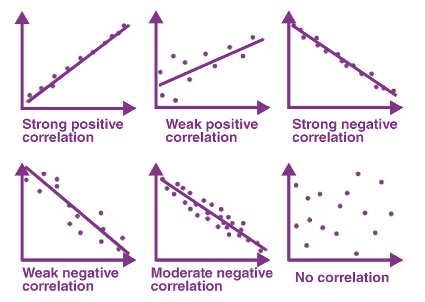
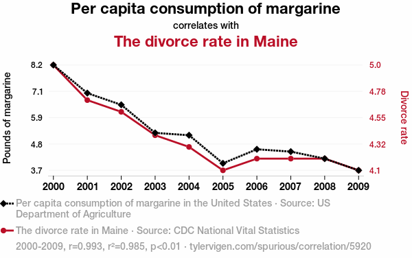

<head>

```{=html}
<script src="https://kit.fontawesome.com/ece750edd7.js" crossorigin="anonymous"></script>
```

</head>

```{r global_options, include=FALSE}
knitr::opts_chunk$set(warning=FALSE, message=FALSE)
```

::: objectives
<h2><i class="far fa-check-square"></i> Learning Objectives</h2>

- Understand the concept of probability and how it relates to statistics
- Understand the difference between categorical, discrete and continuous data
- Learn about different types of probability distributions
- Learn how to summarise and visualise data using descriptive statistics

:::

<br>

This module introduces the basics of statistical thinking and how to apply it using R. We will cover the types of data commonly encountered in biology, how to summarise and visualise data, and how to perform basic statistical analyses.

## Statistics in biology

Statistics is a branch of mathematics that deals with the collection, analysis, interpretation, presentation, and organisation of data. In biology, statistics is used to make sense of complex data and to draw meaningful conclusions from experiments. 

An understanding of statistical thinking is required throughout the research life-cycle, from experimental design to publication and review.

#### Experimental design
  
  - What statistical power is required to see a desired effect size?
  - How many replicates are required?
  - What confounding factors need to be considered? 

#### Data analysis 

  - Applying appropriate statistical methodology to data
  - Interpret the results of statistical tests in biological context

#### Data management and software

  - Preparing and structuring data for analysis
  - Knowledge of statistical software (R, Matlab, SAS…)

#### Publication and review

  - Present the results of statistical analysis
  - Critically evaluate the statistical methods used in published research

## Statistics in R

Base R has a large number of built-in functions for performing statistical analyses. These include functions for calculating descriptive statistics, performing hypothesis tests, and fitting statistical models. In addition to the built-in functions, there are many packages available in R that provide additional functionality.

The **stats** package, which is included in base R, provides a wide range of functions for statistical analysis. 

In this lesson, we will use the **rstatix** package which uses a tidyverse-friendly syntax for performing common statistical tests. The functions in rstatix are wrappers for the functions in the stats package, but they provide a more user-friendly interface and additional features such as automatic formatting of results.

We will use **ggplot** and **ggpubr** for visualizing data and results of statistical tests.

```{r}
## Load libraries
library(tidyverse) ## for data manipulation and plotting
library(rstatix)
library(ggplot2)
library(ggpubr)
```

## Types of data

Biological data comes in many forms: gene expression levels, mutation counts, phenotypes, and categories like genotype or treatment group.

Before doing any statistical test, we need to understand what type of data we have.

### Categorical Data

Values represent groups or labels
Examples:

  - Genotype: WT, KO
  - Cell type: T-cell, B-cell

```{r}
genotype <- factor(c("WT", "WT", "KO", "KO", "WT"))
summary(genotype)
```
In R, categorical data is often represented as factors. Factors can still be numerically encoded, but they are treated as categorical variables in statistical analyses.

```{r}
## Numerical variable
timepoint <- c(1, 2, 3, 4, 5, 1, 2, 3, 4, 5)
summary(timepoint)

## Categorical variable
timepoint_factor <- factor(c(1, 2, 3, 4, 5, 1, 2, 3, 4, 5))
summary(timepoint_factor)
```

### Ordinal data

Ordinal data is a type of categorical data where the categories have a natural order or ranking. Examples include:

  - Disease severity: mild, moderate, severe
  - Tumor grade: low, intermediate, high
  - Time points: day 1, day 2, day 3

In R, we can create an ordered factor to represent ordinal data. This allows us to specify the order of the categories and perform appropriate statistical analyses that take the ordering into account. The `levels` parameter specifies the order of the categories, and the `ordered` parameter indicates that the factor is ordinal.
  
```{r}
## Create an ordered factor for disease severity
severity <- factor(c("moderate", "moderate", "severe", "mild", "moderate"), 
                   levels = c("mild", "moderate", "severe"), 
                   ordered = TRUE)
summary(severity)
```

### Discrete data

Discrete data consists of distinct, separate values. It often represents counts or categories that can only take on specific values. Discrete data can either be quantitative (e.g., number of cells) or categorical (e.g., species).

Examples include:

  - Mutation counts: 0, 1, 2, 3 (quantitative)
  - Number of cells: 10, 20, 30 (quantitative)
  - Species: human, mouse, rat (categorical)
  - Results of a survey: yes, no, maybe (categorical)
  - Days post-infection: 1, 5, 10 (ordinal)
  
Data is discrete if it has the following properties:

  - Distinct values from a finite list of possibilities
  - Clear spaces between values with no intermediate values
  - Quantitative data is countable as integers
  
```{r}
## Discrete numerical variable
mutation_counts <- c(0, 1, 2, 3, 0,
                     1, 2, 3, 0, 1)
table(mutation_counts)
```

### Continuous data

Continuous data can take on any value within a range and is often measured rather than counted. Examples include:

  - Gene expression levels: 0.5, 1.2, 3.4
  - Protein concentrations: 10.5 ng/mL, 20.3 ng/mL
  - Time to event: 5.2 hours, 10.8 hours
  - Body weight: 70.5 kg, 80.2 kg

Data is discrete if it has the following properties:

  - Sampled from infinite values within a given range
  - Data points fall in a continuous sequence
  - Measurable and divisible

```{r}
## Continuous numerical variable
gene_expression <- c(0.5, 1.2, 3.4,
                     0.8, 1.5, 2.3,
                     0.6, 1.0, 3.0)
summary(gene_expression)
```

## Probability

Probability forms the foundation of statistics. It is important to understand the basic concepts of probability before diving into statistical analyses.

  - **Trial**: An activity or experiment that produces an event
  - **Sample space**: All of the possible outcomes of a trial
  - **Event**: 1 or more of the possible outcomes
  - **Probability**: The chance of a particular event occurring

**Example: Flipping a coin**

  - Sample space (S) = {heads, tails}
  - Probability (p) of getting heads = number of outcomes that are heads / total number of possible outcomes = ½ = 0.5

**Example: Drawing a card from the pack**

  - Sample space (S) = all 52 cards
  - p(ace of clubs) = 1/52
  - p(ace) = 4/52 = 1/13
  - p(club) = 13/52 = 1/4

### Independent events

What if we toss the coin twice? What are the chances of getting tails on the first flip and heads on the second flip?

  - Event A = Tails on 1st toss
  - Event B = Heads on 2nd toss

The outcome of event A does not affect the probability of event B so these events are **independent**.

  - p(A and B) = p(A) * p(B)
  - p(tails and heads) = ½ * ½ = ¼

### Non-Independent events

What is the probability of drawing 2 aces from a deck of cards?

  - p(A) = p(Ace on 1st draw) = 4/52
  - p(B|A) = p(Ace on 2nd draw | Ace on first draw) = 3/51

These events are not independent as removing one ace from the pack changes the probability of finding another ace. For non-independent events we are interested in the conditional probability.

So p(A and B) = p(A) * p(B|A)  = 4/52 * 3/51 = 1/221

## Probability functions and distributions

When the sample space and number of events is small, we can easily write down all of the possible outcomes and calculate probabilities.

**Example: Flip a coin 3 times and count the number of tails**

Outcome | Probability | Number of tails
------- | ----------- | ---------------
HHH | 1/8 | 0
HHT | 1/8 | 1
HTH | 1/8 | 1
THH | 1/8 | 1
HTT | 1/8 | 2
THT | 1/8 | 2
TTH | 1/8 | 2
TTT | 1/8 | 3

We can sum the probabilities for each outcome (0, 1, 2, or 3 tails):

Number of tails (x) | Probability (p)
------------------ | ---------------
0 | 1/8
1 | 3/8
2 | 3/8
3 | 1/8

We can now plot these probabilities to visualise the distribution of outcomes.

```{r}
tails_data <- data.frame(
  tails = c(0, 1, 2, 3),
  probability = c(1/8, 3/8, 3/8, 1/8)
)

ggplot(tails_data, aes(x = tails, y = probability)) +
  geom_bar(stat = "identity", fill = "steelblue") +
  labs(title = "Probability of Number of Tails in 3 Coin Flips",
       x = "Number of Tails",
       y = "Probability") +
  theme_minimal()
```

The probability distribution shows the likelihood of each possible outcome. The most likely outcomes are getting 1 or 2 tails, while getting 0 or 3 tails is less likely.

When the total number of outcomes is large, it is not practical to list all of the possible outcomes and calculate probabilities manually. 

Instead, we use **probability functions** to calculate probabilities for different types of distributions. We can visualise these distributions using histograms.

## Bionomial distribution

Coin flips are an example of a **binomial distribution**, which describes the number of successes (e.g., heads) in a fixed number of independent trials (e.g., flips), where each trial has the same probability of success.

The binomial distribution is defined by two parameters: 

- The number of trials (n)
- The probability of success on each trial (p). 

The `dbinom()` function in R calculates the probability of getting a specific number of successes in a given number of trials for a binomial distribution.

**Example: Calculate the probability of every outcome for the number of heads in 100 coin flips**

```{r}
## Number of flips
n_flips <- 100
## Probability of getting heads
p_heads <- 0.5
## Calculate the probability of getting 0 to 100 heads
heads_data <- data.frame(
  heads = 0:n_flips,
  probability = dbinom(0:n_flips, size = n_flips, prob = p_heads)
)

ggplot(heads_data, aes(x = heads, y = probability)) +
  geom_bar(stat = "identity", fill = "steelblue") +
  labs(title = "Probability of Number of Heads in 100 Coin Flips",
       x = "Number of Heads",
       y = "Probability") +
  theme_minimal()
```

In the plot above, the possible outcomes (total number of heads) are on the x-axis, and the probability of each outcome is on the y-axis. The most likely outcome is getting 50 heads, while getting very few or many heads is less likely. The distribution is symmetric around the mean (n\*p = 50) and has a **bell-shaped** curve.

The binomial distribution describes the probability of getting a certain number of successes in a fixed number of independent trials, where each trial has the same probability of success.

A *success* is defined as the outcome of interest. It can be heads in a coin flip, patient recovery after treatment, sex determination in chicken eggs, or any other binary outcome.

The binomial distribution is a **discrete probability distribution** because it describes discrete outcomes (e.g. you can't get 2.5 heads in 100 flips). There are a number of assumptions that must be met to model data using a binomial distribution:

- Each trial has a **single outcome**
- There are only **two possible outcomes** (success/failure, heads/tails, alive/dead etc.) 
- Each trial has the **same probability** of success (p)
- Each trial is **independent**



**Experiment: Everyone flip a coin 10 times and record the number of heads**

If you don't have coins handy, you can simulate this experiment using the `rbinom()` function in R, which generates random numbers from a binomial distribution.

```{r}

n <- 20 ## number of trials (people flipping coins)
size <- 10 ## number of flips per trial
prob <- 0.5 ## probability of getting heads
rbinom(n = n, size = size, prob = prob)

## make a function to plot the results of a binomial experiment
binom_plot <- function(n, size, prob){
  results <- rbinom(n, size, prob)
  results |> table() |> 
  as.data.frame() |> 
  ggplot(aes(x = as.integer(as.character(results)), y = Freq)) +
  geom_bar(stat = "identity", fill = "steelblue") +
  labs(x = "Number of successes", y = "Frequency") +
  xlim(0,size) +
  theme_minimal()
}

binom_plot(n, size, prob)
```

  - What are the most / least frequent observations
  - What is the overall pattern of observations
  - Does your sample look like a binomial distribution?

:::: challenge
<h2><i class="fas fa-pencil-alt"></i> Challenge:</h2>

How would the following affect the results?

  - 100 coin flips instead of 10
  - 100 people flipping 10 coins
  - 100 people flipping 100 coins
  - 10000 people flipping 100 coins
  - Rolling a dice 10 times and looking for the number 6

Use the `rbinom()` function to simulate these scenarios and visualise the results using ggplot2.

<details>

<summary>

</summary>

::: solution
<h2><i class="far fa-eye"></i> Solution:</h2>

```{r}
## 20 people flipping 100 coins
binom_plot(n = 20, size = 100, prob = 0.5)

## 100 people flipping 10 coins
binom_plot(n = 100, size = 10, prob = 0.5)

## 100 people flipping 100 coins
binom_plot(n = 100, size = 100, prob = 0.5)

## 10000 people flipping 100 coins
binom_plot(n = 10000, size = 100, prob = 0.5)

## 10000 people rolling a dice 100 times and looking for the number 6
binom_plot(n = 10000, size = 100, prob = 1/6)
```

:::

</details>
::::

<br>

What we are seeing in these plots is the **law of large numbers** in action. As we increase the number of flips and the number of people flipping coins, the distribution of outcomes becomes more consistent with the expected binomial distribution. The most likely outcome remains around (p \* n ), but the variability decreases as we increase the number of trials.

When we roll a dice 100 times and look for the number 6, we are still looking for a binary outcome (getting a 6 or not getting a 6), but the probability of success is different (p = 1/6). The distribution of outcomes will still follow a binomial distribution, but the most likely outcome will be around (p \* n ) = (1/6 \* 100) ≈ 16.67 successes.

So, the probability (p) and the number of trials (n) defines the shape of a binomial distribution.

## Normal distribution

The **normal distribution** is one of the most commonly encountered distributions in biology and statistics. It is a **continuous** probability distribution that is symmetric around its mean, with a bell-shaped curve.

Continuous distributions do not have discrete outcomes like the binomial distribution. Instead, they can take on any value within a range. The normal distribution is often used to model data such as gene expression levels, protein concentrations, weights, heights and other continuous measurements.



The normal distribution is a continuous curve. The probability of a random outcome falling into a specific interval is equal to the area beneath the curve. The total area of the curve is equal to 1, which represents the total probability of all possible outcomes.

The normal distribution has the following properties:

  - **Continuous** probability distribution
  - The curve has a **single peak**
  - The mean (average) lies at the centre of the distribution
  - Distribution is **symmetrical around the mean**

The normal distribution is defined by two parameters: 

- Mean (μ)
- Standard deviation (σ)

### Standard deviation and variance

Variance (𝛔^2 or var) is a measure of how dispersed data is from the mean. The variance is the average of the square of the distance from each data point to the mean.

Standard deviation (𝛔 or sd) is the square root of the variance. A small standard deviation indicates that the data points are close to the mean, while a large standard deviation indicates that the data points are more spread out.

In a normal distribution, the mean and standard deviation determine the shape of the curve. The mean determines the location of the peak, while the standard deviation determines the width of the curve. A smaller standard deviation results in a narrower curve, while a larger standard deviation results in a wider curve.

### Simulating a normal distribution

We can use the `rnorm()` to simulate data from a normal distribution.

The `rnorm()` function takes three arguments: 

  - The number of observations to generate (n)
  - The mean of the distribution (mean)
  - The standard deviation of the distribution (sd)
 
::: challenge
<h2><i class="fas fa-pencil-alt"></i> Challenge:</h2>

A: Use the `rnorm()` function to simulate 1000 observations from a normal distribution with a mean of 50 and a standard deviation of 10. Plot the distribution of the simulated data using a histogram.

B: What happens when we change the the standard deviation to 30? 

C: What about a mean of -23.2 and a standard deviation of 0.75?

<details>

<summary>

</summary>
::: solution
<h2><i class="far fa-eye"></i> Solution:</h2>
```{r}

## Simulate 1000 observations from a normal distribution with mean = 50 and sd = 10
simA <- data.frame(value = rnorm(n = 1000, mean = 50, sd = 10), distribution = "A")
## Simulate data with mean = 50 and sd = 30
simB <- data.frame(value = rnorm(n = 1000, mean = 50, sd = 30), distribution = "B")
## Simulate data with mean = -23.2 and sd = 0.75
simC <- data.frame(value = rnorm(n = 1000, mean = -23.2, sd = 0.75), distribution = "C")

sim_data <- bind_rows(simA, simB, simC)

## Plot the distributions together 
ggplot(sim_data, aes(x = value, fill = distribution)) +
  geom_histogram(binwidth = 0.5) +
  labs(title = "Histogram of Simulated Normal Data",
       x = "Value",
       y = "Frequency") +
  theme_minimal()
```

:::

</details>

::::

<br>

In these plots, we can see that changing the mean shifts the location of the peak of the distribution, while changing the standard deviation changes the width of the distribution. A larger standard deviation results in a wider curve, while a smaller standard deviation results in a narrower curve.

Although our histogram has discrete bars, the underlying distribution is continuous. The histogram is a visual representation of the distribution of values in our dataset. As we increase the number of observations, the histogram will more closely approximate the shape of the normal distribution curve. You could try increasing `n` to see this in action. Sample size is important when trying to determine the underlying distribution of a dataset!

When the standard deviation is small, the mean is a good representation of the data, as most of the values are close to the mean. However, when the standard deviation is large, the mean may not be a good representation of the data, as there is more variability and more values that are far from the mean.

## Other distributions

There are many types of probability distributions with different mathematical parameters and shapes. Some of the most commonly encountered distributions in biology include:

  - **Poisson**
    - Used for modelling count data, such as mutation counts or number of cells
  - **Binomial**
    - Used for modelling binary outcomes, such as alive/dead
  - **Normal** 
    - Used for modelling continuous data, such as gene expression levels or mice weights
  - **Negative binomial**
    - Used for modelling overdispersed count data, such as RNA-seq read with high variability
  - **Hypergeometric**
    - Used for modelling sampling without replacement, such as selecting individuals from a population

<br>



Each distribution has its own set of parameters and assumptions, and it is important to choose the appropriate distribution for your data when performing statistical analyses.

## Simulating data from statistical distributions

Before we move on, we will simulate some biological data to work with. We will create a dataset with 100 samples and four variables:

  - A categorical variable representing two genotypes (WT and KO)
  - Two continuous variables representing expression levels of geneA and geneB
  - A discrete variable representing mutation counts in a regulatory region

The gene expression levels will be normally distributed with different means for the WT and KO groups, while the mutation counts will follow a Poisson distribution with different rates for the two groups.


```{r}
set.seed(123) # For reproducibility

## 100 samples
n_samples <- 100

## Categorical data randomly sampled from two groups
genotype <- factor(sample(c("WT", "KO"),
                       n_samples, replace = TRUE))

## Expression levels for geneA and geneB, with different means and standard deviation for WT and KO
geneA_expression <- rnorm(n_samples, mean = ifelse(genotype == "WT", 5, 7), sd = 1)
geneB_expression <- c(geneA_expression + rnorm(n_samples, mean = 0, sd = 0.7)) # geneB is correlated with geneA

## Mutation counts, with different means for WT and KO
mutation_counts <- rpois(n_samples, lambda = ifelse(genotype == "WT", 2, 4))

data <- data.frame(genotype, geneA_expression, geneB_expression, mutation_counts)
head(data)
```

## Descriptive statistics

Although it is possible to list all of the values in a large dataset it is not the best way for our human minds to interpret data. Instead, we use **summary statistics** and **visualisation** to describe the distribution of values.

The base R `summary()` function provides a quick overview of the distribution of values for each variable in a dataset. 

```{r}
## Base R
summary(data)
```

The `get_summary_stats()` function from the rstatix package provides a more detailed summary, including measures of central tendency (mean, median) and variability (standard deviation, interquartile range). The output is a *tibble* that can be easily piped into dplyr or ggplot functions.

```{r}
## RStatix
get_summary_stats(data)
```

### Measures of central tendency

Measures of central tendency describe the typical or central value of a dataset. They are often used to summarise data and provide a single value that represents the entire dataset. Common measures of central tendency include:

  - **Mean**: The average value of a dataset, calculated by summing all values and dividing by the number of values.
  - **Median**: The middle value of a dataset when the values are arranged in order. If there is an even number of values, the median is the average of the two middle values.
  - **Mode**: The value that appears most frequently in a dataset. A dataset can have one mode (unimodal), more than one mode (multimodal), or no mode if all values are unique.

```{r}
mean(data$geneA_expression)
```

```{r}
median(data$geneA_expression)
```

In a perfectly normal distribution, the data is symmetric around the mean, and the mean, median and mode are the same value.

The mean is a good measure of central tendency when the data is **normally distributed**. However, when data is skewed or contains outliers, the mean can be misleading and doesn't accurately represent a typical value in the dataset.

```{r}
set.seed(123)

## Simulate an outlier and plot the distribution with the mean as a vertical line
outlier_data <- c(1, 2, 3, 4, 5, 6, 7, 8, 9, 10, 100)
outlier_data |> table() |> 
  as.data.frame() |> 
  ggplot(aes(x = as.integer(as.character(outlier_data)), y = Freq)) +
  geom_bar(stat = "identity", fill = "grey80") +
  geom_vline(xintercept = mean(outlier_data), color = "red", linetype = "dashed") +
  labs(x = "Value", y = "Frequency") +
  theme_minimal()

## Simulate a skewed, non-normal dataset with a long tail of high values
skewed_data <- c(rgamma(n = 1000, shape = 1, scale = 2))
skewed_data |> table() |> 
  as.data.frame() |> 
  ggplot(aes(x = as.integer(as.character(skewed_data)), y = Freq)) +
  geom_bar(stat = "identity", fill = "grey80") +
  geom_vline(xintercept = mean(skewed_data), color = "red", linetype = "dashed") +
  labs(x = "Value", y = "Frequency") +
  theme_minimal()
```

In some cases, the **median** is a better measure of central tendency because it is less affected by extreme values. For example, if we have a dataset of gene expression levels that includes a few very high values (outliers), the mean may be much higher than the typical expression level for most genes, while the median would provide a more accurate representation of the central tendency of the data.

```{r}
## Plot the outlier data with mean in red and median in blue
outlier_data |> table() |> 
  as.data.frame() |> 
  ggplot(aes(x = as.integer(as.character(outlier_data)), y = Freq)) +
  geom_bar(stat = "identity", fill = "grey80") +
  geom_vline(xintercept = mean(outlier_data), color = "red", linetype = "dashed") +
  geom_vline(xintercept = median(outlier_data), color = "dodgerblue", linetype = "dashed") +
  labs(x = "Value", y = "Frequency") +
  theme_minimal()
```
The mean is sensitive to outliers and can be skewed by extreme values, while the median is more robust to outliers and provides a better representation of the central tendency for skewed distributions.

#### Multimodal distributions

Sometimes data can be **multimodal**, meaning it has multiple peaks in the distribution. In this case, visualisation can be more informative than summary statistics. 

```{r}
## Simulate bimodal data
bimodal_data <- c(rnorm(1000, mean = 5, sd = 1), rnorm(1000, mean = 10, sd = 1))
bimodal_data |> table() |> 
  as.data.frame() |> 
  ggplot(aes(x = as.integer(as.character(bimodal_data)), y = Freq)) +
  geom_bar(stat = "identity", fill = "grey80") +
  geom_vline(xintercept = mean(bimodal_data), color = "red", linetype = "dashed") +
  geom_vline(xintercept = median(bimodal_data), color = "dodgerblue", linetype = "dashed") +
  labs(x = "Value", y = "Frequency") +
  theme_minimal()
```

Identifying multiple distributions within a dataset can provide insights into underlying biological processes or sub-populations within the data (e.g. different cell types, experimental batches or sample sex). This can inform your downstream analysis or allow you to separate your data into separate analyses.

#### Outliers

**Outliers** can be biologically meaningful, so it is important to investigate outliers rather than simply removing them from your data. For example, an outlier in gene expression data could represent a technical artefact or real biology e.g. a rare cell type. Visualisation can help to identify outliers.

Data **transformation** (e.g. log transformation) can be used to reduce the impact of outliers and make the data more normally distributed, which can improve the performance of statistical tests.

## Visualising data

The first step in every analysis is to visualise your data. Visualisation allows you to explore the distribution of values, identify patterns and relationships between variables, and detect outliers.

### Histograms

Histograms are useful for visualising the shape of the distribution, identifying skewness, and detecting outliers. If your data approximately follows a normal distribution, the histogram will have a bell-shaped curve and the mean and standard deviation will be good summary statistics to describe the data.

```{r}
ggplot(data, aes(x = geneA_expression)) +
  geom_histogram(binwidth = 0.3, fill = "steelblue") +
  labs(title = "Histogram of geneA expression",
       x = "geneA expression",
       y = "Frequency") +
  theme_minimal()
```

### Boxplots

A boxplot is a graphical representation of the distribution of a dataset that shows the median, quartiles, and potential outliers. 

#### Quartiles

Quantiles divide an ordered dataset into equal parts. There are different types of quantiles, including:

- Percentiles: Quantiles that divide the data into 100 equal parts.
- Quartiles: Quantiles that divide the data into 4 equal parts.

Quartiles divide the data into four equal parts. The first quartile (Q1) is the value below which 25% of the data falls, the second quartile (Q2) is the median, and the third quartile (Q3) is the value below which 75% of the data falls. The interquartile range (IQR) is the difference between the third and first quartiles (IQR = Q3 - Q1) and represents the range of the middle 50% of the data.



#### Boxplot components

The box represents the interquartile range (IQR), which contains the middle 50% of the data. The line inside the box represents the median, and the "whiskers" extend to the minimum and maximum values within 1.5 times the IQR from the quartiles. Points outside this range are considered outliers and are plotted individually.



A symmetrical boxplot with the median line in the middle of the box and whiskers of equal length suggests a normal distribution. A skewed boxplot with the median line closer to one end of the box and whiskers of unequal length suggests a skewed distribution. Outliers can be identified as points outside the whiskers.

Boxplots are useful for comparing the distribution of values between different groups. They can help to identify differences in central tendency, variability, and the presence of outliers between groups.

```{r}
ggplot(data, aes(x = genotype, y = geneA_expression, fill = genotype)) +
  geom_boxplot() +
  labs(title = "Boxplot of geneA expression by group",
       x = "Group",
       y = "geneA expression") +
  theme_minimal()
```

## Scatterplots

Scatterplots are used to visualise the relationship between two continuous variables. Each point on the scatterplot represents an observation, with the x-axis representing one variable and the y-axis representing the other variable. Scatterplots can help to identify patterns, trends, and potential correlations between variables.

```{r}
p <- ggplot(data, aes(x = geneA_expression, y = geneB_expression)) +
  geom_point() +
  labs(title = "Scatterplot of geneA expression vs mutation counts",
       x = "geneA expression",
       y = "geneB expression") +
  theme_minimal()
p
```

A regression line can be added to the scatterplot to help visualise an overall trend in the data. We will explore linear regression later.

```{r}
p + geom_smooth(method = "lm") # Add a linear model line of regression

```
## Correlation

A linear pattern in the scatterplot can be indicative of a **correlation** between  two variables. A positive correlation is indicated by points that trend upwards from left to right, while a negative correlation is indicated by points that trend downwards from left to right. A lack of any clear pattern suggests no correlation between the variables.



The strength of a correlation can be quantified using a correlation coefficient (r or R) which ranges from -1 to 1, where values close to 1 indicate a strong positive correlation, values close to -1 indicate a strong negative correlation, and values close to 0 indicate no correlation.

Correlation analysis looks for an association between two quantitative variables (does *x* vary with *y*?). The most common method for calculating correlation is the **Pearson** correlation coefficient, which measures the strength and direction of a linear relationship between two variables. 

The `cor()` function in R can be used to calculate the Pearson correlation coefficient between two variables. The `stat_cor()` function from the ggpubr package can be used to add the Pearson correlation coefficient to a scatterplot.


```{r}
cor(data$geneA_expression, data$geneB_expression, method = "pearson") # Calculate Pearson correlation coefficient)

p +
  geom_smooth(method = "lm") +
  stat_cor(method = "pearson", label.x = 3, label.y = 10) # Add Pearson correlation coefficient to the plot
```
We can confidently say that expression of geneA correlates with expression of geneB, but it does not imply causation! Even if the two genes are strongly correlated, it does not mean that a change in expression of one is responsible for the other changing. There could be another variable that is influencing expression of these genes, or the correlation could be due to chance.



Other types of correlation include:

- **Spearman's rank correlation**: Assesses the monotonic (non-linear) relationship between two variables. It is used when the data is not normally distributed or when there are outliers.
- **Kendall's tau**: Another measure of correlation that assesses the strength of association between two variables. It is based on the number of concordant and discordant pairs of observations.

## Anscombe's quartet

Anscombe's quartet is a set of four datasets that have nearly identical statistical properties (mean, variance, correlation coefficient) but have very different distributions and relationships between the variables. 

```{r}
anscombe

anscombe_tidy <- tibble(
  x = c(anscombe$x1, anscombe$x2, anscombe$x3, anscombe$x4),
  y = c(anscombe$y1, anscombe$y2, anscombe$y3, anscombe$y4),
  dataset = factor(rep(1:4, each = 11))
)
get_summary_stats(anscombe_tidy)


ggplot(anscombe_tidy, aes(x, y, colour = dataset)) +
  geom_point(size = 3, alpha = 0.8) +
  geom_smooth(method = "lm", se = FALSE) +
  facet_wrap(~ dataset) +
  theme_bw() +
  labs(
    title = "Anscombe's Quartet",
    subtitle = "Identical statistics, very different datasets"
  )
```

The lesson here is to never rely solely on summary statistics. Always visualise your data!

Lecture 3: Sampling & the Central Limit Theorem
Populations vs samples
Standard deviation vs standard error vs SEM
Central Limit Theorem (CLT)

👉 R practical: simulate sampling distributions

Lecture 4: Frequentist vs Bayesian Thinking
Core philosophical differences
Likelihood vs posterior
When each is used in biology (e.g. prior knowledge in genomics)

👉 Keep light—focus on intuition, not math

::: discussion
<h2><i class="far fa-bell"></i> Discussion</h2>

  1. The shape of a normal distribution is defined by the ______ and the _______.
  2. When a dataset has an even number of values, what is the median?
  3. The 2nd quartile is also known as the _________.

:::

<br>

::: key-points
<h2><i class="fas fa-thumbtack"></i> Key points</h2>

-   Probability is the foundation of statistics and is used to model the likelihood of different outcomes in a dataset
-   There are many different types of probability distributions, each with its own set of parameters and assumptions.
-   Descriptive statistics and visualisation are essential for summarising and understanding the distribution of values in a dataset.

:::
