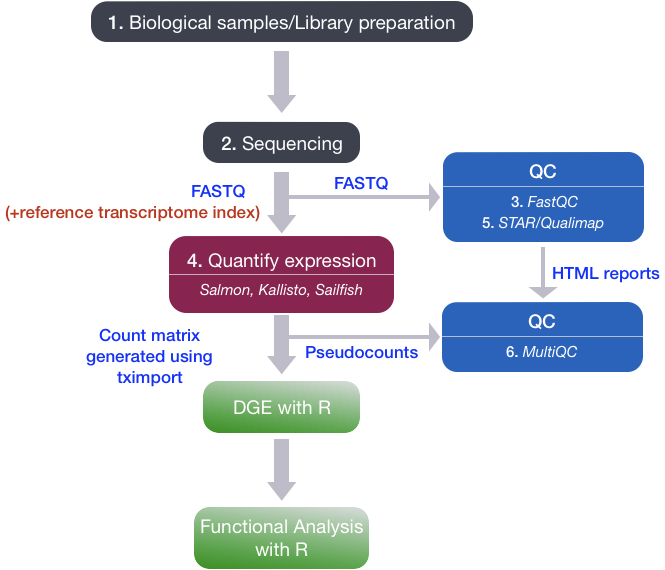

<head>

```{=html}
<script src="https://kit.fontawesome.com/ece750edd7.js" crossorigin="anonymous"></script>
```

</head>

```{r global_options, include=FALSE}
knitr::opts_chunk$set(warning=FALSE, message=FALSE)
```

::: {.box .objectives}
<h3><i class="far fa-check-square"></i> Learning Objectives</h3>

-   Import gene expression data into R
-   Understand the concept of differential expression and statistical testing
-   Perform differential expression analysis using the DESeq2 package
-   Interpret the results of differential expression analysis
:::

In this module, we will put all of our R knowledge together to perform a differential expression analysis of RNA-Seq data. We will use the DESeq2 package, which is a widely used tool for analysing count data from RNA-Seq experiments.

This is a lightweight differential expression workshop, partly modeled on the training materials already provided by the [Harvard Chan Bioinformatics Core](https://hbctraining.github.io/main/). For a comprehensive overview DESeq2 and differential expression, check out the following resources:

-   [DESeq2 tutorial](http://bioconductor.org/packages/devel/bioc/vignettes/DESeq2/inst/doc/DESeq2.html)

-   [HBC Differential expression workshop](https://hbctraining.github.io/Intro-to-DGE/schedule/links-to-lessons.html)

## 1. RNA-seq data

The data we will we use in this workshop is part of a larger study described in [Kenny PJ et al., Cell Rep 2014](https://pubmed.ncbi.nlm.nih.gov/25464849/). The authors investigated interactions between various genes involved in Fragile X syndrome, a disease of aberrant protein production, which results in cognitive impairment and autistic-like features. They sought to show that RNA helicase **MOV10** regulates the translation of RNAs involved in Fragile X syndrome.

The RNA was extracted from HEK293F cells that were transfected with a MOV10 transgene (MOV10 over-expression), MOV10 siRNA (MOV10 knockdown), or an irrelevant siRNA (Control).

We will use this data to investigate changes in transcription upon perturbation of MOV10 expression relative to the control (irrelevant siRNA) experiment.

### Raw Data

The raw RNA-seq data is available publicly via [GEO](https://www.ncbi.nlm.nih.gov/geo/query/acc.cgi?acc=GSE50499) and the [SRA](https://www.ncbi.nlm.nih.gov/sra?term=SRP029367) (sequence read archive).

| Dataset    | Description           | Replicate   |
|------------|-----------------------|-------------|
| Control_1  | Control               | replicate 1 |
| Control_2  | Control               | replicate 2 |
| Control_3  | Control               | replicate 3 |
| MOV10_OE_1 | MOV10 over-expression | replicate 1 |
| MOV10_OE_2 | MOV10 over-expression | replicate 2 |
| MOV10_OE_3 | MOV10 over-expression | replicate 3 |
| MOV10_KD_2 | MOV10 knock-down      | replicate 2 |
| MOV10_KD_3 | MOV10 knock-down      | replicate 3 |

Replicate 1 for MOV10 knockdown is missing as this was presumably a failed experiment.

### Raw data to read counts

Differential expression analyses work with matrices of **read counts per gene** for multiple samples.

These read counts are typically generated using command line tools to process and count reads.

{width="50%"}

In the past, we used RNA-seq aligners like [STAR](https://github.com/alexdobin/STAR) to map reads to the genome, and read counting software like [HTSeq-count](https://htseq.readthedocs.io/en/release_0.11.1/count.html) or [featureCounts](https://subread.sourceforge.net/featureCounts.html) to quantify counts of aligned reads over exons for each gene model.

The standard practice now is to use **pseudocounts** from tools like [Salmon](https://combine-lab.github.io/salmon/) which do a much better job at estimating expression levels by:

-   Correcting for sequencing biases e.g. GC content
-   Correcting for differences in individual transcript lengths
-   Including reads that map to multiple genes
-   Producing much smaller output files than aligners

The [NF-core RNA-seq pipeline](https://nf-co.re/rnaseq/3.14.0/) can perform alignment with STAR and quantification with Salmon and is recommended for processing raw RNA-seq data.

::: {.box .resources}
<h3><i class="fas fa-book"></i> Further Learning</h3>

If you are new to RNA-seq, this [overview](https://hbctraining.github.io/Intro-to-DGE/lessons/01a_RNAseq_processing_workflow.html) provides an explanation of how RNA-seq libraries are prepared, sequenced and quantified for short-read data.

If you are thinking about performing your own RNA-seq experiments then take a look at these [experimental design considerations](https://hbctraining.github.io/Intro-to-DGE/lessons/experimental_planning_considerations.html).

-   How many replicates do I need?
-   How many reads do I need?
-   What type of reads should I use?:
    -   Paired or single end?
    -   What length?
    -   Stranded or unstranded?
-   Confounding factors
-   Batch effects
:::

### DESeq2 input data

DESeq2 requires non-normalised or **raw** count estimates at the **gene-level** for performing DE analysis.

Salmon outputs estimated read counts for each **transcript** in a file called `quant.sf`. We will use the R package **tximport** to import salmon transcript counts and summarise transcript abundance estimates for each gene.

The quant.sf files for our samples are already in the folder you downloaded. They are organised in sub-folders by sample name.

We also have a file called *salmon_tx2gene.tsv* which contains a map between transcript IDs and gene IDs for our annotation.

## 2. The DESeq2 method

DESeq2 performs statistical analysis of un-normalised raw/estimated read count data per gene. It uses a **median of ratios** normalisation method to account for differences in sequencing depth and RNA composition between samples.

Count data is modeled using a generalised linear model based on the **negative binomial distribution**, with a fitted mean and a gene-specific dispersion parameter which describes the relationship between **variance** in the count data and the observed **mean**.

::: {.box .resources}
<h3><i class="fas fa-book"></i> Further Learning</h3>

[More on count data and the negative binomial distribution](https://hbctraining.github.io/Intro-to-DGE/lessons/01c_RNAseq_count_distribution.html).
:::

The model coefficient represents the change in mean between sample groups giving us **log2 fold change** values per gene. By default, DESeq2 performs the **Wald** test to test for significant changes in gene expression between sample groups and generate **p-values** which are then adjusted for multiple testing.

The Wald test is a parametric statistical test that compares the estimated log2 fold change for each gene to its standard error. It tests the null hypothesis that the log2 fold change is equal to zero (i.e., no change in expression between groups) against the alternative hypothesis that it is not equal to zero.

DESeq2 has internal methods for:

-   Estimating size factors (sample normalisation)
-   Estimating dispersions
-   Fitting the negative binomial GLM (log2 fold changes)
-   Filtering outliers and low count genes
-   Statistical tests between sample groups (p-values)
-   Multiple testing correction (FDR adjusted p-value)

{width="50%"}

### Experimental design for DESeq2

DESeq2 and other differential expression tools perform statistical analysis by comparing mean expression levels between sample groups. Accurate mean estimates can only be achieved with precise estimates of the biological variation between independent samples.

In DE experiments, increasing the number of **biological replicates** is generally more desirable than increasing read depth in single samples, unless you are particularly interested in rare RNAs. DESeq2 will not work if a sample group only has one replicate and it is recommended to have at least 3.

If you have **technical replicates** in your experimental design, these should be merged into one sample to represent a single biological replicate.

We also need to ensure (as much as possible) that any effect we see between groups can be attributed to differences in biology rather than **confounding factors** in the design or **batch effects** introduced at the library preparation stage.

## 3. Create a sample file

The first step in our analysis is to create a tab separated file of sample IDs and metadata. This already exists in the folder you downloaded earlier but you would normally create this manually. We can then import the sample sheet to R with the `read_tsv()` function from **readr**.

For our DE analysis, we want to compare the expression levels of genes in our MOV10 over-expression and knockdown samples to the control. In this example, the Control samples are our **reference** or **base-level** sample. By default, DESeq2 will use the first level of the condition factor as the reference level. We should make sure the *Control* samples are the first level of our Group factor.

```{r,warning=FALSE,message=FALSE}
library(tidyverse)

## Create a dataframe
ss <- data.frame(Sample = c("Control_1","Control_2","Control_3","MOV10_OE_1","MOV10_OE_2","MOV10_OE_3","MOV10_KD_2","MOV10_KD_3"),
                 Group = factor(c("Control","Control","Control","MOV10_OE","MOV10_OE","MOV10_OE","MOV10_KD","MOV10_KD"), levels = c("Control","MOV10_OE","MOV10_KD")),
                 Replicate = factor(c(1,2,3,1,2,3,2,3))
)

## Or read in a sample sheet.
## col_types argument specifies the data type for each column. The Sample name is a character and the Group and Replicate columns are factors.
ss <- read_tsv("data/salmon/samples.tsv", col_names = T, col_types = "cff")

## Look at our sample sheet
ss
```

::: {.box .key-points}
<h3><i class="fas fa-thumbtack"></i> Key points:</h3>

-   The sample file contains metadata on each sample
-   The sample file should include a column for the variable of interest (e.g. condition, genotype, group)
-   It is also important to include all other known variables that could confound results or explain technical variance. These can be used in plotting and quality control
:::

## 4. Importing count data with tximport

The package [tximport](https://bioconductor.org/packages/release/bioc/html/tximport.html) can read Salmon transcript count files and create a matrix of read counts for each gene.

### Transcript to gene mapping

We must supply a map between transcript IDs and gene IDs for our annotations, so that the function can summarise counts at gene level. This file is already provided in the downloaded data.

```{r,warning=FALSE,message=FALSE}
library(GenomicFeatures)

## Get the tx2gene map file
tx2gene <- read_tsv("data/salmon/salmon_tx2gene.tsv",col_names = c("TranscriptID","GeneID","GeneSymbol"))
```

If you don't have a transcript -\> gene map, these can be downloaded from annotation databases like Ensembl or generated from a gtf annotation file using the `GenomicFeatures` package as shown below.

```{r eval=F}

### EXAMPLE: DO NOT RUN THIS CODE!!

## Make a Transcript DB object from a gene annotation GTF file
txdb <- makeTxDbFromGFF(organism = "Homo sapiens", file = "Homo_sapiens.GRCh38.106.gtf", format = "gtf")

## Extract mappings from transcriptID to geneID
k <- keys(txdb, keytype = "TXNAME")
tx2gene <- select(txdb, k, "GENEID", "TXNAME")

```

Let's look at our transcript to gene map:

```{r,warning=FALSE,message=FALSE}
head(tx2gene)
```

The `tx2gene` object contains 3 columns:

-   Transcript ID
-   Gene ID
-   Gene symbol

When we import our transcript counts with `tximport()`, we will use the transcript ID and gene ID columns to summarise transcript counts to gene counts. The gene symbol column is not used in this step but it can be used later to annotate our results.

### Import transcript read counts

```{r,warning=FALSE,message=FALSE}
library(tximport)

## List all of our salmon quant.sf files
files <- file.path("data/salmon",ss$Sample,"quant.sf")
names(files) <- ss$Sample

## Import the transcript counts and summarise to gene counts
txi <- tximport(files, type = "salmon", tx2gene = tx2gene)

str(txi)
```

The `txi` object is a list containing the following elements:

-   **abundance**: A matrix of transcript abundances (TPM) for each gene in each sample
-   **counts**: A matrix of estimated read counts for each gene in each sample
-   **length**: A matrix of the average transcript length for each gene in each sample. This is calculated as the weighted average of the lengths of the transcripts that map to each gene, where the weights are based on the estimated abundance of each transcript

The [tximeta](https://bioconductor.org/packages/release/bioc/html/tximeta.html) package extends tximport to automatically detect the genome, download the tx2gene map and import count data in one function.

::: {.box .key-points}
<h3><i class="fas fa-thumbtack"></i> Key points:</h3>

-   Import pseudo-count data into R with **tximeta** or **tximport**
-   DESeq2 expects gene-level counts
-   Summarise transcript counts to gene counts
:::

## 5. Creating a DESeq object

Now that we have per-gene count data, we can import this into DESeq2. We need to supply the `txi` object we have just created as well as the **design** for our differential expression analysis.

The simplest design is to compare our samples by the Group column (Control, MOV10_KD, MOV10_OE). The design is a **formula** in R so is preceded by the `~` character.

```{r}
library(DESeq2)

## Create the DESeq dataset object
dds <- DESeqDataSetFromTximport(txi = txi, colData = ss, design = ~ Group)
dds
```

The `dds` object is a DESeqDataSet object with 58396 rows and 8 columns, where the rows are the genes and the columns are the samples. These genes include non-coding RNAs as well as protein-coding genes.

The columns of the `colData` slot contain the sample metadata from our sample sheet and can be accessed with the `colData()` function.

```{r,warning=FALSE,message=FALSE}
colData(dds)
```

We can access the count data with the `assay()` function.

```{r,warning=FALSE,message=FALSE}
assay(dds) |> head()
```

::: {.box .resources}
<h3><i class="fas fa-book"></i> Further Learning</h3>

In this example, we created our DESeq dataset from a tximport object. But what if we already have a read count table or used a different workflow to generate counts?

DESeq2 has the functions `DESeqDataSetFromMatrix()` and `DESeqDataFromHTSeqCount()` to create a DESeq dataset from a count matrix or HTSeq-count output files respectively. You can read more about these in the [DESeq2 vignette](https://bioconductor.org/packages/devel/bioc/vignettes/DESeq2/inst/doc/DESeq2.html#count-matrix-input).
:::

### DESeq2 design formula

The design formula is used to specify the variables that we want to use in our DE analysis. In this case, we have a single variable of interest, Group, which has three levels (Control, MOV10_OE, MOV10_KD). DESeq2 will perform pairwise comparisons between these levels by default.

If we had other variables in our experimental design that we wanted to control for (e.g. sex, cell type, batch etc) we could include these in our design formula as well. For example, if we had a batch variable we could specify the design as `~ Batch + Group` to control for batch effects in our analysis.

In this case, DESeq2 will first test for differences between batches and then test for differences between groups while controlling for batch effects. This is a powerful way to control for confounding factors in your analysis and ensure that any significant results you find are more likely to be biologically relevant.

It is possible to perform complex analyses with multiple variables of interest and interaction terms in DESeq2.

::: {.box .resources}
<h3><i class="fas fa-book"></i> Further Learning</h3>

Have a look at these resources for advice on complex experimental designs (e.g. multiple variables of interest, interaction terms, time-course analysis:

-   [DESeq2 manual](https://bioconductor.org/packages/devel/bioc/vignettes/DESeq2/inst/doc/DESeq2.html#variations-to-the-standard-workflow)
-   [Time-course analysis example](http://master.bioconductor.org/packages/release/workflows/vignettes/rnaseqGene/inst/doc/rnaseqGene.html#time-course-experiments)
-   [Likelihood ratio test](https://hbctraining.github.io/Intro-to-DGE/lessons/08a_DGE_LRT_results.html) for measuring changes across multiple sample groups at once.
:::

## 6. Running DESeq2

Now we are ready to run DESeq. The DESeq function has internal methods to:

-   Estimate size factors: Normalise gene counts per sample
-   Estimate gene-wise dispersions: Measure variance in the dataset
-   Shrink gene-wise dispersions: Improve the dispersion estimates
-   Fit a **negative binomial** statistical model to the data
-   Perform statistical testing with the **Wald Test** or **Likelihood Ratio Test**

```{r}
## run DESeq
dds <- DESeq(dds)

## save the dds object as a file for later use
saveRDS(dds, file = "dds.RDS")
```

### Size factor estimation

DESeq2 uses a **median of ratios** method to normalise gene counts per sample. This method calculates size factors for each sample which are used to normalise the counts. The size factor for each sample is calculated as the median of the ratios of the observed counts to the geometric mean of the counts across all samples for each gene. This method is robust to differences in sequencing depth and RNA composition between samples, making it a good choice for normalising RNA-seq data.

This normalisation method assumes that most of the genes are not differentially expressed between sample groups. If this assumption is violated (e.g. in cases of global changes in gene expression) then the size factor estimation may be inaccurate and alternative normalisation methods should be considered.

::: {.box .resources}
<h3><i class="fas fa-book"></i> Further Learning</h3>

[More on RNA-seq normalisation](https://hbctraining.github.io/Intro-to-DGE/lessons/02_DGE_count_normalization.html).
:::

### Plot gene-level dispersions

It can be useful to plot the gene-level dispersion estimates to ensure the DESeq model is right for your data. You should find that dispersion is generally lower for genes with higher read counts. Final dispersion levels should shrink towards the fitted model and there should be a few outliers. If the red line is not a good generalisation for your data then DE analysis with DESeq2 may not be appropriate.

::: {.box .resources}
<h3><i class="fas fa-book"></i> Further Learning</h3>

[More on gene-level dispersions](https://hbctraining.github.io/Intro-to-DGE/lessons/04b_DGE_DESeq2_analysis.html).
:::

```{r}
#Plot dispersions
plotDispEsts(dds, main="Dispersion plot")
```

::: {.box .key-points}
<h3><i class="fas fa-thumbtack"></i> Key points:</h3>

-   Create a DESeq dataset from count data
-   Understand the DESeq **design** parameter
-   Run the `DESeq()` function and understand the internal steps
-   Plot **dispersions** to assess the fitted model
:::

## 7. DESeq quality control

Before we look at the results of differential expression tests we first want to perform some quality control by visualising and assessing the entire dataset.

### Transform count data for visualisation

Count data is not optimal for visualisation and clustering as there are likely to be a few genes with very high expression and variance.

DEseq provides two functions to transform count data for visualisation and clustering:

-   `rlog()`: Regularised log transformation
-   `vst()`: Variance stabilising transformation

The `rlog()` function is generally recommended for smaller datasets (less than 30 samples) as it can be more effective at reducing the bias from genes with extreme counts. The `vst()` function is faster to run and is recommended for larger datasets.

```{r}
## Log transformed data
rld <- rlog(dds, blind=F) ## Blind=F means the transformation will take into account the experimental design
saveRDS(rld, file = "MOV10.rld.RDS")
```

::: {.box .resources}
<h3><i class="fas fa-book"></i> Further Learning</h3>

[More on DESeq2 data transformations](http://bioconductor.org/packages/devel/bioc/vignettes/DESeq2/inst/doc/DESeq2.html#data-transformations-and-visualization).
:::

### Heatmap of Sample Distances

We can use our log transformed data to perform sample clustering. Here, we calculate **sample distances** by applying the `dist()` function to our transformed read count matrix.

By default, the `dist()` function calculates euclidean distances between the rows of a matrix. We have to transpose our read count table first to calculate distances between samples (columns). The distance calculated is a measure of the distance between two vectors, in this case the read counts for all genes:

$$d(a,b) = \sqrt{\sum_{i=1}^{n} (a_i - b_i)^2}$$

A heatmap of this distance matrix gives us an overview of similarities and dissimilarities between samples.

```{r}
library("pheatmap") #  heatmap plotting package
library("RColorBrewer") # colour scales

sampleDists <- dist(t(assay(rld))) ## t() function transposes a matrix
sampleDistMatrix <- as.matrix(sampleDists)
rownames(sampleDistMatrix) <- as.list(colnames(dds))
colnames(sampleDistMatrix) <- as.list(colnames(dds))
cols <- colorRampPalette( rev(brewer.pal(9, "Blues")) )(255) ## Set a colour pallette in shades of blue
pheatmap(sampleDistMatrix,
         clustering_distance_rows = sampleDists,
         clustering_distance_cols = sampleDists,
         col = cols)
```

### Principle Component Analysis

Another way to visualise sample-to-sample distances is a principal component analysis (PCA). PCA is a dimensionality reduction technique that identifies the directions (principal components) in which the data varies the most. Each principal component is a linear combination of the original variables (genes) and captures a certain percentage of the total variance in the data.

We can then plot our samples on a 2D plot where the x-axis and y-axis represent the first two principal components (PC1 and PC2).

The percent of the total variance that is contained in each direction is printed on the axis label. Note that these percentages do not add to 100%, because there are more dimensions that contain the remaining variance.

We expect to see our samples divide by their biological *Group* or some other source of variation that we are aware of (e.g. sex, cell type, batches of library preparation etc).

If you do not see your samples separating by your variable of interest you may want to plot out PC3 and PC4 to see if it appears there. If there is a large amount of variance introduced by other factors or batch effects then you will need to control for these in your experimental design.

We will run the PCA analysis with the DESeq2 command `plotPCA()`.

```{r}
## Principle component analysis - get the PCA data
plotPCA(rld, intgroup = c("Group"))
```

If we don't like the default plotting style we can ask `plotPCA()` to return the data only and create our own custom plot with ggplot.

```{r}
## Principle component analysis - get the PCA data
pca <- plotPCA(rld, intgroup = c("Group", "Replicate"), returnData = T)

## Plot with ggplot
ggplot(pca, aes(PC1, PC2, colour = Group, shape = Replicate)) + 
  geom_point(size = 3) +
  theme_bw() + 
  theme(legend.key = element_blank()) + 
  xlab(paste("PC1:",round(attr(pca,"percentVar")[1]*100),"%")) + 
  ylab(paste("PC2:",round(attr(pca,"percentVar")[2]*100),"%"))

```

To plot PC3 and PC4 we can specify the `pcsToUse` argument in `plotPCA()`. By default, only the top 500 most variable genes are used in the PCA analysis. If you want to use more genes, you can set the `ntop` argument.

```{r}
## Principle component analysis - get the PCA data
pca <- plotPCA(rld, intgroup = c("Group", "Replicate"), returnData = T, pcsToUse = 3:4, ntop = 2000)

## Plot with ggplot
ggplot(pca, aes(PC3, PC4, colour = Group, shape = Replicate)) + 
  geom_point(size = 3) +
  theme_bw() + 
  theme(legend.key = element_blank()) + 
  xlab(paste("PC3:",round(attr(pca,"percentVar")[1]*100),"%")) + 
  ylab(paste("PC4:",round(attr(pca,"percentVar")[2]*100),"%"))

```

### Heatmap of genes with the largest variance

It may also be useful to take an initial look at the genes with the highest amount of variation across the dataset. We should expect to see some genes which appear to be differentially expressed between sample groups.

```{r}
## Get the top 20 genes after ordering the rld counts by variance
topVarGenes <- head(order(-rowVars(assay(rld),useNames = T)), 20)

## Create a matrix from these genes only
mat <- assay(rld)[topVarGenes, ] 
## Create an annotation dataframe for the columns (samples) to show the Group and Replicate information
anno <- as.data.frame(colData(dds)[,c("Group","Replicate")])
## Plot the heatmap with pheatmap
pheatmap(mat, cluster_rows = T, cluster_cols = T, show_rownames = T, scale = "row", annotation_col = anno)
```

::: {.box .discussion}
<h3><i class="far fa-bell"></i> Discussion</h3>

Can you guess which gene has the Ensembl identifier ENSG00000155363? What are some of the other genes in the top 20 most variable genes? Do you think these are likely to be differentially expressed between sample groups?
:::

:::: {.box .challenge}
<h3><i class="fas fa-pencil-alt"></i> Challenge:</h3>

Replace the rownames of the `mat` matrix with gene symbols from the `tx2gene` map and re-plot the heatmap.

<details>

<summary>

</summary>

::: {.box .solution}
<h3><i class="far fa-eye"></i> Solution:</h3>

```{r}
## set rownames to symbol using the tx2gene map
rownames(mat) <- tx2gene$GeneSymbol[match(rownames(mat), tx2gene$GeneID)]

## Plot the heatmap again
pheatmap(mat, cluster_rows = T, cluster_cols = T, show_rownames = T, scale = "row", annotation_col = anno)
```
:::

</details>
::::

### Plot Individual Gene Counts

In certain cases like ours, where we know the expression levels of particular genes should change between sample groups, we may want to plot individual gene counts for quality control. Let's plot normalised gene counts for the MOV10 gene (ENSG00000155363).

```{r}
## Get normalised counts for a single gene
gene = "ENSG00000155363"
geneData <- plotCounts(dds, gene = gene, intgroup = c("Group", "Replicate"), returnData = TRUE, normalized = T)

## Plot with ggplot
ggplot(geneData, aes(x = Group, y= count, colour = Replicate)) + 
  geom_jitter(position = position_jitter(width = 0.2, height = 0), size = 3) +
  scale_y_log10() + 
  theme_bw() + 
  theme(legend.key = element_blank()) + 
  ggtitle(gene) + 
  theme(axis.text.x = element_text(angle = 90, hjust = 1))
```

::: {.box .key-points}
<h3><i class="fas fa-thumbtack"></i> Key points:</h3>

-   Transform count data for summary plots
-   Create summary plots and assess for QC
    -   PCA
    -   Clustering by sample distance
    -   Heatmaps of gene counts
    -   Individual gene counts
:::

## 8. Extract DESeq2 results

If we are happy with our QC assessment we can retrieve results from the DESeq object and visualise fold changes between specific groups.

DESeq2 has a `results()` function, which by default prints the results of the last level in your design variables against the reference level. In our case this is MOV10_OE vs Control.

```{r}
results(dds)
```

However, the `dds` object stores several results. You can see these with the function `resultsNames()`.

```{r}
resultsNames(dds)
```

The Intercept result is a statistical model that compares gene expression to 0 so is not relevant here. We can see that we have results for both of our MOV10 perturbation experiments vs the control.

We can extract a specific result by providing a contrast argument to the `results()` function.

```{r}
res <- results(dds, contrast = c("Group","MOV10_OE","Control"))
res
```

The results table includes several columns:

-   **baseMean** = Mean normalised read counts of all samples
-   **log2FoldChange** = Log2 of the fold change between sample groups in the contrast
-   **lfcSE** = Standard error of the log2 fold change
-   **stat** = The test statistic (Wald test in this case)
-   **pvalue** = The pvalue for the statistical test
-   **padj** = The pvalue adjusted for multiple testing

### Multiple testing correction and independent filtering

The two most important columns in our results table are **log2FoldChange**, which is the effect size and tells us how much a gene's expression has changed, and **padj** which gives us the level of statistical confidence in this result.

DESeq2 reports adjusted p-values (padj) which are corrected for **multiple testing**. We should use these values, **not the pvalue column**, to filter or call significant genes!

DESeq2 uses the Benjamini-Hochberg method to adjust p-values and control the false discovery rate. If you filter for genes with a padj \<= 0.05 you would expect 5% of these to be false positives.

If you inspect the result table you may notice that some genes have padj and/or pvalue set to NA. This is because the `results()` function performs filtering of genes to reduce the total number of genes tested and increase the likelihood of finding significant genes after the multiple testing correction. The more genes we test, the larger the multiple testing correction, so it makes sense to remove genes where we are unlikely to see a statistical effect:

-   Genes with zero counts in all samples
-   Genes with extreme outliers
-   Genes with extremely low normalised counts

Let's look at a summary of our results. We will also set an **alpha** to tell DESeq which significance threshold to use when summarising results:

```{r}
alpha = 0.05
summary(res, alpha = alpha)
```

This is great, we definitely have significant differentially expressed genes!

### Log Fold Change Shrinkage

Let's take a look at these results visually. DESeq2 provides a `plotMA()` function to create MA plots(log2FoldChange vs the mean of normalised counts), a common way to visualise DE genes.

```{r}
plotMA(res)
```

Significant genes (\<=0.05 padj) appear in blue, while non-significant genes are grey. We can immediately see that genes with low counts have much larger variation in log-fold changes.

DESeq2 provides the `LFCshrink()` function to shrink the fold change estimates and reduce the "noise" from these genes. We can use it instead of the `results()` function and these shrunken fold changes are much better for visualising and ranking our data.

The LFC shrinkage method we will use is called **apeglm** and is based on an adaptive t prior shrinkage estimator for log fold changes. This method has been shown to perform well in terms of reducing noise while preserving true signal in the data.

```{r}
library(apeglm)

resLFC <- lfcShrink(dds, coef = "Group_MOV10_OE_vs_Control", type = "apeglm")
summary(resLFC, alpha = alpha)
```

We can see that the number of significant genes is unaffected. Let's create a new MA plot.

```{r}
plotMA(resLFC)
```

These shrunken fold changes are more useful for downstream analysis of the data where we want to rank or visualise genes by their fold change. We will use these shrunken fold changes for the rest of our analysis.

### Formatting and annotating results

We will apply a bit of formatting to our results table and also add some annotation.

-   Convert to a **tidyverse** tibble
-   Move the rownames to a **geneID** column
-   Add the **geneSymbol** from the tx2gene map as a new column
-   Create a **Significant** column for genes we wish to label as significant
-   **Order** the table by padj so the most significant genes are at the top

```{r}

gene_map <- tx2gene |>
  dplyr::select(GeneID, GeneSymbol) |>
  unique()

## Set a threshold for log2 fold change to call significant genes by effect size as well as padj
lthresh = 1

## Build the result table
result_table <- resLFC |>
    as.data.frame() |> 
    rownames_to_column("GeneID") |> 
    left_join(gene_map, by = "GeneID") |> 
    mutate(Significant = case_when( 
      padj <= alpha & abs(log2FoldChange) >= lthresh ~ "Both",
      padj <= alpha & abs(log2FoldChange) < lthresh ~ "padj",
      padj > alpha & abs(log2FoldChange) >= lthresh ~ "l2FC",
      .default = "Not Significant")
      ) |> 
   mutate(Significant = factor(Significant, levels = c("Not Significant", "padj", "l2FC", "Both"))) |>
   arrange(padj) |> 
   as_tibble()

result_table
```

Our result table contains Ensembl gene identifiers. We can use these to fetch additional annotations from the Ensembl website or fetch annotations using the **AnnotationHub** or **biomaRt** packages.

```{r,warning=FALSE,message=FALSE}
library(AnnotationHub)
ah <- AnnotationHub()

## Search for the human annotation database in Ensembl version 106
query(ah, c("GRCh38","106"))

## Fetch the annotation for AH102893, which is the Ensembl GTF file for GRCh38 version 106. This is the GTF file that was used with Salmon to create our read count table.
Ensembl.hg38.106.gr <- ah[["AH102893"]]

Ensembl.hg38.106.gr

## Convert to a dataframe and select the gene_id and gene_biotype columns
gene_biotype <- Ensembl.hg38.106.gr |>
  as.data.frame() |> 
  dplyr::select(gene_id, gene_biotype) |> 
  dplyr::rename(ensembl_gene_id = gene_id) |>
  unique()

## Example code for fetching biotype annotation with biomaRt. This is not run here as the connection to the Ensembl database can be unreliable. You can run this code if you want to fetch the biotype annotation yourself, but the result is already provided in the `gene_biotype` object above.

#library(biomaRt)
#ensembl <- useMart("ensembl", dataset = "hsapiens_gene_ensembl")
#gene_biotype <- getBM(attributes =c("ensembl_gene_id","gene_biotype"), mart = ensembl)

gene_biotype |> head()
```

Now we can merge our result table with the biotype column.

```{r}
## Map all result lists to a function that joins with the anno data
result_table <- result_table |>
  left_join(gene_biotype, by = c("GeneID" = "ensembl_gene_id")) |>
  mutate(gene_biotype = factor(gene_biotype)) ## set biotype to factor
```

We could use this column to filter our results if we are interested in specific types of RNA (e.g. protein coding).

We will now save the result table to file so we can use it outside of R if required.

```{r,warning=FALSE,message=FALSE,eval=F}
write_tsv(result_table, "MOV10_OE_vs_Control.deseq2.tsv", col_names = T)
```

::: {.box .key-points}
<h3><i class="fas fa-thumbtack"></i> Key points:</h3>

-   Extract results for individual contrasts
-   Create MA plots
-   Shrink log2 fold change estimates
-   Add annotation to result tables
:::

## 9. Visualise DESeq2 results

We have already seen the MA plot but there are many other methods for plotting DESeq2 results. We will cover some popular visualisations below.

### Volcano plots

A **volcano plot** is a popular visualisation for DE analysis. Here we are plotting the log fold change on the x-axis against the negative log10 of our adjusted p-values, so that significant genes appear at the top of the plot.

We can then see the spread of fold changes in each direction in our set of significant genes.

We can use our `Significant` column to colour our points by whether they are significant by padj, log2 fold change or both.

```{r,warning=FALSE,message=FALSE}

sig_cols <- c("Not Significant" = "grey60", "padj" = "#143960", "l2FC" = "#08A4BD", "Both" = "#C91F3A")

ggplot(result_table, aes(log2FoldChange, -log10(padj), colour = Significant)) + 
  geom_point(size = 1, alpha = 0.5) + 
  theme_bw() + 
  scale_colour_manual(values = c(sig_cols)) +
  ggtitle("MOV10_OE_vs_Control")
```

We can even use **ggrepel** to label some of our genes. Let's select ten genes with the lowest adjusted p-values.

```{r}
library(ggrepel)
topTen <- result_table |> head(n = 10)

ggplot(result_table, aes(log2FoldChange, -log10(padj), colour = Significant)) + 
  geom_point(size = 1, alpha = 0.5) + 
  geom_text_repel(data = topTen, aes(label = GeneSymbol))+
  theme_bw() + 
  scale_colour_manual(values = c(sig_cols)) +
  ggtitle("MOV10_OE_vs_Control") +
  guides(colour = guide_legend(override.aes = list(size=3, alpha = 1)))

```

### Plots of DE genes by biotype

We can take a look at the types of RNAs which are represented in our list of DE genes. First, let's filter our results for genes which pass our threshold for differential expression.

```{r}
## Get significant DEGs with padj <= 0.05 and log2 fold change >= 1
sig_genes <- result_table |> dplyr::filter(padj <= alpha)

## Plot barplot of gene_biotype
ggplot(sig_genes, aes(gene_biotype, fill = gene_biotype)) +
  geom_bar(position = "dodge") + 
  theme_bw() + 
  xlab("") +
  theme(axis.text.x = element_text(angle = 45, vjust = 1, hjust=1)) +
  guides(fill="none")

```

We can see that most of our DE genes are protein coding.

### Heatmaps of genes with largest changes

We can use the log normalised counts we created earlier to plot heatmaps of genes with the largest changes.

```{r}

## Out of all significant genes, get the 20 with the largest fold change in either direction in MOV10_OE relative to the control

top20 <- result_table |> 
  dplyr::filter(padj <= alpha) |> 
  arrange(desc(abs(log2FoldChange))) |> 
  head(n = 20) |> 
  pull(GeneID)

## Create a matrix of rld counts and plot the heatmap
mat <- assay(rld)[top20,]
## Set rownames to gene symbols using the tx2gene map
rownames(mat) <- tx2gene$GeneSymbol[match(rownames(mat), tx2gene$GeneID)]
## Create a colour palette for the heatmap
colors <- colorRampPalette(rev(brewer.pal(9, "RdBu")) )(255)
## Plot the heatmap
pheatmap(mat, color = colors, scale = "row", cluster_rows = T, cluster_cols = T, annotation_col = anno)

```

::: {.box .key-points}
<h3><i class="fas fa-thumbtack"></i> Key points:</h3>

-   There are many ways to summarise and visualise DE results
-   Get creative!
:::

## 10. Functional enrichment analysis

Now that we have our list of DE genes, we can perform functional enrichment analysis to see if particular pathways or gene sets are over-represented in our list of DE genes. This is a powerful way to gain insight into the biological processes that may be affected by our experimental perturbation.

We will use the **clusterProfiler** package to perform enrichment analysis, testing for over-representation of Gene Ontology (GO) terms and KEGG pathway IDs in our list of DE genes.

We will test our list of DE genes against the background of all genes that were tested in our DESeq2 analysis (i.e. all genes that passed the independent filtering step). This is important to ensure that we are testing for enrichment against the correct background set of genes.

### Gene Ontology enrichment analysis

The Gene Ontology is a hierarchical database of gene functions that are organised into three categories: Biological Process (BP), Molecular Function (MF) and Cellular Component (CC). We can use the `enrichGO()` function to test for over-representation of GO terms in our list of DE genes.

```{r,warning=FALSE,message=FALSE,fig.height = 8}
library(clusterProfiler)
library(org.Hs.eg.db)

## Get a vector of significant gene IDs
sig_gene_ids <- sig_genes$GeneID

## Get a vector of background gene IDs (all genes that were tested in DESeq2)
background_gene_ids <- result_table$GeneID

## Perform GO enrichment analysis for the Biological Process category
ego <- enrichGO(gene = sig_gene_ids,
                universe = background_gene_ids,
                OrgDb = org.Hs.eg.db,
                keyType = "ENSEMBL",
                ont = "BP",
                pAdjustMethod = "BH",
                qvalueCutoff = 0.05,
                readable = T)

## View the result as a datatable
data.frame(ego) |> head()

## Plot the ego results
dotplot(ego, showCategory = 20) + 
  ggtitle("GO Biological Process Enrichment") +
  theme(axis.text.y = element_text(size = 8))

```

We can also plot the similarity between significant GO terms with an enrichment map plot. This is a network-based visualization that shows the relationships between enriched GO terms based on the overlap of their gene sets.

```{r,warning=FALSE,message=FALSE,fig.height = 8}
ego_terms <- enrichplot::pairwise_termsim(ego)
emapplot(ego_terms, showCategory = 25) +
  ggtitle("GO Biological Process Enrichment") +
  theme(axis.text.y = element_text(size = 8))
```

### KEGG pathway enrichment analysis

The KEGG database is a collection of manually curated pathways that represent our current knowledge of molecular interactions and reactions in various biological processes. We can use the `enrichKEGG()` function to test for over-representation of KEGG pathways in our list of DE genes.

The KEGG database uses Entrez gene identifiers, so we need to convert our Ensembl gene IDs to Entrez IDs before we can perform the enrichment analysis. We can use the `bitr()` function from the **clusterProfiler** package to perform this conversion.

```{r,warning=FALSE,message=FALSE,fig.height = 8}

sig_entrez <- bitr(
    geneID = sig_gene_ids,
    fromType = "ENSEMBL",
    toType   = "ENTREZID",
    OrgDb    = org.Hs.eg.db
)

bg_entrez <- bitr(
    geneID = background_gene_ids,
    fromType = "ENSEMBL",
    toType   = "ENTREZID",
    OrgDb    = org.Hs.eg.db
)

ekegg <- enrichKEGG(
    gene = sig_entrez$ENTREZID |> unique(),
    universe = bg_entrez$ENTREZID |> unique(),
    organism = "hsa",
  )

dotplot(ekegg, showCategory = 20) +
  ggtitle("KEGG Pathway Enrichment") +
  theme(axis.text.y = element_text(size = 8))

```

::: {.box .resources}
<h3><i class="fas fa-book"></i> Further Learning</h3>

The analyses above are just a starting point for functional enrichment analysis. There are many other methods and databases that you can use to perform functional enrichment analysis.

-   [More on functional enrichment analysis](https://hbctraining.github.io/Intro-to-DGE/lessons/10_FA_over-representation_analysis.html).
-   [GSEA analysis](https://hbctraining.github.io/Intro-to-DGE/lessons/11_FA_functional_class_scoring.html)
:::

::: {.box .key-points}
<h3><i class="fas fa-thumbtack"></i> Key points:</h3>

-   DEG lists can be used to perform functional enrichment analysis
    -   Test for enrichment of GO terms and KEGG pathways
-   The analyses above used all DE genes, but you can also run enrichment analysis on subsets of your DE genes e.g.:
    -   Upregulated and downregulated genes separately
    -   DE above a log2FoldChange threshold
:::

::: {.box .challenge}
<h3><i class="fas fa-pencil-alt"></i> Final Challenge:</h3>

See if you can produce similar visual outputs and summaries of results for the MOV10_KD_vs_Control comparison.
:::
