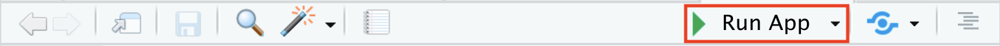
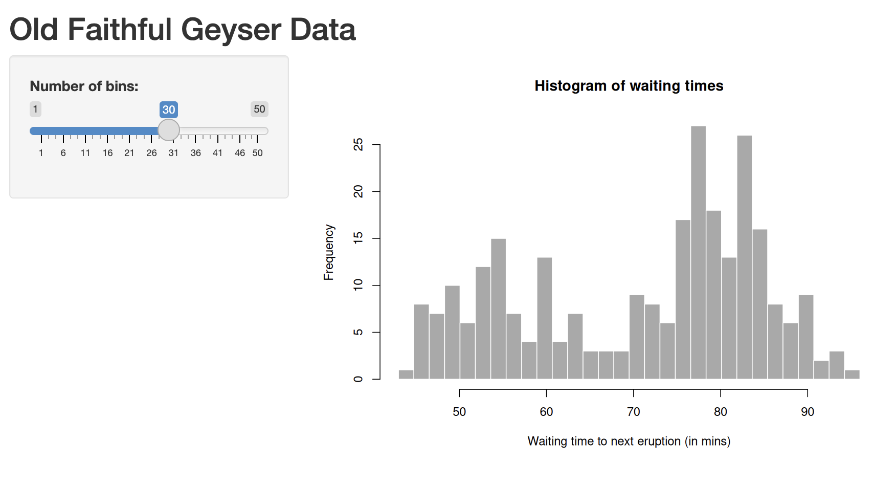

<head>

```{=html}
<script src="https://kit.fontawesome.com/ece750edd7.js" crossorigin="anonymous"></script>
```

</head>

```{r global_options, include=FALSE}
knitr::opts_chunk$set(warning=FALSE, message=FALSE)
```

::: {.box .objectives}
<h3><i class="fas fa-check-square"></i> Learning Objectives</h3>
------------------------------------

-   Create an interactive web application with **Shiny**
-   Understand how Shiny uses reactivity
-   Use Shiny for exploratory data analysis
:::

[Shiny](https://shiny.rstudio.com/) is an R package that makes it easy to build interactive web applications straight from R. You can host standalone apps that run from your R console, host them on websites or embed them in Markdown documents. Shiny applications can be used for a variety of purposes, including data visualisation, data exploration, and interactive reporting.

{fig-align="center" width="20%"}

The Shiny package is built on the concept of **reactivity**, which allows you to create applications that respond to user input in real time. In this chapter, we will explore how to create a simple Shiny application and how to use it for exploratory data analysis.

::: {.box .resources}
<h3><i class="fas fa-book"></i> Resources</h3>

  - The [Shiny tutorial](https://shiny.rstudio.com/tutorial/) is the best place to start learning about Shiny
  - [Mastering Shiny](https://mastering-shiny.org/index.html) is a free online book that provides a comprehensive guide to building Shiny applications
  - The [Shiny gallery](https://shiny.rstudio.com/gallery/) contains a collection of Shiny applications that you can explore and learn from.
:::

## Create a new Shiny project

We will start by creating a new Shiny project in RStudio. To do this, go to **File > New Project > New Directory > Shiny Web Application**. You will be prompted to enter a name for your application and choose a directory to save it in. Check the **renv** and **git** checkboxes again, to ensure that your project is set up with a reproducible environment and version control.

Once you have done this, RStudio will create a new project with a basic Shiny application template.

Make sure Shiny is installed and load the library:

```{r, eval=FALSE}
install.packages("shiny")
library(shiny)
```

## Running a Shiny application

Open the `app.R` file in your new Shiny project. This app plots a histogram of the waiting times between eruptions of the Old Faithful geyser in Yellowstone National Park. 

You will see that the app contains two main components: the **UI** (user interface) and the **server** function. 

```{r, eval=FALSE}
library(shiny)

# Define UI for application that draws a histogram
ui <- fluidPage(

    # Application title
    titlePanel("Old Faithful Geyser Data"),

    # Sidebar with a slider input for number of bins 
    sidebarLayout(
        sidebarPanel(
            sliderInput("bins",
                        "Number of bins:",
                        min = 1,
                        max = 50,
                        value = 30)
        ),

        # Show a plot of the generated distribution
        mainPanel(
           plotOutput("distPlot")
        )
    )
)

# Define server logic required to draw a histogram
server <- function(input, output) {

    output$distPlot <- renderPlot({
        # generate bins based on input$bins from ui.R
        x    <- faithful[, 2]
        bins <- seq(min(x), max(x), length.out = input$bins + 1)

        # draw the histogram with the specified number of bins
        hist(x, breaks = bins, col = 'darkgray', border = 'white',
             xlab = 'Waiting time to next eruption (in mins)',
             main = 'Histogram of waiting times')
    })
}

# Run the application 
shinyApp(ui = ui, server = server)
```

The UI defines how the application will look, while the server function defines how the application will behave. The `shinyApp()` function combines the UI and server components into a single application.

Hit the <kbd>Run App</kbd> button in the toolbar to launch your Shiny application. 



You should see a web page with a title, a sidebar and a sliding input control that changes the number of bins in the histogram. You can interact with the application by moving the slider and observing how the histogram updates in real time.

{fig-align="center" width="80%"}

## User Interface

The UI (user interface) is the web based front-end of the Shiny application. Shiny uses R functions to build HTML elements, including text, images, input controls and outputs.

### Pages and Layouts

The appearance of the UI is defined using **page** and **layout** functions, which determine how the various UI elements are arranged. The most commonly used page function is `fluidPage()`, which creates a fluid layout that adjusts to the size of the browser window.

The default app is a single page with a `titlePanel()`, and a `sidebarLayout()`, which consists of a `sidebarPanel()` and a `mainPanel()`. The sidebar contains input controls, while the main panel displays the output of the application.

{fig-align="center" width="80%"}

::: {.box .resources}
<h3><i class="fas fa-book"></i> Resources</h3>

There are many different page functions in Shiny including `fluidPage()`, `fixedPage()`, `navbarPage()`, and `dashboardPage()` for single and multi-page applications.

Within a page, you can use layout functions to arrange UI elements. The most commonly used layout functions are `sidebarLayout()`, `fluidRow()`, and `tabsetPanel()` for multi-tab pages.

There are also several Shiny UI packages available that provide additional UI elements and layouts, such as `shiny.semantic`, `shiny.semantic.dashboard`, and `shinydashboard`.

  - [Shiny guide to layouts](https://shiny.posit.co/r/layouts/)
  - [Layout and themes guide guide](https://mastering-shiny.org/action-layout.html)
:::

### Input controls

The default app has a single input control, a `sliderInput()` that allows the user to select the number of bins for a histogram. 

```{r,eval=FALSE}
sliderInput("bins",
            "Number of bins:",
            min = 1,
            max = 50,
            value = 30)
```

Input controls are used to collect user input and can be of various types:

  - `sliderInput()`: A slider for selecting a numeric value within a range
  - `numericInput()`: A text box for entering a numeric value
  - `textInput()`: A text box for entering a character value
  - `selectInput()`: A drop-down menu for selecting a value from a list
  - `checkboxInput()`: A checkbox for selecting a boolean value
  - `radioButtons()`: A set of radio buttons for selecting a single value from a list
  - `dateInput()`: A date picker for selecting a date
  - `fileInput()`: A file upload control for selecting a file from the user's computer
  - `actionButton()`: A button that can be used to trigger an action in the server function
  
Each Input control has a unique `inputId` that is used to access its value in the server function. The value of an input control can be accessed using the `input` object, which is a list that contains the values of all input controls in the application.

Input controls also have additional parameters, such as `label`, `min`, `max`, and `step`, which define the appearance and behaviour of the control.

:::: {.box .challenge}
<h3><i class="fas fa-pencil-alt"></i> Challenge:</h3>

Add a `selectInput()` control to the sidebar that allows the user to select which column to plot from the `faithful` dataset.

Run the app and see if your input control works. It shouldn't update the plot yet, but you should be able to select a column from a drop-down menu.

<details>

<summary>

</summary>

::: {.box .solution}
<h3><i class="far fa-eye"></i> Solution:</h3>

```{r, eval=FALSE}
sidebarPanel(
            sliderInput("bins",
                        "Number of bins:",
                        min = 1,
                        max = 50,
                        value = 30),
            selectInput("x_var",
                        "Select a column to plot:",
                        choices = colnames(faithful),
                        selected = colnames(faithful)[2]) ## Set Waiting time as the 
        )
```

:::
</details>
::::
  
### Output controls

Output controls are used to display the results of the server function in the UI. The default app has a single output control, a `plotOutput()` that displays a histogram of the selected dataset. Output controls can be of various types:

  - `plotOutput()`: Displays a plot generated by the server function.
  - `tableOutput()`: Displays a table generated by the server function.
  - `textOutput()`: Displays text output generated by the server function.

There is also a `UIoutput()` function that allows you to create UI elements programmatically, based on the values of other input controls.

## Server

The server function is the back-end of the Shiny application. It contains the logic that defines how the application behaves in response to user input. 

The server function takes two arguments: `input` and `output`. The `input` argument is a list that contains the values of all input controls in the application, while the `output` argument is a list that contains the output controls that will be displayed in the UI.

### Reactivity

Shiny uses a reactive programming model, which means that the server function is automatically re-executed whenever the value of an input control changes. This allows you to create applications that respond to user input in real time.

Our default app has a single reactive expression, which generates a histogram based on the number of bins selected by the user. The reactive expression is defined using the `renderPlot()` function, which defines a block of code to generate a plot.

The output object created is `output$distPlot`, which is the name of the object specified in the `plotOutput()` function in the UI. 

```{r, eval=FALSE}
output$distPlot <- renderPlot({
        # generate bins based on input$bins from ui.R
        x    <- faithful[, 2]
        bins <- seq(min(x), max(x), length.out = input$bins + 1)

        # draw the histogram with the specified number of bins
        hist(x, breaks = bins, col = 'darkgray', border = 'white',
             xlab = 'Waiting time to next eruption (in mins)',
             main = 'Histogram of waiting times')
    })
```

The `renderPlot()` function is a reactive function that contains the `input$bins` input control. Whenever the value of `input$bins` changes, the `renderPlot()` function is automatically re-executed, and the plot is updated in the UI.

::: {.box .resources}
<h3><i class="fas fa-book"></i> Resources</h3>

  - [Reactivity in Shiny](https://shiny.rstudio.com/articles/reactivity-overview.html) is a good introduction to the concept of reactivity in Shiny.
  - [Reactive programming in R](https://shiny.rstudio.com/articles/reactivity.html) is a more in-depth guide to reactive programming in R.
:::

### Render functions

Shiny provides a set of render functions that are used to create reactive expressions for different types of output controls. The most commonly used render functions are:

  - `renderPlot()`: Creates a reactive expression that generates a plot.
  - `renderTable()`: Creates a reactive expression that generates a table.
  - `renderText()`: Creates a reactive expression that generates text output.
  - `renderUI()`: Creates a reactive expression that generates UI elements programmatically.
  
Some packages provide additional render functions for specific types of output controls, such as `renderDataTable()` from the `DT` package or `renderPlotly()` from the `plotly` package.
  
:::: {.box .challenge}
<h3><i class="fas fa-pencil-alt"></i> Challenge:</h3>

Update the `renderPlot()` function to use the column `selectInput()` control we added earlier.

<details>

<summary>

</summary>

::: {.box .solution}
<h3><i class="far fa-eye"></i> Solution:</h3>

```{r, eval=FALSE}
output$distPlot <- renderPlot({
        # generate bins based on input$bins from ui.R
        x    <- faithful[, input$x_var]
        bins <- seq(min(x), max(x), length.out = input$bins + 1)

        # draw the histogram with the specified number of bins
        hist(x, breaks = bins, col = 'darkgray', border = 'white',
             xlab = input$x_var,
             main = paste('Histogram of',input$x_var))
    })
```

:::
</details>
::::

## File upload and download

Shiny apps are great for exploratory data analysis. It is often useful to allow users to upload their own datasets and export results. Shiny provides functions for handling file uploads and downloads.

### File upload 

The example below shows how to use `fileInput()` to allow users to upload a tsv file and display its contents in a table. 

We will load the `readr` package to read the uploaded file.

```{r, eval=FALSE}
library(shiny)
library(readr)

ui <- fluidPage(
  titlePanel("File Upload Example"),
  sidebarLayout(
    sidebarPanel(
      fileInput("file", "Choose a TSV File")
    ),
    mainPanel(
      tableOutput("contents")
    )
  )
)


server <- function(input, output) {
  output$contents <- renderTable({
    read_tsv(input$file$datapath, col_names = T)
  })
}

shinyApp(ui = ui, server = server)
```

When a file is selected, the `input$file` object is updated to contain information about the file, including its name and path, which can be used by functions like `read.table()`. or `read_tsv()`.

### File download

The example below shows how to use `downloadButton()` in the UI and `downloadHandler()` in the server to download tables and images.

```{r, eval=FALSE}
library(shiny)
library(readr)
library(ggplot2)

ui <- fluidPage(
  titlePanel("Download Example"),
  sidebarLayout(
    sidebarPanel(
      sliderInput("binwidth", "Bin Width:", min = 1, max = 10, value = 2),
      downloadButton("downloadData", "Download Table"),
      downloadButton("downloadPlot", "Download Plot")
    ),
    mainPanel(
      tableOutput("table"),
      plotOutput("plot")
    )
  )
)
server <- function(input, output) {
  
  output$table <- renderTable({
    head(mtcars)
  })
  
  output$plot <- renderPlot({
    ggplot(mtcars, aes(x = mpg)) +
      geom_histogram(binwidth = input$binwidth, fill = "blue", color = "black") +
      labs(title = "Histogram of MPG", x = "MPG", y = "Count")
  })
  
  output$downloadData <- downloadHandler(
    filename = function() {
      paste("mtcars-", Sys.Date(), ".csv", sep="")
    },
    content = function(file) {
      write_csv(head(mtcars), file)
    }
  )
  
  output$downloadPlot <- downloadHandler(
    filename = function() {
      paste("mtcars-hist", input$binwidth, Sys.Date(), "png", sep=".")
    },
    content = function(file) {
      plot <- ggplot(mtcars, aes(x = mpg)) +
      geom_histogram(binwidth = input$binwidth, fill = "blue", color = "black") +
      labs(title = "Histogram of MPG", x = "MPG", y = "Count")
      
      ggsave(file, plot = plot, device = "png")
    }
  )
}

shinyApp(ui = ui, server = server)
```

Note how the `input$binwidth` value is used in `downloadHandler()` to dynamically generate the filename based on input values.

## Reactive functions

In the example above, the `renderTable()` and `renderPlot()` functions are reactive expressions that generate a table and a plot based on the uploaded file. This logic is repeated in the download handlers, which duplicates code and would be inefficient for large datasets.

We can use `reactive` functions to create intermediate results that can be used by multiple output controls. This allows us to avoid duplicating code and makes our application more efficient.

```{r, eval=FALSE}
server <- function(input, output) {
  
  data <- reactive({
    head(mtcars)
  })
  
  plot_data <- reactive({
    ggplot(mtcars, aes(x = mpg)) +
      geom_histogram(binwidth = input$binwidth, fill = "blue", color = "black") +
      labs(title = "Histogram of MPG", x = "MPG", y = "Count")
  })
  
  output$table <- renderTable({
    data()
  })
  
  output$plot <- renderPlot({
    plot_data()
  })
  
  output$downloadData <- downloadHandler(
    filename = function() {
      paste("mtcars-", Sys.Date(), ".csv", sep="")
    },
    content = function(file) {
      write_csv(head(mtcars), file)
    }
  )
  
  output$downloadPlot <- downloadHandler(
    filename = function() {
      paste("mtcars-hist", input$binwidth, Sys.Date(),"png", sep=".")
    },
    content = function(file) {
      ggsave(file, plot = plot_data(), device = "png")
    }
  )
}

```

Note how the `data()` and `plot_data()` reactive functions are used in both the output controls and the download handlers, which avoids duplicating code and makes the application more efficient. You must call the reactive expressions as functions, using parentheses, to access their values.

::: {.box .resources}
<h3><i class="fas fa-book"></i> Resources</h3>

  - [Reactive expressions](https://shiny.rstudio.com/articles/reactivity-overview.html#reactive-expressions)
  - [Basic reactivity](https://mastering-shiny.org/basic-reactivity.html) 

:::

## Global variables

Global variables can be defined in the `app.R` file outside of the `ui` and `server` functions. These variables are available to both the UI and server functions, and can be used to store data or other information that is needed by the application.

```{r, eval=FALSE}
library(shiny)
library(ggplot2)
library(RColorBrewer)

## Create colour schemes
Set1 <- brewer.pal(3,"Set1")
Set2 <- brewer.pal(3,"Set2")

ui <- fluidPage(
  titlePanel("Global Variables Example"),
  sidebarLayout(
    sidebarPanel(
      selectInput("color_scheme", "Select a colour scheme:", choices = c("Set1", "Set2"))
    ),
    mainPanel(
      plotOutput("plot")
    )
  )
)

server <- function(input, output) {
  
  output$plot <- renderPlot({
    if (input$color_scheme == "Set1") {
      ggplot(iris, aes(x = Sepal.Length,y = Sepal.Width, colour = Species)) +
        geom_point() +
        labs(title = "Iris dataset", x = "Sepal Length", y = "Sepal Width") +
        scale_colour_manual(values = Set1)
    } else {
      ggplot(iris, aes(x = Sepal.Length,y = Sepal.Width, colour = Species)) +
        geom_point() +
        labs(title = "Iris dataset", x = "Sepal Length", y = "Sepal Width") +
        scale_colour_manual(values = Set2)
    }
  })
}

shinyApp(ui, server)
```

## Tidy evaluation

If you are using Tidyverse functions in your Shiny app you may need to make some small adjustments to your code to ensure that it works correctly with Shiny's reactive programming model. 

Tidyverse functions use non-standard evaluation to capture the expressions passed to them. This makes them easier to use in a programming context, but can cause issues when used in a reactive Shiny apps.

For instance, you may want to design a shiny app which plots a variable selected by the user from a drop-down menu. The `aes()` function in ggplot expects an unquoted variable name, but the value of the input control is a character string. The expression below will not work:

```{r,eval=FALSE}
my_plot <- renderPlot({
  ggplot(mtcars, aes(x = input$x_var)) +
    geom_histogram()
})
```

Instead, the `.data` pronoun can be used to refer to the variable in the dataset. This points to the `data` provided to the function, and allows you to select the variable using square bracket notation:

```{r,eval=FALSE}
my_plot <- renderPlot({
  ggplot(mtcars, aes(x = .data[[input$x_var]])) +
    geom_histogram()
})
```

## Having fun with Shiny

The best way to learn Shiny is to build your own application. You should have all the tools you need to build a simple Shiny application that allows users to explore a dataset of your choice.

::: {.box .challenge}
<h3><i class="fas fa-pencil-alt"></i> Challenge:</h3>

Now it's time to create your own Shiny application! Find a dataset that interests you and build an interactive application that allows users to explore the data.

Your app should include:

-   File upload functionality
-   More than one input control (e.g. slider, select menu, checkboxes)
-   An output table of data
-   An output plot of data
-   Download buttons for the plot

Start with something simple and build your app iteratively, adding new features and functionality as you go. You can use the Shiny gallery and online resources for inspiration.

1. Think about what your final plot will look.
2. Write a plotting function in R. This will help you understand what inputs you will need in your UI.
3. Build your UI to include the input controls required.
4. Build your server function to generate the plot based on the input controls.
5. Expand your layout and themes to make your app more visually appealing.

If you are stuck for ideas, build an app that takes a DESeq2 output file to build a volcano plot. Allow the user to set thresholds for log2 fold change and alpha values, dynamically change the colour and size of points, select which genes to label and download the final result.

If you have time you could also explore the following:

-   [Shiny dashboard](https://rstudio.github.io/shinydashboard/) for creating dashboards with multiple pages, tabs and panels
-   [Shiny extensions](https://github.com/nanxstats/awesome-shiny-extensions?tab=readme-ov-file#feedback--alert--notification) for adding additional functionality to your app

:::

## Publishing your Shiny app

There are several ways to share your Shiny application with others. 

  - Publish to [Shinyapps.io](https://www.shinyapps.io/)
  - Host your own [Shiny Server](https://docs.posit.co/shiny-server/)
  - Use cloud services like [Hugging Face Spaces](https://huggingface.co/spaces) or [Posit Connect](https://posit.co/products/connect/)
  - Use [Shiny Live](https://posit-dev.github.io/r-shinylive/) to run your app in a web page without needing to install Shiny

Shinyapps.io is a cloud service provided by RStudio that allows you to easily deploy and share Shiny applications. You can create a free account and deploy your app with just a few clicks. There are also paid plans available that provide additional features and resources for hosting larger applications.

::: {.box .challenge}
<h3><i class="fas fa-pencil-alt"></i> Challenge:</h3>

Deploy your Shiny application to [Shinyapps.io](https://www.shinyapps.io/). You will need to create an account and install the `rsconnect` package. Once you have done this, click the <kbd>Publish</kbd> button in the editor toolbar.
:::

::: {.box .key-points}
<h3><i class="fas fa-lightbulb"></i> Key Points</h3>

-   Shiny is an R package that allows you to build interactive web applications straight from R.
-   Shiny applications consist of a UI (user interface) and a server
-   Shiny uses a reactive programming model
-   Shiny is an excellent tool for exploratory data analysis and interactive visualisations
:::